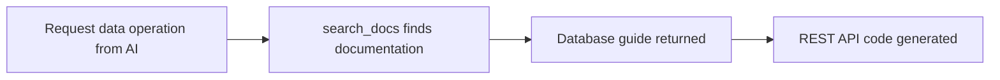

# Data Tools


💡 This page explains how to perform data CRUD operations from your AI tool. Data CRUD uses REST API calls, not dedicated MCP tools.


## Overview

The bkend MCP server does not include dedicated data CRUD tools. Instead, the AI tool uses `search_docs` to find data operation documentation and generates REST API calling code.



***

## Using from Your AI Tool

Ask your AI tool in natural language and it will generate the data operation code.

```text
"List all articles sorted by date"

"Create a new user record"

"Update the user's role to editor"

"Delete the article with this ID"
```

***

## Key Data REST API Endpoints

All data operations use the dynamic table endpoint pattern: `/v1/data/{tableName}`

### CRUD Operations

| Endpoint | Method | Description |
|----------|:------:|-------------|
| `/v1/data/{tableName}` | GET | List records (with filtering, sorting, pagination) |
| `/v1/data/{tableName}/{id}` | GET | Get a single record |
| `/v1/data/{tableName}` | POST | Create a record |
| `/v1/data/{tableName}/{id}` | PATCH | Update a record |
| `/v1/data/{tableName}/{id}` | DELETE | Delete a record |

***

## Filtering

### AND Filters

Retrieve data that satisfies all conditions simultaneously.

```bash
curl -X GET "https://api-client.bkend.ai/v1/data/users?andFilters=%7B%22role%22%3A%22admin%22%7D" \
  -H "X-API-Key: {pk_publishable_key}" \
  -H "Authorization: Bearer {accessToken}"
```

### Sorting and Pagination

```bash
curl -X GET "https://api-client.bkend.ai/v1/data/articles?sortBy=createdAt&sortDirection=desc&page=1&limit=20" \
  -H "X-API-Key: {pk_publishable_key}" \
  -H "Authorization: Bearer {accessToken}"
```

| Parameter | Description |
|-----------|-------------|
| `sortBy` | Sort field |
| `sortDirection` | `asc` or `desc` |
| `page` | Page number (default: 1) |
| `limit` | Items per page (default: 20) |
| `andFilters` | JSON string of AND condition filters |

***

## Code Generation Example

When you ask the AI tool to "list all articles," it generates code like this:



```typescript
const response = await fetch(
  "https://api-client.bkend.ai/v1/data/articles?sortBy=createdAt&sortDirection=desc",
  {
    headers: {
      "X-API-Key": PUBLISHABLE_KEY,
      "Authorization": `Bearer ${accessToken}`,
    },
  }
);

const { items, pagination } = await response.json();
```


```bash
curl -X GET "https://api-client.bkend.ai/v1/data/articles?sortBy=createdAt&sortDirection=desc" \
  -H "X-API-Key: {pk_publishable_key}" \
  -H "Authorization: Bearer {accessToken}"
```



### Response Structure

```json
{
  "items": [
    {
      "id": "rec_abc123",
      "title": "My Article",
      "createdAt": "2025-01-01T00:00:00Z",
      "updatedAt": "2025-01-01T00:00:00Z"
    }
  ],
  "pagination": {
    "page": 1,
    "limit": 20,
    "total": 45,
    "totalPages": 3
  }
}
```


⚠️ List data is contained in the `items` array and pagination info is in the `pagination` object. The ID field is `id`.


***

## Next Steps

- [Table Tools](04-table-tools.md) — Manage table structure via MCP
- [Auth Tools](06-auth-tools.md) — Auth implementation guide
- [Database Overview](../database/01-overview.md) — Detailed database guide
