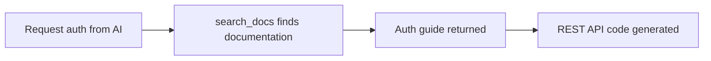

# Auth Tools


💡 This page explains how to implement authentication (Auth) features from your AI tool. Auth uses REST API calls, not MCP tools.


## Overview

The bkend MCP server does not include dedicated auth tools. Instead, the AI tool uses `search_docs` to find auth documentation and automatically generates REST API calling code.



***

## Using from Your AI Tool

Ask your AI tool in natural language and it will generate the auth code.

```text
"Implement email signup and login"

"Add social login (Google, GitHub)"

"Create a token refresh flow"
```

***

## Key Auth REST API Endpoints

Main endpoints the AI tool uses when generating code:

### Email Auth

| Endpoint | Method | Description |
|----------|:------:|-------------|
| `/v1/auth/email/signup` | POST | Email signup |
| `/v1/auth/email/signin` | POST | Email login |
| `/v1/auth/email/verify/send` | POST | Send email verification |
| `/v1/auth/email/verify/confirm` | POST | Confirm email verification |
| `/v1/auth/email/verify/resend` | POST | Resend verification email |

### Social Auth (OAuth)

| Endpoint | Method | Description |
|----------|:------:|-------------|
| `/v1/auth/{provider}/callback` | GET | OAuth callback (redirect) |
| `/v1/auth/{provider}/callback` | POST | OAuth callback (API flow) |

### Token Management

| Endpoint | Method | Description |
|----------|:------:|-------------|
| `/v1/auth/me` | GET | Get my profile |
| `/v1/auth/refresh` | POST | Refresh token |
| `/v1/auth/signout` | POST | Logout |

### Password Management

| Endpoint | Method | Description |
|----------|:------:|-------------|
| `/v1/auth/password/reset/request` | POST | Request password reset |
| `/v1/auth/password/reset/confirm` | POST | Confirm password reset |
| `/v1/auth/password/change` | POST | Change password |

### User Management

| Endpoint | Method | Description |
|----------|:------:|-------------|
| `/v1/users/{userId}` | GET | Get user profile |
| `/v1/users/{userId}` | PATCH | Update user profile |
| `/v1/users/{userId}/avatar/upload-url` | POST | Get profile image upload URL |

***

## Code Generation Example

When you ask the AI tool to "create an email login feature," it generates code like this:



```typescript
const response = await fetch(
  "https://api-client.bkend.ai/v1/auth/email/signin",
  {
    method: "POST",
    headers: {
      "Content-Type": "application/json",
      "X-API-Key": PUBLISHABLE_KEY,
    },
    body: JSON.stringify({
      email: "user@example.com",
      password: "password123",
      method: "password",
    }),
  }
);

const { accessToken, refreshToken } = await response.json();
```


```bash
curl -X POST https://api-client.bkend.ai/v1/auth/email/signin \
  -H "Content-Type: application/json" \
  -H "X-API-Key: {pk_publishable_key}" \
  -d '{
    "email": "user@example.com",
    "password": "password123",
    "method": "password"
  }'
```




💡 All auth API calls require the `X-API-Key` header. After authentication, pass the issued JWT via the `Authorization: Bearer {accessToken}` header.


***

## Next Steps

- [Storage Tools](07-storage-tools.md) — File upload/download implementation
- [Data Tools](05-data-tools.md) — Data CRUD operations
- [Auth Overview](../authentication/01-overview.md) — Detailed auth guide
