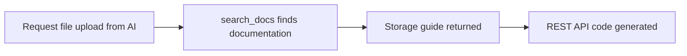
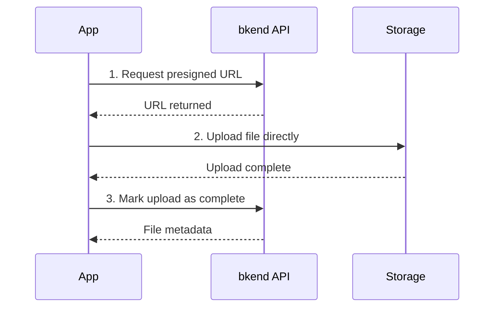

# Storage Tools


💡 This page explains how to implement file upload/download features from your AI tool. Storage uses REST API calls, not MCP tools.


## Overview

The bkend MCP server does not include dedicated storage tools. Instead, the AI tool uses `search_docs` to find storage documentation and automatically generates REST API calling code.



***

## Using from Your AI Tool

Ask your AI tool in natural language and it will generate the storage code.

```text
"Implement an image upload feature"

"Create code to get a file download URL"

"Build a profile image upload component"
```

***

## Key Storage REST API Endpoints

Main endpoints the AI tool uses when generating code:

### Presigned URL

| Endpoint | Method | Description |
|----------|:------:|-------------|
| `/v1/files/presigned-url` | POST | Issue a presigned URL for upload |
| `/v1/files/{fileId}/download-url` | GET | Issue a download URL |

### File Management

| Endpoint | Method | Description |
|----------|:------:|-------------|
| `/v1/files` | GET | List files |
| `/v1/files/{fileId}` | GET | Get file metadata |
| `/v1/files/{fileId}` | DELETE | Delete a file |
| `/v1/files/{fileId}/complete` | POST | Mark upload as complete |
| `/v1/files/{fileId}/visibility` | PATCH | Change file visibility |

### Multipart Upload

| Endpoint | Method | Description |
|----------|:------:|-------------|
| `/v1/files/multipart/initiate` | POST | Start multipart upload |
| `/v1/files/multipart/{uploadId}/part-url` | POST | Issue a part upload URL |
| `/v1/files/multipart/{uploadId}/complete` | POST | Complete multipart upload |
| `/v1/files/multipart/{uploadId}/abort` | POST | Abort multipart upload |

### Bucket Management

| Endpoint | Method | Description |
|----------|:------:|-------------|
| `/v1/files/buckets` | GET | List buckets |

***

## Upload Flow

File uploads follow a 3-step process:



***

## Code Generation Example

When you ask the AI tool to "create an image upload feature," it generates code like this:



```typescript
// 1. Get presigned URL
const presignedResponse = await fetch(
  "https://api-client.bkend.ai/v1/files/presigned-url",
  {
    method: "POST",
    headers: {
      "Content-Type": "application/json",
      "X-API-Key": PUBLISHABLE_KEY,
      "Authorization": `Bearer ${accessToken}`,
    },
    body: JSON.stringify({
      filename: "profile.jpg",
      contentType: "image/jpeg",
    }),
  }
);
const { fileId, url } = await presignedResponse.json();

// 2. Upload file directly
await fetch(url, {
  method: "PUT",
  headers: { "Content-Type": "image/jpeg" },
  body: file,
});

// 3. Mark upload as complete
await fetch(
  `https://api-client.bkend.ai/v1/files/${fileId}/complete`,
  {
    method: "POST",
    headers: {
      "X-API-Key": PUBLISHABLE_KEY,
      "Authorization": `Bearer ${accessToken}`,
    },
  }
);
```


```bash
# 1. Get presigned URL
curl -X POST https://api-client.bkend.ai/v1/files/presigned-url \
  -H "Content-Type: application/json" \
  -H "X-API-Key: {pk_publishable_key}" \
  -H "Authorization: Bearer {ACCESS_TOKEN}" \
  -d '{"filename": "profile.jpg", "contentType": "image/jpeg"}'

# 2. Upload file (use the returned URL)
curl -X PUT "{PRESIGNED_URL}" \
  -H "Content-Type: image/jpeg" \
  --data-binary @profile.jpg

# 3. Mark upload as complete
curl -X POST https://api-client.bkend.ai/v1/files/{FILE_ID}/complete \
  -H "X-API-Key: {pk_publishable_key}" \
  -H "Authorization: Bearer {ACCESS_TOKEN}"
```



***

## File Visibility Levels

| Level | Description |
|-------|-------------|
| `public` | Accessible by anyone |
| `private` | Accessible only by the uploader |
| `protected` | Accessible only by authenticated users |
| `shared` | Shared with specific users |

***


⚠️ Watch out for presigned URL expiration times in the file upload code your AI tool generates. Upload the file immediately after obtaining the URL.


## Next Steps

- [Auth Tools](06-auth-tools.md) — Auth implementation guide
- [MCP Resources](08-resources.md) — Resource URIs and how to query them
- [Storage Overview](../storage/01-overview.md) — Detailed storage guide
