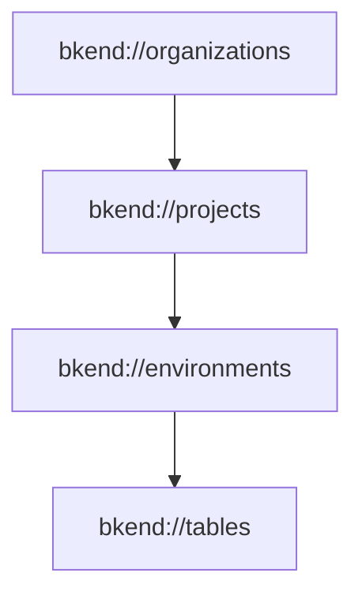
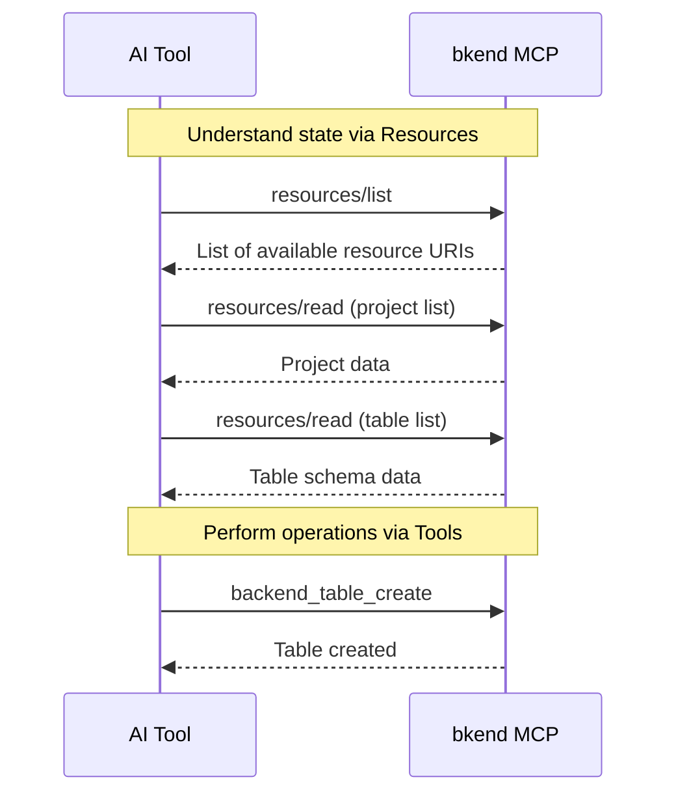

# MCP Resources


💡 This page explains how to query the current state of bkend in read-only mode through MCP Resources.


## Overview

Unlike Tools, MCP Resources are **read-only**. They use the `bkend://` URI schema to query the current state of Organizations, projects, environments, and tables. Resources are automatically generated from MCP-enabled GET endpoints.



***

## Resource URIs

### Organization Resources

```text
bkend://organizations
bkend://organizations/{organizationId}
```

Returns the list of Organizations or details of a specific Organization.

### Project Resources

```text
bkend://projects
bkend://projects/{projectId}
```

Returns the list of projects or details of a specific project.

### Environment Resources

```text
bkend://environments
bkend://environments/{environmentId}
```

Returns the list of environments or details of a specific environment.

### Table Resources

```text
bkend://tables
bkend://tables/{tableId}
```

Returns the list of tables or details of a specific table (including schema).

### Schema and Index Version Resources

```text
bkend://tables/{tableId}/schema/versions
bkend://tables/{tableId}/indexes/versions
```

Returns the list of schema or index versions for a specific table.

### Access Token Resources

```text
bkend://access-tokens
bkend://access-tokens/{accessTokenId}
```

Returns the list of access tokens or details of a specific token.

***

## MCP Methods

### resources/list

Retrieves the list of available resource URIs.

```json
{
  "method": "resources/list"
}
```

#### Response Example

```json
{
  "resources": [
    {
      "uri": "bkend://organizations",
      "name": "Organization",
      "description": "List all accessible organizations",
      "mimeType": "application/json"
    },
    {
      "uri": "bkend://projects",
      "name": "Project",
      "description": "List all accessible projects",
      "mimeType": "application/json"
    }
  ]
}
```

### resources/read

Reads the data of a specific resource.

```json
{
  "method": "resources/read",
  "params": {
    "uri": "bkend://projects"
  }
}
```

#### Response Example

```json
{
  "contents": [
    {
      "uri": "bkend://projects",
      "mimeType": "application/json",
      "text": "{\"items\":[{\"id\":\"proj_xyz789\",\"name\":\"my-app\"}],\"pagination\":{...}}"
    }
  ]
}
```

***

## Caching

MCP Resources are cached for performance.

| Item | Value |
|------|-------|
| Scope | Per Organization |


💡 Resource data is cached. After creating a new resource, it may not appear immediately in the list.


***

## Resources vs Tools

| Aspect | Resources | Tools |
|--------|-----------|-------|
| Purpose | Query state | Execute operations |
| Access | Read-only | Read/write |
| Invocation | URI-based (`bkend://...`) | Function call (`backend_*`) |
| Caching | Yes | None |
| Example | List projects | Create a table |

### When should you use Resources?

- When the AI tool needs to **understand the current state** (what projects or tables exist)
- When **background information** is needed for auto-completion or context

### When should you use Tools?

- When **modifying data** (creating tables, updating fields, managing indexes)
- When **performing specific operations** (searching docs, creating projects)

***

## Usage Flow



***

## Next Steps

- [MCP Tools Overview](01-overview.md) — Complete tool classification
- [API Reference](09-api-reference.md) — Tool input/output schemas
- [Understanding the MCP Protocol](../ai-tools/02-mcp-protocol.md) — MCP protocol details
