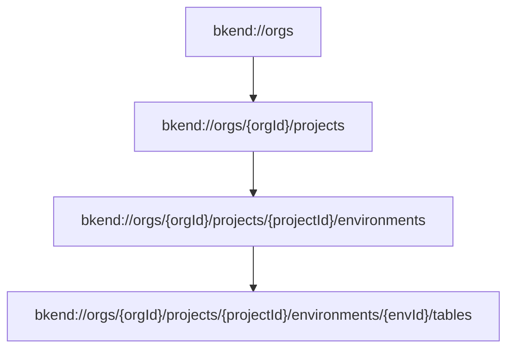

# MCP Resources


This page explains how to query the current state of bkend in read-only mode through MCP Resources.


## Overview

Unlike Tools, MCP Resources are **read-only**. They use the `bkend://` URI schema to query the current state of Organizations, projects, environments, and tables.



***

## Resource URIs

### Organization List

```text
bkend://orgs
```

Returns the list of accessible Organizations.

### Project List

```text
bkend://orgs/{orgId}/projects
```

Returns the list of projects in a specific Organization.

### Environment List

```text
bkend://orgs/{orgId}/projects/{projectId}/environments
```

Returns the list of environments in a specific project.

### Table List

```text
bkend://orgs/{orgId}/projects/{projectId}/environments/{envId}/tables
```

Returns the list of tables (including schemas) in a specific environment.

***

## MCP Methods

### resources/list

Retrieves the list of available resource URIs.

```json
{
  "method": "resources/list"
}
```

#### Response Example

```json
{
  "resources": [
    {
      "uri": "bkend://orgs",
      "name": "Organizations",
      "mimeType": "application/json"
    },
    {
      "uri": "bkend://orgs/org_abc123/projects",
      "name": "Projects",
      "mimeType": "application/json"
    }
  ]
}
```

### resources/read

Reads the data of a specific resource.

```json
{
  "method": "resources/read",
  "params": {
    "uri": "bkend://orgs/org_abc123/projects"
  }
}
```

#### Response Example

```json
{
  "contents": [
    {
      "uri": "bkend://orgs/org_abc123/projects",
      "mimeType": "application/json",
      "text": "[{\"id\":\"proj_xyz789\",\"name\":\"my-app\"}]"
    }
  ]
}
```

***

## Caching

MCP Resources are cached for performance.

| Item | Value |
|------|-------|
| TTL | 60 seconds |
| Scope | Per Organization |


Resource data is cached for up to 60 seconds. After creating a table, it may not appear in the table list until the cache refreshes.


***

## Resources vs Tools

| Aspect | Resources | Tools |
|--------|-----------|-------|
| Purpose | Query state | Execute operations |
| Access | Read-only | Read/write |
| Invocation | URI-based | Function call |
| Caching | 60-second TTL | None |
| Example | List projects | Create a table |

### When should you use Resources?

- When the AI tool needs to **understand the current state** (what projects or tables exist)
- When **background information** is needed for auto-completion or context

### When should you use Tools?

- When **modifying data** (creating tables, adding data, updating fields)
- When **performing specific operations** (searching docs, querying schemas)

***

## Usage Flow


***

## Next Steps

- [MCP Tools Overview](01-overview.md) — Complete tool classification
- [API Reference](09-api-reference.md) — Tool input/output schemas
- [Understanding the MCP Protocol](../ai-tools/02-mcp-protocol.md) — MCP protocol details
