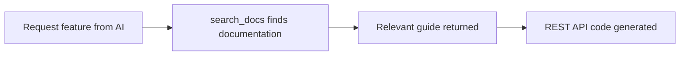
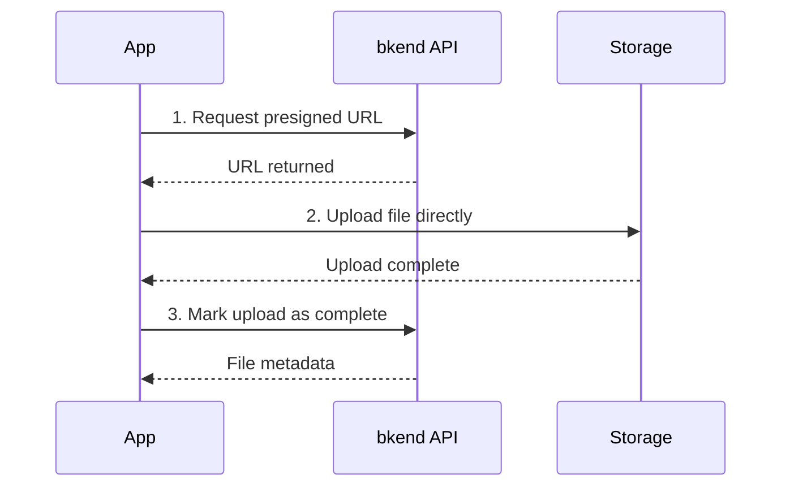

# REST API Code Generation


💡 Auth, Storage, and Data CRUD do not have dedicated MCP tools. Instead, your AI tool uses `search_docs` to find documentation and generates REST API code automatically.


## Overview

When you ask your AI tool to implement Auth, Storage, or Data CRUD features, it follows this pattern:



***

## Data CRUD

### Ask Your AI Tool

```text
"List all articles sorted by date"

"Create a new user record"

"Update the user's role to editor"

"Delete the article with this ID"
```

### Key Endpoints

All data operations use the dynamic table endpoint pattern: `/v1/data/{tableName}`

| Endpoint | Method | Description |
|----------|:------:|-------------|
| `/v1/data/{tableName}` | GET | List records (with filtering, sorting, pagination) |
| `/v1/data/{tableName}/{id}` | GET | Get a single record |
| `/v1/data/{tableName}` | POST | Create a record |
| `/v1/data/{tableName}/{id}` | PATCH | Update a record |
| `/v1/data/{tableName}/{id}` | DELETE | Delete a record |

### Filtering, Sorting, and Pagination

| Parameter | Description |
|-----------|-------------|
| `sortBy` | Sort field |
| `sortDirection` | `asc` or `desc` |
| `page` | Page number (default: 1) |
| `limit` | Items per page (default: 20) |
| `andFilters` | JSON string of AND condition filters |

### Code Example



```typescript
const response = await fetch(
  "https://api-client.bkend.ai/v1/data/articles?sortBy=createdAt&sortDirection=desc",
  {
    headers: {
      "X-API-Key": PUBLISHABLE_KEY,
      "Authorization": `Bearer ${accessToken}`,
    },
  }
);

const { items, pagination } = await response.json();
```


```bash
curl -X GET "https://api-client.bkend.ai/v1/data/articles?sortBy=createdAt&sortDirection=desc" \
  -H "X-API-Key: {pk_publishable_key}" \
  -H "Authorization: Bearer {accessToken}"
```



### Response Structure

```json
{
  "items": [
    {
      "id": "rec_abc123",
      "title": "My Article",
      "createdAt": "2025-01-01T00:00:00Z",
      "updatedAt": "2025-01-01T00:00:00Z"
    }
  ],
  "pagination": {
    "page": 1,
    "limit": 20,
    "total": 45,
    "totalPages": 3
  }
}
```


⚠️ List data is contained in the `items` array and pagination info is in the `pagination` object. The ID field is `id`.


***

## Auth

### Ask Your AI Tool

```text
"Implement email signup and login"

"Add social login (Google, GitHub)"

"Create a token refresh flow"
```

### Key Endpoints

#### Email Auth

| Endpoint | Method | Description |
|----------|:------:|-------------|
| `/v1/auth/email/signup` | POST | Email signup |
| `/v1/auth/email/signin` | POST | Email login |
| `/v1/auth/email/verify/send` | POST | Send email verification |
| `/v1/auth/email/verify/confirm` | POST | Confirm email verification |
| `/v1/auth/email/verify/resend` | POST | Resend verification email |

#### Social Auth (OAuth)

| Endpoint | Method | Description |
|----------|:------:|-------------|
| `/v1/auth/{provider}/callback` | GET | OAuth callback (redirect) |
| `/v1/auth/{provider}/callback` | POST | OAuth callback (API flow) |

#### Token Management

| Endpoint | Method | Description |
|----------|:------:|-------------|
| `/v1/auth/me` | GET | Get my profile |
| `/v1/auth/refresh` | POST | Refresh token |
| `/v1/auth/signout` | POST | Logout |

#### Password Management

| Endpoint | Method | Description |
|----------|:------:|-------------|
| `/v1/auth/password/reset/request` | POST | Request password reset |
| `/v1/auth/password/reset/confirm` | POST | Confirm password reset |
| `/v1/auth/password/change` | POST | Change password |

#### User Management

| Endpoint | Method | Description |
|----------|:------:|-------------|
| `/v1/users/{userId}` | GET | Get user profile |
| `/v1/users/{userId}` | PATCH | Update user profile |
| `/v1/users/{userId}/avatar/upload-url` | POST | Get profile image upload URL |

### Code Example



```typescript
const response = await fetch(
  "https://api-client.bkend.ai/v1/auth/email/signin",
  {
    method: "POST",
    headers: {
      "Content-Type": "application/json",
      "X-API-Key": PUBLISHABLE_KEY,
    },
    body: JSON.stringify({
      email: "user@example.com",
      password: "password123",
      method: "password",
    }),
  }
);

const { accessToken, refreshToken } = await response.json();
```


```bash
curl -X POST https://api-client.bkend.ai/v1/auth/email/signin \
  -H "Content-Type: application/json" \
  -H "X-API-Key: {pk_publishable_key}" \
  -d '{
    "email": "user@example.com",
    "password": "password123",
    "method": "password"
  }'
```




💡 All auth API calls require the `X-API-Key` header. After authentication, pass the issued JWT via the `Authorization: Bearer {accessToken}` header.


***

## Storage

### Ask Your AI Tool

```text
"Implement an image upload feature"

"Create code to get a file download URL"

"Build a profile image upload component"
```

### Key Endpoints

#### Presigned URL

| Endpoint | Method | Description |
|----------|:------:|-------------|
| `/v1/files/presigned-url` | POST | Issue a presigned URL for upload |
| `/v1/files/{fileId}/download-url` | GET | Issue a download URL |

#### File Management

| Endpoint | Method | Description |
|----------|:------:|-------------|
| `/v1/files` | GET | List files |
| `/v1/files/{fileId}` | GET | Get file metadata |
| `/v1/files/{fileId}` | DELETE | Delete a file |
| `/v1/files/{fileId}/complete` | POST | Mark upload as complete |
| `/v1/files/{fileId}/visibility` | PATCH | Change file visibility |

#### Multipart Upload

| Endpoint | Method | Description |
|----------|:------:|-------------|
| `/v1/files/multipart/initiate` | POST | Start multipart upload |
| `/v1/files/multipart/{uploadId}/part-url` | POST | Issue a part upload URL |
| `/v1/files/multipart/{uploadId}/complete` | POST | Complete multipart upload |
| `/v1/files/multipart/{uploadId}/abort` | POST | Abort multipart upload |

#### Bucket Management

| Endpoint | Method | Description |
|----------|:------:|-------------|
| `/v1/files/buckets` | GET | List buckets |

### Upload Flow



### Code Example



```typescript
// 1. Get presigned URL
const presignedResponse = await fetch(
  "https://api-client.bkend.ai/v1/files/presigned-url",
  {
    method: "POST",
    headers: {
      "Content-Type": "application/json",
      "X-API-Key": PUBLISHABLE_KEY,
      "Authorization": `Bearer ${accessToken}`,
    },
    body: JSON.stringify({
      filename: "profile.jpg",
      contentType: "image/jpeg",
    }),
  }
);
const { fileId, url } = await presignedResponse.json();

// 2. Upload file directly
await fetch(url, {
  method: "PUT",
  headers: { "Content-Type": "image/jpeg" },
  body: file,
});

// 3. Mark upload as complete
await fetch(
  `https://api-client.bkend.ai/v1/files/${fileId}/complete`,
  {
    method: "POST",
    headers: {
      "X-API-Key": PUBLISHABLE_KEY,
      "Authorization": `Bearer ${accessToken}`,
    },
  }
);
```


```bash
# 1. Get presigned URL
curl -X POST https://api-client.bkend.ai/v1/files/presigned-url \
  -H "Content-Type: application/json" \
  -H "X-API-Key: {pk_publishable_key}" \
  -H "Authorization: Bearer {ACCESS_TOKEN}" \
  -d '{"filename": "profile.jpg", "contentType": "image/jpeg"}'

# 2. Upload file (use the returned URL)
curl -X PUT "{PRESIGNED_URL}" \
  -H "Content-Type: image/jpeg" \
  --data-binary @profile.jpg

# 3. Mark upload as complete
curl -X POST https://api-client.bkend.ai/v1/files/{FILE_ID}/complete \
  -H "X-API-Key: {pk_publishable_key}" \
  -H "Authorization: Bearer {ACCESS_TOKEN}"
```



### File Visibility Levels

| Level | Description |
|-------|-------------|
| `public` | Accessible by anyone |
| `private` | Accessible only by the uploader |
| `protected` | Accessible only by authenticated users |
| `shared` | Shared with specific users |


⚠️ Watch out for presigned URL expiration times in the file upload code your AI tool generates. Upload the file immediately after obtaining the URL.


***

## Next Steps

- [Table Tools](08-table-tools.md) — Manage table structure via MCP
- [Resources](10-resources.md) — MCP resource URIs
- [Database Overview](../database/01-overview.md) — Detailed database guide
- [Auth Overview](../authentication/01-overview.md) — Detailed auth guide
- [Storage Overview](../storage/01-overview.md) — Detailed storage guide
