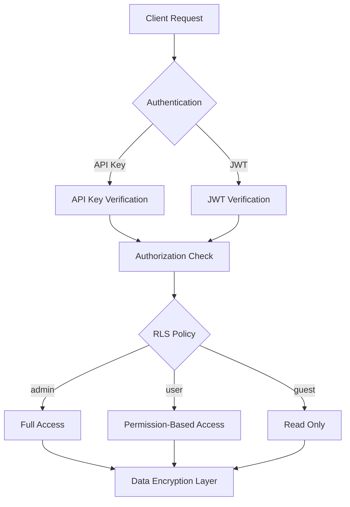

# Security Overview


Understand bkend's security architecture and how your data is protected.


## Overview

To prevent users from editing or deleting other users' posts, you need data access control. With bkend's security features, you can set fine-grained permissions at the Row and Column level.

bkend protects your data through a multi-layered security model. Multiple security layers -- API key-based authentication, Row Level Security (RLS), and encryption -- work together to keep your data safe.

***

## Security Layers

| Layer | What It Protects | Mechanism |
|-------|-----------------|-----------|
| **Authentication** | API access | API keys, JWT tokens |
| **Authorization** | Resource access | RLS policies, permission groups |
| **In-Transit Encryption** | Network communication | TLS 1.2+ |
| **At-Rest Encryption** | Stored data | AES-256-GCM, MongoDB Atlas Encryption at Rest |
| **Password Hashing** | User passwords | Argon2id (OWASP recommended) |
| **Token Security** | API keys | SHA-256 one-way hash |

***

## Authentication Methods

### API Keys

Authentication keys generated from the console. Use them in the `Authorization: Bearer {api_key}` format.

- **Publishable Key**: Used on the client side (limited permissions)
- **Secret Key**: Used on the server side only (full permissions)

> [Understanding API Keys](02-api-keys.md), [Publishable Key vs Secret Key](03-public-vs-secret.md)

### JWT Tokens

Authentication tokens issued when a user signs in. They are managed automatically after user authentication.

> [Authentication Overview](../authentication/01-overview.md)

***

## Authorization (RLS)

Row Level Security gives you fine-grained control over who can access your table data.

| User Group | Description | Default Permissions |
|-----------|-------------|-------------------|
| `admin` | Administrator | All permissions |
| `user` | Authenticated user | Create, read, list |
| `guest` | Unauthenticated user | Read, list |
| `self` | Own data | Access based on createdBy |

> [RLS Overview](04-rls-overview.md), [Writing RLS Policies](05-rls-policies.md)

***

## Encryption

### In-Transit Encryption

All API communication is encrypted with TLS 1.2 or higher.

### At-Rest Encryption

| Target | Method |
|--------|--------|
| Database connection credentials | AES-256-GCM (application level) |
| MongoDB stored data | Atlas Encryption at Rest |
| API keys | SHA-256 hash (one-way) |
| Passwords | Argon2id (OWASP 2025 recommended) |

> [Data Encryption](06-data-encryption.md)

***


Publishable Keys are safe to expose on the client side, but you must use Secret Keys only in server environments. See [Publishable Key vs Secret Key](03-public-vs-secret.md) for details.


***

## Next Steps

- [Understanding API Keys](02-api-keys.md) -- API key structure and management
- [RLS Overview](04-rls-overview.md) -- Data access control
- [Security Best Practices](07-best-practices.md) -- Security recommendations
