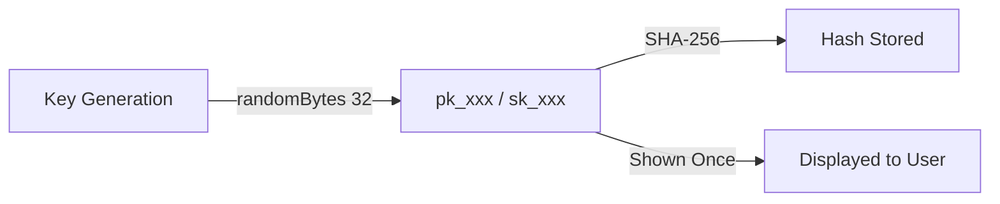
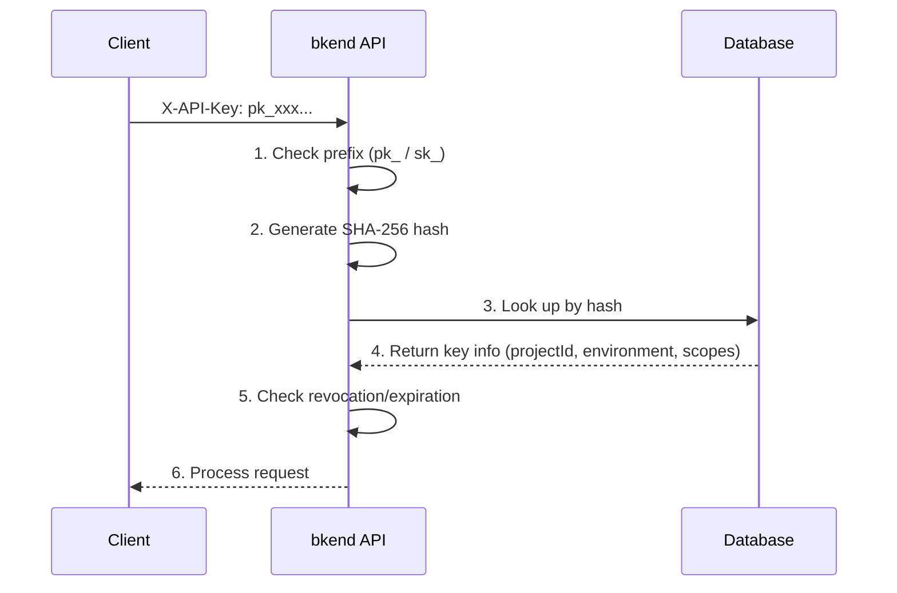

# Understanding API Keys


Learn about bkend API key structure, generation, and security characteristics.


## Overview

API keys are the authentication credentials for accessing the bkend service API. You generate them from the console and use them via the `X-API-Key` header. API keys contain project ID and environment information, so no additional context headers are needed.

***

## API Key Types

bkend provides two types of API keys.

| Item | Publishable Key | Secret Key |
|------|----------------|------------|
| **Prefix** | `pk_` | `sk_` |
| **Environment** | Client (browser, mobile) | Server side only |
| **Permissions** | Limited access based on RLS | Full access (admin) |
| **Exposure Risk** | Low (protected by RLS) | High (full permissions) |

***

## API Key Structure

### Key Format

```text
pk_a1b2c3d4e5f6...  (pk_ + 64-char hex)
sk_a1b2c3d4e5f6...  (sk_ + 64-char hex)
```

| Component | Description |
|-----------|-------------|
| `pk_` / `sk_` | Key type prefix |
| 64-char hex | 32-byte random value (cryptographically secure) |

### Embedded Information

API keys include the following information at creation time. The server automatically extracts this information from the key on each request, so no additional headers are needed.

| Information | Description |
|-------------|-------------|
| Project ID | The project the key belongs to |
| Environment | Target environment (`dev`, `staging`, `prod`) |
| Scopes | Access scope per table and operation |

### Secure Storage

When an API key is generated, it is converted to a **SHA-256 hash** before being stored. The original key is never persisted.




**Warning** -- API keys are displayed **only once** at creation. Save them in a secure location immediately.


***

## API Key Properties

| Property | Description |
|----------|-------------|
| Organization | The organization the key belongs to |
| Project Scope | Projects the key can access (all or specific) |
| Scopes | Permission scope per table and operation (see below) |
| Expiration | Optional (permanent if not set) |
| Creator | The user who generated the key |

### API Key Scopes

Scopes let you restrict which tables and operations an API key can access. When scopes are configured, every API request is checked against the scope **before** RLS permission checks.

| Scope Format | Description | Example |
|-------------|-------------|---------|
| `{tableName}:{operation}` | Allow a specific operation on a specific table | `posts:read` |
| `{tableName}:*` | Allow all operations on a specific table | `posts:*` |
| `*:{operation}` | Allow a specific operation on all tables | `*:read` |
| `*:*` | Allow all operations on all tables | `*:*` |


Scope checks apply **before** RLS permission checks. Even the `admin` group cannot bypass scope restrictions. If the scope does not include the requested operation, a `403 SCOPE_INSUFFICIENT` error is returned.


***

## API Key Verification Flow



### Verification Failure Reasons

| Reason | HTTP | Description |
|--------|:----:|-------------|
| Invalid format | 401 | Missing the `pk_` / `sk_` prefix |
| Key not found | 401 | No key matches the hash |
| Revoked | 401 | The key has been revoked |
| Expired | 401 | The key has passed its expiration time |

***

## Managing API Keys

### Managing from the Console

You can manage API keys from the **API Keys** menu in the console. See the console guide for details on token creation, permission configuration, and revocation.

> [API Key Management (Console)](../console/11-api-keys.md)

### Issue and Test an API Key in 5 Minutes

1. Go to **API Keys** > **Create New Token** in the console.
2. Set the token name to `test-key`, type to Publishable Key, and permissions to `Table Data (read, create)`.
3. Click **Create** and copy the displayed token.
4. Test with curl:

```bash
curl -X GET https://api-client.bkend.ai/v1/data/posts \
  -H "X-API-Key: {pk_publishable_key}"
```


If you get a 200 response, your API key is working correctly.


### API Key Usage Example (JavaScript)

```javascript
// Include the Publishable Key in the X-API-Key header
const response = await fetch('https://api-client.bkend.ai/v1/data/posts', {
  headers: {
    'X-API-Key': '{pk_publishable_key}',
  },
});

const data = await response.json();
```

For detailed instructions on integrating the bkend API into your app, see [Integrating bkend into Your App](../getting-started/03-app-integration.md).

***

## Next Steps

- [Publishable Key vs Secret Key](03-public-vs-secret.md) -- Usage by key type
- [API Key Management (Console)](../console/11-api-keys.md) -- Creating and managing tokens in the console
- [Integrating bkend into Your App](../getting-started/03-app-integration.md) -- Setting up API keys in your app
- [Security Best Practices](07-best-practices.md) -- API key security recommendations
