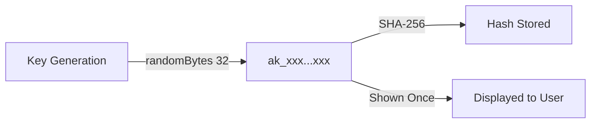
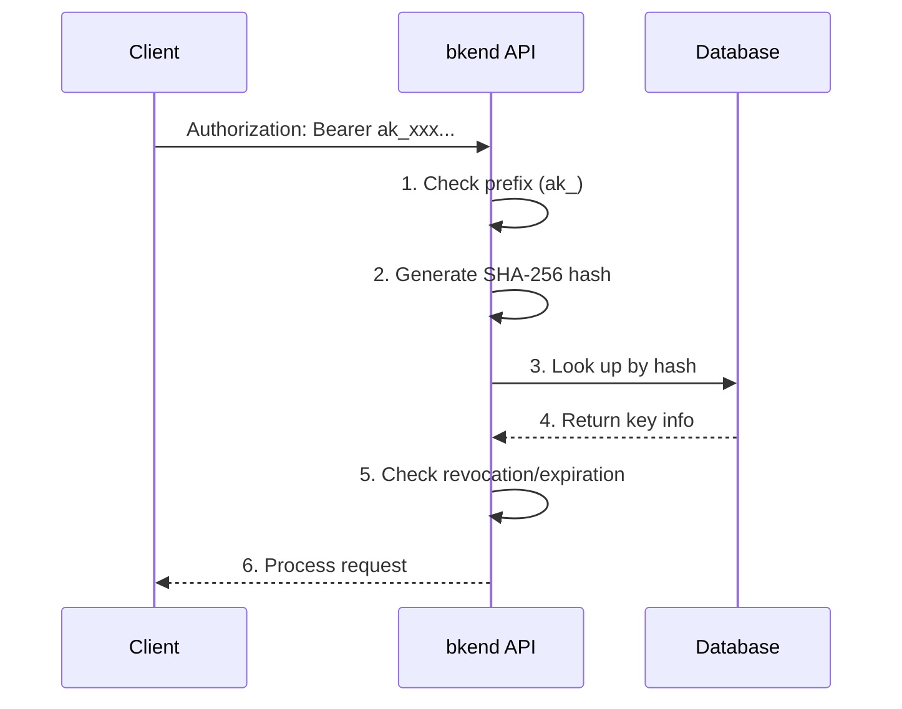

# Understanding API Keys


Learn about bkend API key structure, generation, and security characteristics.


## Overview

API keys are the authentication credentials for accessing the bkend service API. You generate them from the console and use them as the `Authorization: Bearer {api_key}` header.

***

## API Key Structure

### Key Format

```text
ak_a1b2c3d4e5f6...  (ak_ + 64-char hex)
```

| Component | Description |
|-----------|-------------|
| `ak_` | API key prefix |
| 64-char hex | 32-byte random value (cryptographically secure) |

### Secure Storage

When an API key is generated, it is converted to a **SHA-256 hash** before being stored. The original key is never persisted.




**Warning** -- API keys are displayed **only once** at creation. Save them in a secure location immediately.


***

## API Key Properties

| Property | Description |
|----------|-------------|
| Organization | The organization the key belongs to |
| Project Scope | Projects the key can access (all or specific) |
| Scopes | Permission scope (read, write, etc.) |
| Expiration | Optional (permanent if not set) |
| Creator | The user who generated the key |

***

## API Key Verification Flow



### Verification Failure Reasons

| Reason | HTTP | Description |
|--------|:----:|-------------|
| Invalid format | 401 | Missing the `ak_` prefix |
| Key not found | 401 | No key matches the hash |
| Revoked | 401 | The key has been revoked |
| Expired | 401 | The key has passed its expiration time |

***

## Managing API Keys

### Managing from the Console

You can manage API keys from the **Access Tokens** menu in the console. See the console guide for details on token creation, permission configuration, and revocation.

> [API Key Management (Console)](../console/11-api-keys.md)

### Issue and Test an API Key in 5 Minutes

1. Go to **Access Tokens** > **Create New Token** in the console.
2. Set the token name to `test-key`, type to `BEARER_TOKEN`, and permissions to `Table Data (read, create)`.
3. Click **Create** and copy the displayed token.
4. Test with curl:

```bash
curl -X GET https://api-client.bkend.ai/v1/data/posts \
  -H "Authorization: Bearer {your_token}" \
  -H "X-Project-Id: {project_id}" \
  -H "X-Environment: dev"
```


If you get a 200 response, your API key is working correctly.


### API Key Usage Example (JavaScript)

```javascript
// Include the API Key in the Authorization header
const response = await fetch('https://api-client.bkend.ai/v1/data/posts', {
  headers: {
    'Authorization': 'Bearer {api_key}',
    'X-Project-Id': '{project_id}',
    'X-Environment': 'dev',
  },
});

const data = await response.json();
```

For detailed instructions on integrating the bkend API into your app, see [Integrating bkend into Your App](../getting-started/03-app-integration.md).

***

## Next Steps

- [Public Key vs Secret Key](03-public-vs-secret.md) -- Usage by key type
- [API Key Management (Console)](../console/11-api-keys.md) -- Creating and managing tokens in the console
- [Integrating bkend into Your App](../getting-started/03-app-integration.md) -- Setting up API keys in your app
- [Security Best Practices](07-best-practices.md) -- API key security recommendations
