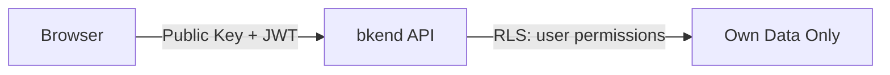
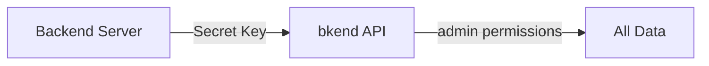

# Public Key vs Secret Key


Understand the differences between Public Keys and Secret Keys and how to use each one correctly.


## Overview

bkend provides two types of API keys. Each key has different usage environments and permissions, so make sure you use the right one for the right purpose.

***

## Key Comparison

| Item | Public Key | Secret Key |
|------|-----------|------------|
| **Environment** | Client (browser, mobile) | Server side only |
| **Permissions** | Limited access based on RLS | Full access (admin) |
| **Exposure Risk** | Low (protected by RLS) | High (full permissions) |
| **Use Case** | Frontend apps, mobile apps | Server-to-server communication, admin tasks |

***

## Public Key

A key designed for use in client-side applications.

### Characteristics

- Safe to use in browser JavaScript and mobile apps
- **Access is restricted by RLS policies** (user/guest permissions)
- When used with a user JWT, grants `user` permissions
- When used without a JWT, grants `guest` permissions

### Usage Example

```javascript
// Using a Public Key on the frontend
const response = await fetch('https://api-client.bkend.ai/v1/data/posts', {
  headers: {
    'Authorization': `Bearer ${PUBLIC_KEY}`,
    'X-Project-Id': '{project_id}',
    'X-Environment': 'dev',
  },
});
```


It is safe to include Public Keys in your source code. RLS policies control data access.


***

## Secret Key

A key intended exclusively for server-side use.

### Characteristics

- **Use only in server environments** (manage via environment variables)
- Grants `admin` permissions with full data access
- Bypasses RLS policies for unrestricted data queries
- Performs admin tasks such as API key management and user management

### Usage Example

```javascript
// Using a Secret Key on the server side
const response = await fetch('https://api-client.bkend.ai/v1/data/users', {
  headers: {
    'Authorization': `Bearer ${process.env.BKEND_SECRET_KEY}`,
    'X-Project-Id': process.env.BKEND_PROJECT_ID,
    'X-Environment': 'dev',
  },
});
```


**Warning** -- Never include a Secret Key in client-side code. It can be exposed through browser DevTools or app decompilation.


***

## Usage Scenarios

### Frontend App (Public Key)



### Server Side (Secret Key)



### Recommended Patterns

| Scenario | Key to Use | Reason |
|----------|-----------|--------|
| React/Vue frontend | Public Key + user JWT | RLS isolates data per user |
| Next.js API Routes | Secret Key | Runs on server, needs full access |
| Mobile app | Public Key + user JWT | Included in client-side code |
| Batch jobs / cron | Secret Key | Runs on server, needs full access |
| Webhook handlers | Secret Key | Runs on server, needs to create/modify data |

***

## Security Rules

### Rules You Must Follow

1. **Manage Secret Keys with environment variables**
2. **Never commit Secret Keys to Git** (add `.env` files to `.gitignore`)
3. **Use only Public Keys on the frontend**
4. **If a Secret Key is exposed, revoke it immediately and generate a new one**

***

## Next Steps

- [RLS Overview](04-rls-overview.md) -- Data access control when using Public Keys
- [API Key Management (Console)](../console/11-api-keys.md) -- Creating and managing keys
- [Security Best Practices](07-best-practices.md) -- Overall security recommendations
