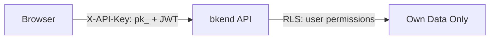
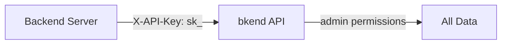

# Publishable Key vs Secret Key


Understand the differences between Publishable Key (`pk_`) and Secret Key (`sk_`) and how to use each one correctly.


## Overview

bkend provides two types of API keys. Each key has different usage environments and permissions, so make sure you use the right one for the right purpose. Both keys contain project ID and environment information, so no additional context headers are needed.

***

## Key Comparison

| Item | Publishable Key (`pk_`) | Secret Key (`sk_`) |
|------|------------------------|-------------------|
| **Environment** | Client (browser, mobile) | Server side only |
| **Permissions** | Limited access based on RLS | Full access (admin) |
| **Exposure Risk** | Low (protected by RLS) | High (full permissions) |
| **Use Case** | Frontend apps, mobile apps | Server-to-server communication, admin tasks |

***

## Publishable Key (`pk_`)

A key designed for use in client-side applications.

### Characteristics

- Safe to use in browser JavaScript and mobile apps
- **Access is restricted by RLS policies** (user/guest permissions)
- When used with a user JWT, grants `user` permissions
- When used without a JWT, grants `guest` permissions

### Usage Example

```javascript
// Using a Publishable Key on the frontend (guest permissions)
const response = await fetch('https://api-client.bkend.ai/v1/data/posts', {
  headers: {
    'X-API-Key': '{pk_publishable_key}',
  },
});

// Publishable Key + JWT (user permissions)
const response = await fetch('https://api-client.bkend.ai/v1/data/posts', {
  headers: {
    'X-API-Key': '{pk_publishable_key}',
    'Authorization': 'Bearer {accessToken}',
  },
});
```


It is safe to include Publishable Keys in your source code. RLS policies control data access.


***

## Secret Key (`sk_`)

A key intended exclusively for server-side use.

### Characteristics

- **Use only in server environments** (manage via environment variables)
- Grants `admin` permissions with full data access
- Bypasses RLS policies for unrestricted data queries
- Performs admin tasks such as API key management and user management

### Usage Example

```javascript
// Using a Secret Key on the server side
const response = await fetch('https://api-client.bkend.ai/v1/data/users', {
  headers: {
    'X-API-Key': process.env.BKEND_SECRET_KEY, // sk_xxx
  },
});
```


**Warning** -- Never include a Secret Key in client-side code. It can be exposed through browser DevTools or app decompilation.


***

## Usage Scenarios

### Frontend App (Publishable Key)



### Server Side (Secret Key)



### Recommended Patterns

| Scenario | Key to Use | Headers |
|----------|-----------|---------|
| React/Vue frontend | `pk_` + user JWT | `X-API-Key` + `Authorization` |
| Next.js API Routes | `sk_` | `X-API-Key` only |
| Mobile app | `pk_` + user JWT | `X-API-Key` + `Authorization` |
| Batch jobs / cron | `sk_` | `X-API-Key` only |
| Webhook handlers | `sk_` | `X-API-Key` only |

***

## Security Rules

### Rules You Must Follow

1. **Manage Secret Keys with environment variables**
2. **Never commit Secret Keys to Git** (add `.env` files to `.gitignore`)
3. **Use only Publishable Keys on the frontend**
4. **If a Secret Key is exposed, revoke it immediately and generate a new one**

***

## Next Steps

- [RLS Overview](04-rls-overview.md) -- Data access control when using Publishable Keys
- [API Key Management (Console)](../console/11-api-keys.md) -- Creating and managing keys
- [Security Best Practices](07-best-practices.md) -- Overall security recommendations
