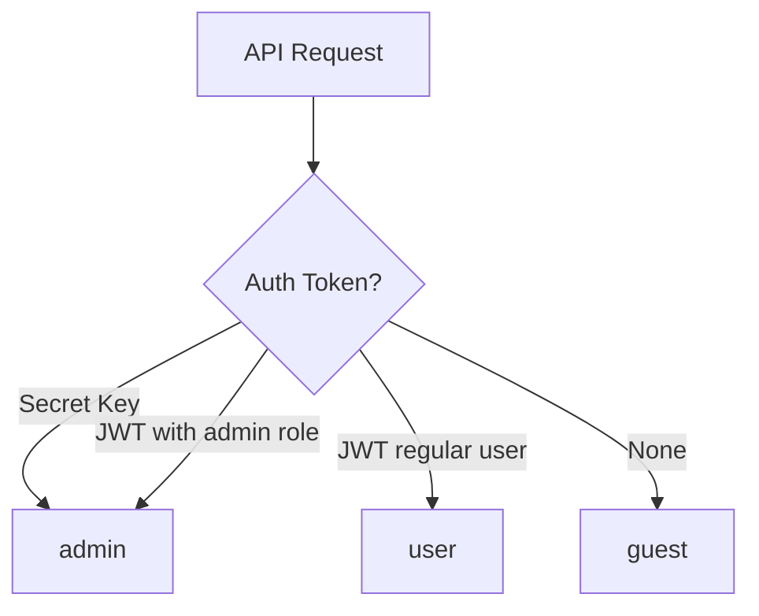

# Row Level Security Overview


Control access to your table data at a granular level with Row Level Security (RLS).


## Overview

RLS (Row Level Security) is a security mechanism that controls data access at the table level. You can configure create, read, update, delete, and list permissions for each user group.

***

## User Groups

bkend uses four user groups to manage permissions.

| Group | Description | How It's Determined |
|-------|-------------|-------------------|
| `admin` | Administrator | API key authentication (Secret Key) or admin role |
| `user` | Authenticated user | JWT token authentication |
| `guest` | Unauthenticated user | No authentication |
| `self` | Own data | Data where `createdBy` matches the requester |

### Group Determination Flow



***

## Permission Model

You can configure CRUD + List permissions per user group for each table.

### Permission Types

| Permission | Description | API |
|-----------|-------------|-----|
| `create` | Create data | `POST /v1/data/:tableName` |
| `read` | Read a single record | `GET /v1/data/:tableName/:id` |
| `update` | Update data | `PATCH /v1/data/:tableName/:id` |
| `delete` | Delete data | `DELETE /v1/data/:tableName/:id` |
| `list` | List records | `GET /v1/data/:tableName` |

### Default Permissions (When Not Configured)

| Group | create | read | update | delete | list |
|-------|:------:|:----:|:------:|:------:|:----:|
| `admin` | ✅ | ✅ | ✅ | ✅ | ✅ |
| `user` | ✅ | ✅ | ❌ | ❌ | ✅ |
| `guest` | ❌ | ✅ | ❌ | ❌ | ✅ |


The `admin` group always has full permissions. This cannot be restricted regardless of any configuration.


***

## Self Permissions

`self` permissions are special permissions that apply **only to data created by the requester**.

### How It Works

- Access is allowed when the data's `createdBy` field matches the requester's user ID
- When listing data with `self` permissions only, **the system automatically filters to show only the requester's data**

### Example

If you set `user` group to `update: false` and `self.update: true`:

- Other users' data: **cannot** update
- Data created by the requester: **can** update

***

## Permission Modes

bkend supports two permission modes. Both can be configured through the console or MCP tools.

| Mode | Description | Use Case |
|------|-------------|----------|
| **Boolean** | Per-group on/off switches for each CRUD operation | Simple access control |
| **Expression** | Rule-based expressions that combine groups and conditions | Fine-grained access control |


Both modes are fully compatible. If expression-based permissions are set, they take priority. Otherwise, the boolean permissions are used as a fallback.


### Expression-Based Permissions

Expression-based permissions let you write rules that combine multiple conditions. For example, you can allow access for the `user` group **or** the data owner in a single expression.

```text
group:user OR self
```

Common expressions:

| Expression | Meaning |
|-----------|---------|
| `group:user` | Allow authenticated users |
| `group:guest` | Allow unauthenticated users |
| `self` | Allow the data owner (where `createdBy` matches the requester) |
| `group:user OR self` | Allow authenticated users and the data owner |

> [Writing RLS Policies](05-rls-policies.md) -- Expression examples and configuration

***

## Column-Level Permissions

In addition to table-level CRUD permissions, you can configure per-field read/write permissions. This allows hiding sensitive fields from certain user groups or restricting who can modify specific fields.

> [Column-Level Permissions](05-rls-policies.md#column-level-permissions)

## Row Filters

Row filters automatically restrict which rows a user can access based on conditions. Unlike `self` permissions (which filter by `createdBy`), row filters support arbitrary field-based conditions.

> [Row Filters](05-rls-policies.md#row-filters)

***

## System Tables

Tables whose names start with `_` are system tables.


System tables are accessible only to the `admin` group by default. If no permissions are configured, `user` and `guest` access is blocked.


***

## Next Steps

- [Writing RLS Policies](05-rls-policies.md) -- Setting permissions per table
- [Publishable Key vs Secret Key](03-public-vs-secret.md) -- Permission differences by key type
- [Security Best Practices](07-best-practices.md) -- Recommended RLS configurations
