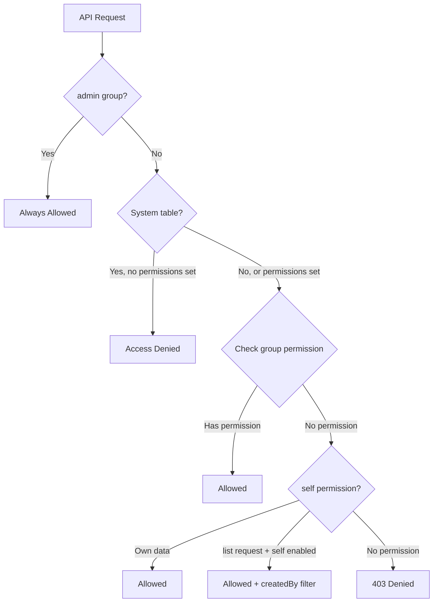
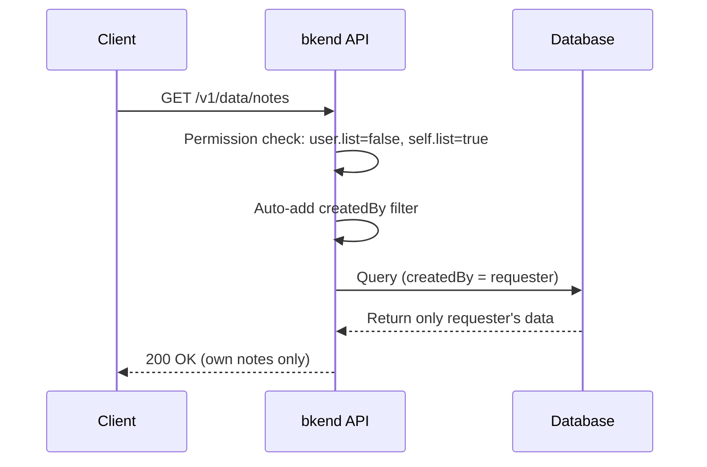

# Writing RLS Policies


Configure Row Level Security policies per table to control data access permissions.


## Overview

RLS policies are defined through a table's `permissions` configuration. You can specify create, read, update, delete, and list permissions individually for each user group (admin, user, guest), and use `self` permissions to grant additional access to the requester's own data.

***

## Policy Structure

### permissions JSON Format

```json
{
  "permissions": {
    "admin": {
      "create": true, "read": true, "update": true, "delete": true, "list": true
    },
    "user": {
      "create": true, "read": true, "update": false, "delete": false, "list": true
    },
    "guest": {
      "create": false, "read": true, "update": false, "delete": false, "list": true
    },
    "self": {
      "read": true, "update": true, "delete": true, "list": true
    }
  }
}
```

### Permission Fields

| Field | Description | Default (When Not Set) |
|-------|-------------|:---:|
| `create` | Create data | Varies by group |
| `read` | Read a single record | Varies by group |
| `update` | Update data | Varies by group |
| `delete` | Delete data | Varies by group |
| `list` | List records | Falls back to `read` value |


If `list` is not explicitly set, it falls back to the `read` permission value. Set `list` explicitly when you need separate control.


***

## Permission Check Flow



### Check Priority

1. **admin group** -- Always allowed for all operations (including system tables)
2. **System table check** -- Blocked if the table has a `_` prefix and no permissions are set
3. **Group permission check** -- Checks the permission of the relevant group (user/guest)
4. **self permission check** -- Allowed if the requester's ID matches the data's `createdBy`
5. **list + self permission** -- List requests with self permissions are allowed (automatic filter applied)

***

## Policy Examples

### Bulletin Board (Public Read, Author-Only Edit/Delete)

Everyone can read, but only the author can edit or delete their own posts.

```json
{
  "permissions": {
    "user": {
      "create": true, "read": true, "update": false, "delete": false, "list": true
    },
    "self": {
      "update": true, "delete": true
    },
    "guest": {
      "read": true, "list": true
    }
  }
}
```

**Behavior:**
- Authenticated users: Can create posts, view all posts, but can only edit/delete their own
- Unauthenticated users: Can only read and list

### Private Notes (Owner-Only Access)

Any authenticated user can create notes, but only the owner can view, edit, or delete them.

```json
{
  "permissions": {
    "user": {
      "create": true, "read": false, "update": false, "delete": false, "list": false
    },
    "self": {
      "read": true, "update": true, "delete": true, "list": true
    },
    "guest": {}
  }
}
```

**Behavior:**
- Authenticated users: Can create notes, can only view/edit/delete **their own notes**
- When listing, the `createdBy` filter is automatically applied so only the requester's notes are returned
- Unauthenticated users: All access is blocked

### Announcements (Admin-Only Write, Public Read)

Only admins can create announcements, but everyone can read them.

```json
{
  "permissions": {
    "user": {
      "create": false, "read": true, "list": true
    },
    "guest": {
      "read": true, "list": true
    }
  }
}
```

**Behavior:**
- Admin: Full permissions (no separate configuration needed)
- Authenticated users: Read and list only
- Unauthenticated users: Read and list only

### Order History (Owner-Only View, No Client-Side Creation)

Orders are created on the server, and users can only view their own orders.

```json
{
  "permissions": {
    "user": {
      "create": false, "read": false, "update": false, "delete": false, "list": false
    },
    "self": {
      "read": true, "list": true
    },
    "guest": {}
  }
}
```

**Behavior:**
- Admin (Secret Key): Creates and manages orders
- Authenticated users: Can only view their own orders (automatic filter)
- Create/update/delete operations are only available from the server side (Secret Key)

***

## Self Permissions in Detail

### Automatic Filter Behavior

When a user with only `self` permissions sends a **list** request, the system automatically adds a `createdBy = {requesterId}` filter.



### Self Permission Decision Criteria

| Condition | Result |
|-----------|--------|
| Group permission is `true` | Group permission takes priority (full data access) |
| Group permission is `false` + self permission is `true` | Self permission applies (own data only) |
| Both group and self permissions are `false` or not set | Access denied |


If the group permission is `true`, the self filter is not applied. To restrict access to only the requester's own data, you must set the group permission to `false`.


***

## How to Configure Policies

You can configure RLS policies through the **console** or **MCP tools**.



1. Navigate to **Project** > **Tables** in the console
2. Open the **Schema** editor for the target table
3. Configure CRUD permissions per group in the **Permissions** section
4. **Save** your changes

> [Table Management (Console)](../console/07-table-management.md)


Use natural language in your AI tool:

```text
"Allow only create, read, and list for the user group on the posts table,
and also allow update and delete for self"
```

> [Table Management Tools](../mcp/04-table-tools.md)



***

## Error Codes

| Error | HTTP | Description |
|-------|:----:|-------------|
| `PERMISSION_DENIED` | 403 | The group does not have permission for the requested operation |
| `SYSTEM_TABLE_ACCESS` | 403 | A non-admin attempted to access a system table |

***

## Next Steps

- [RLS Overview](04-rls-overview.md) -- User groups and default permissions
- [Data Encryption](06-data-encryption.md) -- Protecting stored data
- [Security Best Practices](07-best-practices.md) -- Recommended RLS configurations
