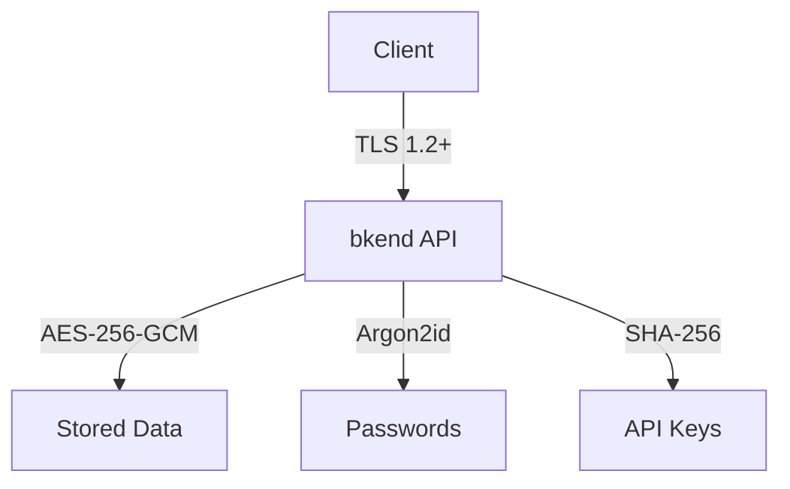

# Data Encryption


Understand bkend's multi-layered encryption approach to protecting your data.


## Overview

bkend applies encryption both in transit and at rest to protect your data. Additionally, application-level encryption is applied to sensitive data.

***

## In-Transit Encryption

All API communication is encrypted with TLS (Transport Layer Security).

| Item | Value |
|------|-------|
| **Protocol** | TLS 1.2 or higher |
| **Scope** | All API requests and responses |
| **Enforcement** | HTTP requests are redirected to HTTPS |
| **Certificates** | Auto-renewed |


If you send a request over HTTP (`http://`), it is automatically redirected to HTTPS (`https://`). Always use `https://api-client.bkend.ai`.


***

## At-Rest Encryption

### Database

| Layer | Method | Target |
|-------|--------|--------|
| **Infrastructure Encryption** | MongoDB Atlas Encryption at Rest | All stored data |
| **Application Encryption** | AES-256-GCM | Sensitive internal configuration data |

MongoDB Atlas automatically encrypts stored data. In addition, sensitive internal configuration data is double-encrypted at the application level using AES-256-GCM.

### File Storage

| Item | Value |
|------|-------|
| **Method** | AWS S3 server-side encryption |
| **Scope** | All uploaded files |

***

## Sensitive Data Handling

### Password Hashing

User passwords are hashed using the **Argon2id** algorithm. The original password is never stored.

| Item | Value |
|------|-------|
| **Algorithm** | Argon2id (OWASP top recommendation) |
| **Strength** | Exceeds OWASP minimum recommendations |


Argon2id is the top-recommended password hashing algorithm by the OWASP Password Storage Cheat Sheet. It uses memory-hard hashing that is resistant to GPU brute-force attacks, and is configured with parameters that exceed OWASP minimum recommendations.


### API Key Hashing

API keys are stored as **SHA-256** one-way hashes.

- Keys are generated using a **cryptographically secure random number generator (CSPRNG)**
- Keys are prefixed with `pk_` or `sk_` to distinguish key types
- The original key is displayed **only once** at creation
- Only the SHA-256 hash is stored on the server
- When a request is made, the transmitted key is hashed and compared against the stored hash

### Refresh Token

| Item | Value |
|------|-------|
| **Storage** | Stored per session |
| **Rotation** | Previous token is immediately invalidated on refresh |
| **Reuse Detection** | If an already-used refresh token is reused, all sessions are invalidated |

***

## Encryption Layer Summary

| Target | Encryption Method | One-Way |
|--------|------------------|:-------:|
| Network communication | TLS 1.2+ | -- |
| Database | MongoDB Atlas Encryption at Rest | -- |
| Sensitive internal configuration data | AES-256-GCM (application level) | -- |
| File storage | AWS S3 SSE | -- |
| Passwords | Argon2id | Yes |
| API keys | SHA-256 | Yes |

***

## Next Steps

- [Security Best Practices](07-best-practices.md) -- Security recommendations
- [Understanding API Keys](02-api-keys.md) -- API key security details
- [Security Overview](01-overview.md) -- Overall security architecture
