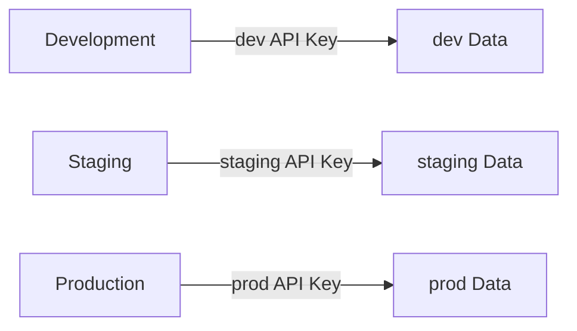

# Security Best Practices


💡 Review the security recommendations for using bkend safely.


## Overview

This document covers the security best practices you should follow when running a bkend project. It addresses six areas: API key management, authentication, data access control, file security, team management, and environment separation.

***

## API Key Management

| Recommendation | Description |
|---------------|-------------|
| **Use environment variables** | Manage Secret Keys through environment variables, not in source code |
| **Never commit to Git** | Add `.env` files to `.gitignore` |
| **Least privilege principle** | Grant only the necessary projects and scopes |
| **Set expiration times** | Limit key validity by setting expiration times when possible |
| **Revoke unused keys** | Revoke API keys that are no longer in use immediately |
| **Respond to exposure** | If a Secret Key is exposed, revoke it immediately and generate a new one |

### Key Usage Guidelines

| Environment | Key to Use |
|-------------|-----------|
| Frontend (browser, mobile) | **Publishable Key** + user JWT |
| Server side (API Routes, batch) | **Secret Key** |


🚨 **Warning** -- Including a Secret Key in client-side code exposes it through browser DevTools or app decompilation. Always use a Publishable Key on the frontend.


***

## Authentication Security

| Recommendation | Description |
|---------------|-------------|
| **Enforce HTTPS** | Use `https://` for all API communication |
| **Store tokens securely** | Browser: HttpOnly Cookie, Mobile: Secure Storage |
| **Never expose tokens** | Do not include tokens in URL parameters, logs, or source code |
| **Manage refresh tokens** | Save the new token immediately on refresh and discard the previous one |
| **Handle sign-out properly** | Delete tokens from both the server and client on sign-out |

### Token Storage Methods



```javascript
// Recommended: HttpOnly Cookie
// Set via the Set-Cookie header on the server

// Not recommended: localStorage (vulnerable to XSS attacks)
localStorage.setItem('token', jwt)  // Do not use this
```


```javascript
// Recommended: Platform-provided Secure Storage
// iOS: Keychain, Android: Keystore

// Not recommended: Plaintext storage like AsyncStorage
```



***

## Data Access Control (RLS)

| Recommendation | Description |
|---------------|-------------|
| **Set permissions per table** | Configure appropriate CRUD permissions for every table |
| **Use self permissions** | Protect personal data (notes, profiles, orders, etc.) with `self` permissions |
| **Minimize guest permissions** | Grant only public data read access to the `guest` group |
| **Be careful with create permissions** | Granting `create` to `guest` allows unauthenticated users to create data |
| **Review default permissions** | Default permissions apply when none are configured. Verify they match your intent |

### Default Permissions (When Not Configured)

| Group | create | read | update | delete | list |
|-------|:------:|:----:|:------:|:------:|:----:|
| `admin` | ✅ | ✅ | ✅ | ✅ | ✅ |
| `user` | ✅ | ✅ | ❌ | ❌ | ✅ |
| `guest` | ❌ | ✅ | ❌ | ❌ | ✅ |


⚠️ By default, `guest` has `read` and `list` enabled. For private tables, make sure to explicitly restrict `guest` permissions.


### Recommended Policy Patterns

| Scenario | user | self | guest |
|----------|------|------|-------|
| Public bulletin board | create, read, list | update, delete | read, list |
| Private notes | create | read, update, delete, list | (none) |
| Announcements | read, list | (none) | read, list |
| Order history | (none) | read, list | (none) |
| Public profiles | create, read, list | update | read, list |

***

## File Security

| Recommendation | Description |
|---------------|-------------|
| **Default to private uploads** | Upload sensitive files as `private` |
| **Limit presigned URL expiration** | Set the shortest possible expiration time |
| **Review public files** | CDN URLs never expire, so do not use them for sensitive files |
| **Set file size limits** | Configure upload size limits to prevent abuse |

***

## Team Management

| Recommendation | Description |
|---------------|-------------|
| **Assign minimum roles** | Grant team members only the minimum role they need |
| **Regular audits** | Review the team member list regularly |
| **Offboarding** | Remove members who have left the team immediately |
| **Separate API keys** | Have each team member use their own API key |

***

## Environment Separation

| Recommendation | Description |
|---------------|-------------|
| **Separate dev/prod** | Keep development and production environments separate |
| **Per-environment API keys** | Use separate API keys for each environment |
| **Production caution** | Do not use test data in the production environment |
| **Per-environment RLS** | Configure appropriate permission policies for each environment |




⚠️ Do not mix API keys across environments. Using a development key to access production data can lead to a security incident.


***

## Security Checklist

Verify the following before launching your project.

- [ ] Secret Key is not included in client-side code
- [ ] `.env` files are listed in `.gitignore`
- [ ] All tables have appropriate RLS permissions configured
- [ ] `guest` group permissions are minimized
- [ ] Sensitive files are uploaded as `private`
- [ ] Team member list and roles are up to date
- [ ] API keys are separated by environment
- [ ] Only HTTPS is used in the production environment

***

## Next Steps

- [Security API Reference](08-api-reference.md) -- Security-related API details
- [Writing RLS Policies](05-rls-policies.md) -- How to configure policies
- [Publishable Key vs Secret Key](03-public-vs-secret.md) -- Guide by key type
