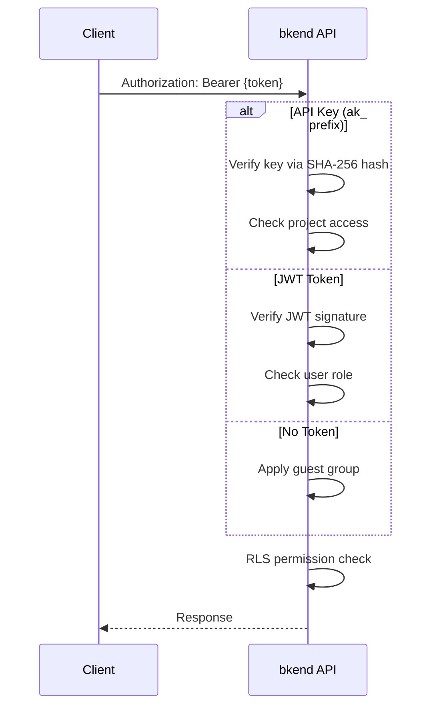

# Security REST API Reference


Review API authentication methods, headers, and error codes related to security.


## Overview

This document covers security-related aspects of the bkend REST API. It describes the authentication headers, permission model, and security error codes that apply to all API requests.

***

## Base URL

```text
https://api-client.bkend.ai
```

***

## Authentication Headers

### Required Headers

| Header | Required | Description |
|--------|:--------:|-------------|
| `X-Project-Id` | Yes | Project ID |
| `X-Environment` | Yes | Environment (`dev`, `staging`, `prod`) |

### Authentication Header (Optional)

| Header | Value | Result |
|--------|-------|--------|
| `Authorization: Bearer {api_key}` | API key (`ak_` prefix) | Permissions granted based on key type |
| `Authorization: Bearer {jwt}` | JWT token | User authenticated (user group) |
| (none) | -- | Unauthenticated (guest group) |

### API Key Authentication

```bash
curl -X GET https://api-client.bkend.ai/v1/data/{tableName} \
  -H "Authorization: Bearer ak_{your_api_key}" \
  -H "X-Project-Id: {project_id}" \
  -H "X-Environment: dev"
```

### JWT Authentication

```bash
curl -X GET https://api-client.bkend.ai/v1/data/{tableName} \
  -H "Authorization: Bearer {jwt_token}" \
  -H "X-Project-Id: {project_id}" \
  -H "X-Environment: dev"
```

***

## Authentication Flow



***

## User Group Determination

| Authentication | Condition | User Group |
|---------------|-----------|-----------|
| Secret Key | API key authentication | `admin` |
| Public Key + JWT | Organization admin role | `admin` |
| Public Key + JWT | Regular user | `user` |
| Public Key (no JWT) | -- | `guest` |
| No authentication | -- | `guest` |

***

## API Key Format

| Item | Value |
|------|-------|
| **Prefix** | `ak_` |
| **Format** | `ak_` + 64-char hex (32-byte random) |
| **Regex** | `^ak_[a-fA-F0-9]{64}$` |
| **Storage** | SHA-256 hash (original not stored) |

### Key Generation

API keys are generated from the **console**.

> [API Key Management (Console)](../console/11-api-keys.md)

***

## RLS Permission Check

### Default Permissions

These default permissions apply when no permissions are configured.

| Group | create | read | update | delete | list |
|-------|:------:|:----:|:------:|:------:|:----:|
| `admin` | ✅ | ✅ | ✅ | ✅ | ✅ |
| `user` | ✅ | ✅ | ❌ | ❌ | ✅ |
| `guest` | ❌ | ✅ | ❌ | ❌ | ✅ |

### Permission-to-API Mapping

| Permission | HTTP Method | Endpoint |
|-----------|-------------|----------|
| `create` | `POST` | `/v1/data/{tableName}` |
| `read` | `GET` | `/v1/data/{tableName}/{id}` |
| `update` | `PATCH` | `/v1/data/{tableName}/{id}` |
| `delete` | `DELETE` | `/v1/data/{tableName}/{id}` |
| `list` | `GET` | `/v1/data/{tableName}` |

### Self Permission Auto-Filter

When a user with only `self` permissions sends a list request, a `createdBy = {requesterId}` filter is automatically applied to the response.

***

## Security Error Codes

### Authentication Errors (401)

| Error Code | Description | Resolution |
|-----------|-------------|------------|
| `UNAUTHORIZED` | No authentication token provided | Add the `Authorization` header |
| `INVALID_TOKEN` | Invalid token format | Verify the token format (ak_ prefix or valid JWT) |
| `TOKEN_EXPIRED` | Token has expired | Issue a new token or refresh using a refresh token |
| `TOKEN_REVOKED` | API key has been revoked | Generate a new API key |

### Authentication Error Response Example

```json
{
  "statusCode": 401,
  "error": "UNAUTHORIZED",
  "message": "Authentication required"
}
```

### Authorization Errors (403)

| Error Code | Description | Resolution |
|-----------|-------------|------------|
| `PERMISSION_DENIED` | The group lacks permission | Check RLS policies or change the authentication method |
| `SYSTEM_TABLE_ACCESS` | System table access blocked | Use admin authentication (Secret Key) |

### Authorization Error Response Example

```json
{
  "statusCode": 403,
  "error": "PERMISSION_DENIED",
  "message": "The user group does not have delete permission"
}
```

### Project/Environment Errors

| Error Code | HTTP | Description | Resolution |
|-----------|:----:|-------------|------------|
| `PROJECT_NOT_FOUND` | 404 | Invalid project ID | Verify `X-Project-Id` |
| `ENVIRONMENT_NOT_FOUND` | 404 | Invalid environment | Verify `X-Environment` |
| `MISSING_PROJECT_ID` | 400 | Missing project ID header | Add the `X-Project-Id` header |

***


Use Secret Keys (`sk_`) only on the server side. Including them in client-side code (JavaScript bundles, mobile apps, etc.) creates an exposure risk.


## Rate Limiting

| Item | Value |
|------|-------|
| **Limit** | Varies by plan |
| **Headers** | `X-RateLimit-Limit`, `X-RateLimit-Remaining` |
| **When Exceeded** | `429 Too Many Requests` |

### Retry Handling

```javascript
async function fetchWithRetry(url, options, maxRetries = 3) {
  for (let i = 0; i < maxRetries; i++) {
    const response = await fetch(url, options);

    if (response.status === 429) {
      const retryAfter = response.headers.get('Retry-After') || '1';
      await new Promise(resolve =>
        setTimeout(resolve, parseInt(retryAfter) * 1000)
      );
      continue;
    }

    return response;
  }
  throw new Error('Rate limit exceeded after retries');
}
```

***

## Next Steps

- [Security Overview](01-overview.md) -- Overall security architecture
- [Understanding API Keys](02-api-keys.md) -- API key details
- [Writing RLS Policies](05-rls-policies.md) -- Configuring access permissions
- [Common Error Codes](../troubleshooting/01-common-errors.md) -- Full error code reference
