# Security REST API Reference


💡 Review API authentication methods, headers, and error codes related to security.


## Overview

This document covers security-related aspects of the bkend REST API. It describes the authentication headers, permission model, and security error codes that apply to all API requests.

***

## Base URL

```text
https://api-client.bkend.ai
```

***

## Authentication Headers

### Required Header

| Header | Required | Description |
|--------|:--------:|-------------|
| `X-API-Key` | Yes | Publishable Key (`pk_`) or Secret Key (`sk_`). Contains project ID and environment information |

### Authentication Header (Optional)

| Header | Value | Result |
|--------|-------|--------|
| `Authorization: Bearer {jwt}` | JWT token | User authenticated (user group) |
| (none) | -- | Unauthenticated (pk_ alone = guest group) |


💡 Since `pk_`/`sk_` keys contain project ID and environment information, the `X-Project-Id` and `X-Environment` headers are not needed.


### Publishable Key Authentication

```bash
# Public endpoint (pk_ alone)
curl -X GET https://api-client.bkend.ai/v1/data/{tableName} \
  -H "X-API-Key: {pk_publishable_key}"

# Authenticated endpoint (pk_ + JWT)
curl -X GET https://api-client.bkend.ai/v1/data/{tableName} \
  -H "X-API-Key: {pk_publishable_key}" \
  -H "Authorization: Bearer {accessToken}"
```

### Secret Key Authentication

```bash
# Server side (sk_ alone, admin permissions)
curl -X GET https://api-client.bkend.ai/v1/data/{tableName} \
  -H "X-API-Key: {sk_secret_key}"
```

***

## Authentication Flow

```mermaid
sequenceDiagram
    participant C as Client
    participant A as bkend API

    C->>A: X-API-Key: pk_/sk_ + (optional) Authorization: Bearer {jwt}
    alt Secret Key (sk_)
        A->>A: Verify key via SHA-256 hash
        A->>A: Grant admin permissions
    else Publishable Key (pk_) + JWT
        A->>A: Verify pk_ → identify project
        A->>A: Verify JWT signature → check user role
    else Publishable Key (pk_) alone
        A->>A: Verify pk_ → identify project
        A->>A: Apply guest group
    end
    A->>A: Scope check (API key)
    A->>A: RLS permission check
    A-->>C: Response
```



***

## User Group Determination

| Authentication | Condition | User Group |
|---------------|-----------|-----------|
| Secret Key (`sk_`) | -- | `admin` |
| Publishable Key (`pk_`) + JWT | Organization admin role | `admin` |
| Publishable Key (`pk_`) + JWT | Regular user | `user` |
| Publishable Key (`pk_`) alone | -- | `guest` |

***

## API Key Format

| Item | Publishable Key | Secret Key |
|------|----------------|------------|
| **Prefix** | `pk_` | `sk_` |
| **Format** | `pk_` + 64-char hex | `sk_` + 64-char hex |
| **Regex** | `^pk_[a-fA-F0-9]{64}$` | `^sk_[a-fA-F0-9]{64}$` |
| **Storage** | SHA-256 hash (original not stored) | SHA-256 hash (original not stored) |

### Key Generation

API keys are generated from the **console**.

> [API Key Management (Console)](../console/11-api-keys.md)

***

## RLS Permission Check

### Default Permissions

These default permissions apply when no permissions are configured.

| Group | create | read | update | delete | list |
|-------|:------:|:----:|:------:|:------:|:----:|
| `admin` | Yes | Yes | Yes | Yes | Yes |
| `user` | Yes | Yes | No | No | Yes |
| `guest` | No | Yes | No | No | Yes |

### Permission-to-API Mapping

| Permission | HTTP Method | Endpoint |
|-----------|-------------|----------|
| `create` | `POST` | `/v1/data/{tableName}` |
| `read` | `GET` | `/v1/data/{tableName}/{id}` |
| `update` | `PATCH` | `/v1/data/{tableName}/{id}` |
| `delete` | `DELETE` | `/v1/data/{tableName}/{id}` |
| `list` | `GET` | `/v1/data/{tableName}` |

### Self Permission Auto-Filter

When a user with only `self` permissions sends a list request, a `createdBy = {requesterId}` filter is automatically applied to the response.

***

## API Key Scope Check

When an API key has scopes configured, the scope is verified **before** the RLS permission check. This applies even to the `admin` group.

### Check Order


### Scope Error Response

```json
{
  "statusCode": 403,
  "error": "SCOPE_INSUFFICIENT",
  "message": "API Key scope does not include posts:delete"
}
```

***

## Security Error Codes

### Authentication Errors (401)

| Error Code | Description | Resolution |
|-----------|-------------|------------|
| `UNAUTHORIZED` | No authentication token provided | Add the `X-API-Key` header |
| `INVALID_TOKEN` | Invalid token format | Verify the token format (pk_/sk_ prefix or valid JWT) |
| `TOKEN_EXPIRED` | Token has expired | Issue a new token or refresh using a refresh token |
| `TOKEN_REVOKED` | API key has been revoked | Generate a new API key |

### Authentication Error Response Example

```json
{
  "statusCode": 401,
  "error": "UNAUTHORIZED",
  "message": "Authentication required"
}
```

### Authorization Errors (403)

| Error Code | Description | Resolution |
|-----------|-------------|------------|
| `PERMISSION_DENIED` | The group lacks permission | Check RLS policies or change the authentication method |
| `SCOPE_INSUFFICIENT` | API key scope does not include the operation | Add the required scope to the API key |
| `SYSTEM_TABLE_ACCESS` | System table access blocked | Use admin authentication (Secret Key) |
| `PROJECT_ACCESS_DENIED` | API key does not have access to this project | Verify the API key matches the target project |

### Authorization Error Response Example

```json
{
  "statusCode": 403,
  "error": "PERMISSION_DENIED",
  "message": "The user group does not have delete permission"
}
```

### Project/Environment Errors

| Error Code | HTTP | Description | Resolution |
|-----------|:----:|-------------|------------|
| `PROJECT_NOT_FOUND` | 404 | Invalid project in the API key | Verify you are using the correct API key |
| `ENVIRONMENT_NOT_FOUND` | 404 | Invalid environment in the API key | Verify you are using the correct environment's API key |

***


⚠️ Use Secret Keys (`sk_`) only on the server side. Including them in client-side code (JavaScript bundles, mobile apps, etc.) creates an exposure risk.


## Rate Limiting

| Item | Value |
|------|-------|
| **Limit** | Varies by plan |
| **Headers** | `X-RateLimit-Limit`, `X-RateLimit-Remaining` |
| **When Exceeded** | `429 Too Many Requests` |

### Retry Handling

```javascript
async function fetchWithRetry(url, options, maxRetries = 3) {
  for (let i = 0; i < maxRetries; i++) {
    const response = await fetch(url, options);

    if (response.status === 429) {
      const retryAfter = response.headers.get('Retry-After') || '1';
      await new Promise(resolve =>
        setTimeout(resolve, parseInt(retryAfter) * 1000)
      );
      continue;
    }

    return response;
  }
  throw new Error('Rate limit exceeded after retries');
}
```

***

## Next Steps

- [Security Overview](01-overview.md) -- Overall security architecture
- [Understanding API Keys](02-api-keys.md) -- API key details
- [Writing RLS Policies](05-rls-policies.md) -- Configuring access permissions
- [Common Error Codes](../troubleshooting/01-common-errors.md) -- Full error code reference
