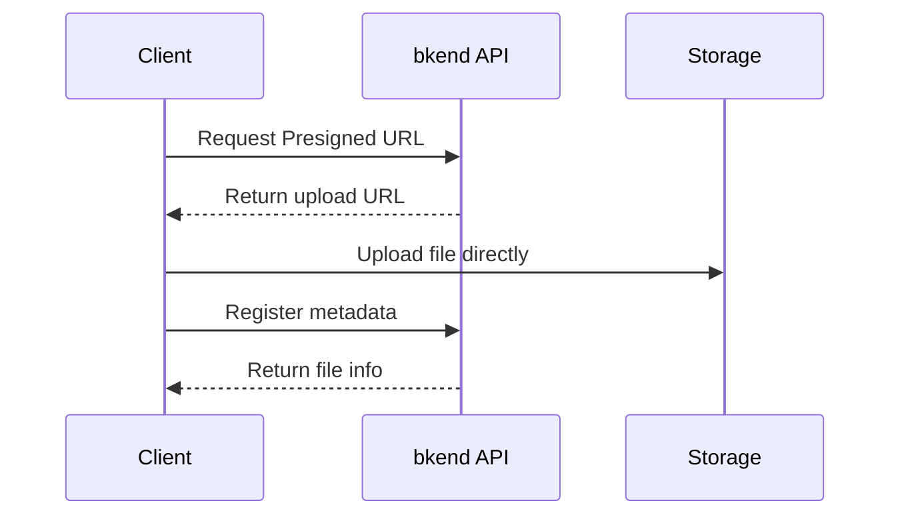
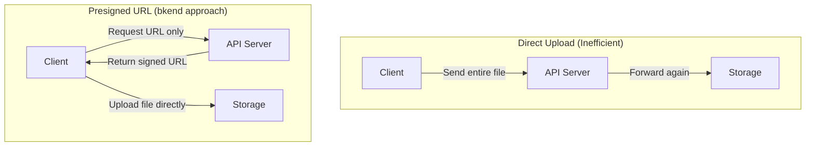
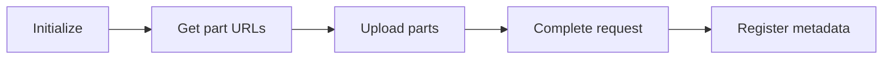

# Storage Overview


💡 Upload files and manage metadata with bkend storage.


## What Is Storage?

Use bkend file storage to safely upload and download profile photos, post images, and document files in your app. With the Presigned URL approach, files are stored directly in storage without passing through the server.

bkend storage is a service for uploading, downloading, and managing file metadata. A Presigned URL is a signed URL that is valid for a limited time, allowing clients to upload and download files directly to storage without going through the server. It uses Presigned URLs so clients upload files directly, while the metadata API handles file information.



***

## Key Features

### Presigned URL Upload

Files are uploaded directly to storage without passing through the bkend server. This allows efficient handling of large files without any server load.

#### Why Presigned URLs?

bkend does not send files directly to the API server (Direct Upload). Instead, it uses a **3-step Presigned URL pattern**. Here is why this approach was chosen.



| Benefit | Description |
|---------|-------------|
| **Security** | Files never pass through the API server, so file data is never exposed in server memory. Presigned URLs are valid only for a limited time, preventing unauthorized access. |
| **Performance** | Clients upload directly to storage, eliminating the bottleneck of the API server relaying file data. Upload speed is not limited by server bandwidth. |
| **Scalability** | The API server only handles URL issuance, so server resource usage remains minimal even when thousands of users upload files simultaneously. Large files (several GB) are handled without server load. |


💡 Presigned URLs expire after a certain period. Start the upload as soon as possible after obtaining the URL.


### Multipart Upload

Large files can be split into multiple parts and uploaded in parallel. If a part fails, you only need to retry that specific part.

### Metadata Management

You can manage file metadata separately, including file name, size, MIME type, category, and tags.

### Access Control

Set the access scope (`visibility`) per file to control public/private access.

| Visibility | Description |
|-----------|-------------|
| `public` | Accessible by anyone |
| `private` | Accessible only by the owner |
| `protected` | Accessible only by authenticated users |
| `shared` | Accessible only by designated users |

### Image Optimization CDN

`public` images can be resized, format-converted, and quality-adjusted via the `img.bkend.ai` CDN using just a URL. No API calls needed — simply construct the URL pattern to get optimized images.

```
https://img.bkend.ai/fit-in/300x200/filters:quality(80)/{filePath}
```

***

## File Categories

| Category | Description |
|----------|-------------|
| `images` | Image files |
| `documents` | Document files |
| `media` | Media (audio/video) |
| `attachments` | Attachment files |
| `exports` | Export files |
| `backups` | Backup files |
| `temp` | Temporary files |

***

## Upload Flow

### Single File Upload


1. `POST /v1/files/presigned-url` — Obtain upload URL
2. Upload file directly to storage (PUT)
3. `POST /v1/files` — Register metadata

### Multipart Upload (Large Files)



1. `POST /v1/files/multipart/init` — Initialize upload
2. `POST /v1/files/multipart/presigned-url` — Get URL per part
3. Upload each part to storage (PUT)
4. `POST /v1/files/multipart/complete` — Complete upload
5. `POST /v1/files` — Register metadata

***

## Required Headers

| Header | Required | Description |
|--------|:--------:|-------------|
| `X-API-Key` | ✅ | `{pk_publishable_key}` — Publishable Key |
| `Authorization` | ✅ | `Bearer {accessToken}` |
| `Content-Type` | Conditional | `application/json` — for POST and PATCH requests |

***

## In This Section

| Document | Description |
|----------|-------------|
| [Single File Upload](02-upload-single.md) | Upload files with Presigned URLs |
| [Large File Upload](03-upload-multipart.md) | Multipart upload |
| [File Metadata](04-file-metadata.md) | Register/view/edit metadata |
| [File List](05-file-list.md) | Filtering/sorting/pagination |
| [File Download](06-download.md) | Download with Presigned URLs |
| [File Deletion](07-file-delete.md) | Delete files |
| [File Access Permissions](08-permissions.md) | Visibility and owner control |
| [API Reference](09-api-reference.md) | Complete endpoint list |
| [File Upload App Patterns](10-upload-app-patterns.md) | Implement file upload in your app |
| [Image Optimization](11-image-optimization.md) | URL-based image resizing/format conversion |


💡 **Learn by doing**: See the [Cookbooks](../../cookbooks/README.md) for how to use image uploads in real-world projects.

