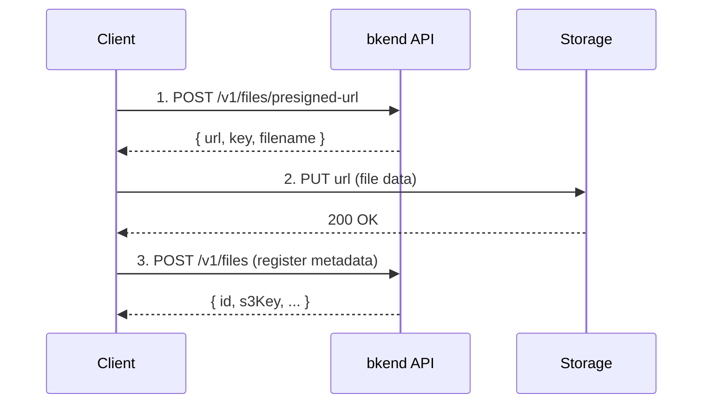

# Single File Upload


Obtain a Presigned URL and upload files directly to storage.



**Before you start** — You need the following to proceed:
- [Project creation](../getting-started/02-quickstart.md) completed
- User authentication completed (JWT token required — all file APIs require authentication)


**APIs used in this document:**

| Endpoint | Method | Auth | Description |
|----------|:------:|:----:|-------------|
| `/v1/files/presigned-url` | POST | JWT | Issue Presigned URL |

## Overview

A single file upload consists of 2 steps:

1. Obtain a **Presigned URL** from the bkend API.
2. **Upload the file directly** to storage using the issued URL.



***

## Step 1: Obtain a Presigned URL

### POST /v1/files/presigned-url



```bash
curl -X POST https://api-client.bkend.ai/v1/files/presigned-url \
  -H "Content-Type: application/json" \
  -H "X-API-Key: {pk_publishable_key}" \
  -H "Authorization: Bearer {accessToken}" \
  -d '{
    "filename": "profile.jpg",
    "contentType": "image/jpeg",
    "fileSize": 1048576,
    "visibility": "private",
    "category": "images"
  }'
```


```javascript
const response = await fetch('https://api-client.bkend.ai/v1/files/presigned-url', {
  method: 'POST',
  headers: {
    'Content-Type': 'application/json',
    'X-API-Key': '{pk_publishable_key}',
    'Authorization': `Bearer ${accessToken}`,
  },
  body: JSON.stringify({
    filename: 'profile.jpg',
    contentType: 'image/jpeg',
    fileSize: 1048576,
    visibility: 'private',
    category: 'images',
  }),
});

const { url, key, filename } = await response.json();
```



### Request Parameters

| Parameter | Type | Required | Description |
|-----------|------|:--------:|-------------|
| `filename` | `string` | ✅ | Original file name |
| `contentType` | `string` | ✅ | MIME type (e.g., `image/jpeg`, `application/pdf`) |
| `fileSize` | `number` | - | File size in bytes |
| `visibility` | `string` | - | `public`, `private` (default), `protected`, `shared` |
| `category` | `string` | - | `images`, `documents`, `media`, `attachments`, `exports`, `backups`, `temp` |

### Response (200 OK)

```json
{
  "url": "https://s3.amazonaws.com/bucket/...",
  "key": "{server_generated_key}",
  "filename": "profile.jpg",
  "contentType": "image/jpeg"
}
```

| Field | Type | Description |
|-------|------|-------------|
| `url` | `string` | Presigned URL (valid for 15 minutes) |
| `key` | `string` | File identifier key (used when registering metadata) |
| `filename` | `string` | Original file name |
| `contentType` | `string` | MIME type |


The Presigned URL is valid for **15 minutes** only. Complete the upload before it expires.


***

## Step 2: Upload to Storage

Upload the file directly using the issued `url`.

```javascript
// Upload file with Presigned URL
const uploadResponse = await fetch(url, {
  method: 'PUT',
  headers: {
    'Content-Type': contentType,
  },
  body: file, // File or Blob object
});

if (uploadResponse.ok) {
  console.log('Upload complete');
}
```

### Using with HTML File Input

```javascript
const fileInput = document.querySelector('input[type="file"]');
const file = fileInput.files[0];

// 1. Obtain Presigned URL
const presigned = await fetch('https://api-client.bkend.ai/v1/files/presigned-url', {
  method: 'POST',
  headers: {
    'Content-Type': 'application/json',
    'Authorization': `Bearer ${accessToken}`,
    'X-API-Key': '{pk_publishable_key}',
  },
  body: JSON.stringify({
    filename: file.name,
    contentType: file.type,
    fileSize: file.size,
    visibility: 'private',
    category: 'images',
  }),
}).then(res => res.json());

// 2. Upload file to storage
await fetch(presigned.url, {
  method: 'PUT',
  headers: { 'Content-Type': file.type },
  body: file,
});

// 3. Register metadata
const metadata = await fetch('https://api-client.bkend.ai/v1/files', {
  method: 'POST',
  headers: {
    'Content-Type': 'application/json',
    'Authorization': `Bearer ${accessToken}`,
    'X-API-Key': '{pk_publishable_key}',
  },
  body: JSON.stringify({
    s3Key: presigned.key,
    originalName: file.name,
    mimeType: file.type,
    size: file.size,
    visibility: 'private',
  }),
}).then(res => res.json());

console.log('File ID:', metadata.id);
```

***

## File Key

The `key` field in the API response is the file's unique key. Use this value as-is.


The file key is automatically generated by the server. Do not construct it manually.


***

## Error Responses

| Error Code | HTTP | Description |
|------------|:----:|-------------|
| `file/invalid-name` | 400 | Invalid file name |
| `file/file-too-large` | 400 | File size exceeded |
| `file/invalid-format` | 400 | Unsupported file format |
| `file/bucket-not-configured` | 500 | Storage bucket not configured |
| `common/authentication-required` | 401 | Authentication required |

***

## Using in Your App

The `bkendFetch` helper automatically includes the required headers.

```javascript
import { bkendFetch } from './bkend.js';

async function uploadFile(file) {
  // 1. Obtain Presigned URL
  const presigned = await bkendFetch('/v1/files/presigned-url', {
    method: 'POST',
    body: {
      filename: file.name,
      contentType: file.type,
      fileSize: file.size,
      visibility: 'private',
      category: 'images',
    },
  });

  // 2. Upload file to storage (do not use bkendFetch — no Authorization header needed)
  await fetch(presigned.url, {
    method: 'PUT',
    headers: { 'Content-Type': file.type },
    body: file,
  });

  // 3. Register metadata
  const metadata = await bkendFetch('/v1/files', {
    method: 'POST',
    body: {
      s3Key: presigned.key,
      originalName: file.name,
      mimeType: file.type,
      size: file.size,
      visibility: 'private',
    },
  });

  return metadata; // { id, s3Key, ... }
}

// Using with HTML file input
const fileInput = document.querySelector('input[type="file"]');
fileInput.addEventListener('change', async (e) => {
  const file = e.target.files[0];
  const result = await uploadFile(file);
  console.log('Upload complete:', result.id);
});
```


For `bkendFetch` setup, see [Integrating bkend with Your App](../getting-started/03-app-integration.md).


***

## Next Steps

- [Large File Upload](03-upload-multipart.md) — Multipart upload
- [File Metadata](04-file-metadata.md) — Register/manage metadata
- [File Access Permissions](08-permissions.md) — Visibility settings
