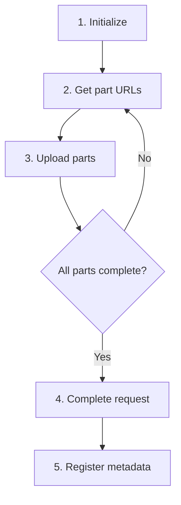

# Large File Upload (Multipart)


Split large files into multiple parts and upload them in parallel.



**Before you start** — You need the following to proceed:
- [Project creation](../getting-started/02-quickstart.md) completed
- User authentication completed (JWT token required — all file APIs require authentication)


**APIs used in this document:**

| Endpoint | Method | Auth | Description |
|----------|:------:|:----:|-------------|
| `/v1/files/multipart/init` | POST | JWT | Initialize multipart upload |
| `/v1/files/multipart/presigned-url` | POST | JWT | Issue part URL |
| `/v1/files/multipart/complete` | POST | JWT | Complete multipart upload |
| `/v1/files/multipart/abort` | POST | JWT | Abort multipart upload |

## Overview

Multipart upload splits a large file into multiple chunks (parts) for uploading. Parts can be uploaded in parallel, and only failed parts need to be retried.



***

## Step 1: Initialize Upload

### POST /v1/files/multipart/init

```bash
curl -X POST https://api-client.bkend.ai/v1/files/multipart/init \
  -H "Content-Type: application/json" \
  -H "X-API-Key: {pk_publishable_key}" \
  -H "Authorization: Bearer {accessToken}" \
  -d '{
    "filename": "video.mp4",
    "contentType": "video/mp4",
    "fileSize": 104857600,
    "visibility": "private",
    "category": "media"
  }'
```

### Request Parameters

| Parameter | Type | Required | Description |
|-----------|------|:--------:|-------------|
| `filename` | `string` | ✅ | Original file name |
| `contentType` | `string` | ✅ | MIME type |
| `fileSize` | `number` | ✅ | Total file size in bytes |
| `visibility` | `string` | - | `public`, `private` (default), `protected`, `shared` |
| `category` | `string` | - | File category |

### Response (200 OK)

```json
{
  "uploadId": "multipart-upload-id",
  "key": "files/a1b2c3d4/video.mp4",
  "filename": "video.mp4"
}
```

***

## Step 2: Get Part URLs

### POST /v1/files/multipart/presigned-url

Obtain an upload URL for each part.

```bash
curl -X POST https://api-client.bkend.ai/v1/files/multipart/presigned-url \
  -H "Content-Type: application/json" \
  -H "X-API-Key: {pk_publishable_key}" \
  -H "Authorization: Bearer {accessToken}" \
  -d '{
    "key": "{key from init response}",
    "uploadId": "multipart-upload-id",
    "partNumber": 1
  }'
```

### Request Parameters

| Parameter | Type | Required | Description |
|-----------|------|:--------:|-------------|
| `key` | `string` | ✅ | File key from init response |
| `uploadId` | `string` | ✅ | Upload ID from init response |
| `partNumber` | `number` | ✅ | Part number (1–10000) |

### Response (200 OK)

```json
{
  "url": "https://s3.amazonaws.com/bucket/...?partNumber=1&uploadId=...",
  "partNumber": 1
}
```

***

## Step 3: Upload Parts

Upload file chunks to storage using the issued URLs. Save the `ETag` header from the response.

```javascript
const response = await fetch(partUrl, {
  method: 'PUT',
  body: partData,
});

const etag = response.headers.get('ETag');
// etag: "\"abc123def456\"" — needed for the completion step
```

***

## Step 4: Complete Upload

### POST /v1/files/multipart/complete

Once all parts are uploaded, send the completion request.

```bash
curl -X POST https://api-client.bkend.ai/v1/files/multipart/complete \
  -H "Content-Type: application/json" \
  -H "X-API-Key: {pk_publishable_key}" \
  -H "Authorization: Bearer {accessToken}" \
  -d '{
    "key": "{key from init response}",
    "uploadId": "multipart-upload-id",
    "parts": [
      { "partNumber": 1, "etag": "\"abc123\"" },
      { "partNumber": 2, "etag": "\"def456\"" },
      { "partNumber": 3, "etag": "\"ghi789\"" }
    ]
  }'
```

### Request Parameters

| Parameter | Type | Required | Description |
|-----------|------|:--------:|-------------|
| `key` | `string` | ✅ | File key |
| `uploadId` | `string` | ✅ | Upload ID |
| `parts` | `array` | ✅ | List of uploaded parts |
| `parts[].partNumber` | `number` | ✅ | Part number |
| `parts[].etag` | `string` | ✅ | ETag from storage response |

### Response (200 OK)

```json
{
  "key": "files/a1b2c3d4/video.mp4",
  "location": "https://s3.amazonaws.com/bucket/..."
}
```

***

## Abort Upload

Send an abort request if you need to cancel the upload.

### POST /v1/files/multipart/abort

```bash
curl -X POST https://api-client.bkend.ai/v1/files/multipart/abort \
  -H "Content-Type: application/json" \
  -H "X-API-Key: {pk_publishable_key}" \
  -H "Authorization: Bearer {accessToken}" \
  -d '{
    "key": "{key from init response}",
    "uploadId": "multipart-upload-id"
  }'
```

### Response (200 OK)

```json
{
  "success": true,
  "key": "files/a1b2c3d4/video.mp4"
}
```

***

## Full Implementation Example

```javascript
const PART_SIZE = 10 * 1024 * 1024; // 10MB

async function multipartUpload(file, accessToken) {
  // 1. Initialize
  const initRes = await fetch('https://api-client.bkend.ai/v1/files/multipart/init', {
    method: 'POST',
    headers: {
      'Content-Type': 'application/json',
      'X-API-Key': '{pk_publishable_key}',
      'Authorization': `Bearer ${accessToken}`,
    },
    body: JSON.stringify({
      filename: file.name,
      contentType: file.type,
      fileSize: file.size,
    }),
  }).then(res => res.json());

  const { uploadId, key } = initRes;
  const totalParts = Math.ceil(file.size / PART_SIZE);
  const parts = [];

  // 2-3. Get part URLs + upload
  for (let i = 0; i < totalParts; i++) {
    const start = i * PART_SIZE;
    const end = Math.min(start + PART_SIZE, file.size);
    const partNumber = i + 1;

    // Get URL
    const urlRes = await fetch('https://api-client.bkend.ai/v1/files/multipart/presigned-url', {
      method: 'POST',
      headers: {
        'Content-Type': 'application/json',
        'X-API-Key': '{pk_publishable_key}',
        'Authorization': `Bearer ${accessToken}`,
      },
      body: JSON.stringify({ key, uploadId, partNumber }),
    }).then(res => res.json());

    // Upload part
    const partData = file.slice(start, end);
    const uploadRes = await fetch(urlRes.url, {
      method: 'PUT',
      body: partData,
    });

    parts.push({
      partNumber,
      etag: uploadRes.headers.get('ETag'),
    });
  }

  // 4. Complete
  const completeRes = await fetch('https://api-client.bkend.ai/v1/files/multipart/complete', {
    method: 'POST',
    headers: {
      'Content-Type': 'application/json',
      'X-API-Key': '{pk_publishable_key}',
      'Authorization': `Bearer ${accessToken}`,
    },
    body: JSON.stringify({ key, uploadId, parts }),
  }).then(res => res.json());

  return { key: completeRes.key };
}
```

***

## Error Responses

| Error Code | HTTP | Description |
|------------|:----:|-------------|
| `file/upload-init-failed` | 500 | Initialization failed |
| `file/invalid-part-number-range` | 400 | Part number outside 1–10000 range |
| `file/invalid-parts-array` | 400 | Invalid parts array |
| `file/file-too-large` | 400 | File size exceeded |
| `common/authentication-required` | 401 | Authentication required |

***

## Using in Your App

The `bkendFetch` helper automatically includes the required headers.

```javascript
import { bkendFetch } from './bkend.js';

const PART_SIZE = 10 * 1024 * 1024; // 10MB

async function multipartUpload(file) {
  // 1. Initialize
  const { uploadId, key } = await bkendFetch('/v1/files/multipart/init', {
    method: 'POST',
    body: {
      filename: file.name,
      contentType: file.type,
      fileSize: file.size,
      visibility: 'private',
      category: 'media',
    },
  });

  const totalParts = Math.ceil(file.size / PART_SIZE);
  const parts = [];

  // 2-3. Get part URLs + upload
  for (let i = 0; i < totalParts; i++) {
    const start = i * PART_SIZE;
    const end = Math.min(start + PART_SIZE, file.size);
    const partNumber = i + 1;

    // Get URL
    const { url } = await bkendFetch('/v1/files/multipart/presigned-url', {
      method: 'POST',
      body: { key, uploadId, partNumber },
    });

    // Upload part (do not use bkendFetch — no Authorization header needed)
    const partData = file.slice(start, end);
    const uploadRes = await fetch(url, {
      method: 'PUT',
      body: partData,
    });

    parts.push({
      partNumber,
      etag: uploadRes.headers.get('ETag'),
    });
  }

  // 4. Complete
  const result = await bkendFetch('/v1/files/multipart/complete', {
    method: 'POST',
    body: { key, uploadId, parts },
  });

  return result; // { key, location }
}

// Using with HTML file input
const fileInput = document.querySelector('input[type="file"]');
fileInput.addEventListener('change', async (e) => {
  const file = e.target.files[0];

  if (file.size > 10 * 1024 * 1024) {
    // Use multipart upload for files over 10MB
    const result = await multipartUpload(file);
    console.log('Multipart upload complete:', result.key);
  }
});
```


For `bkendFetch` setup, see [Integrating bkend with Your App](../getting-started/03-app-integration.md).


***

## Next Steps

- [File Metadata](04-file-metadata.md) — Register metadata after upload
- [Single File Upload](02-upload-single.md) — Upload small files
- [File Access Permissions](08-permissions.md) — Visibility settings
