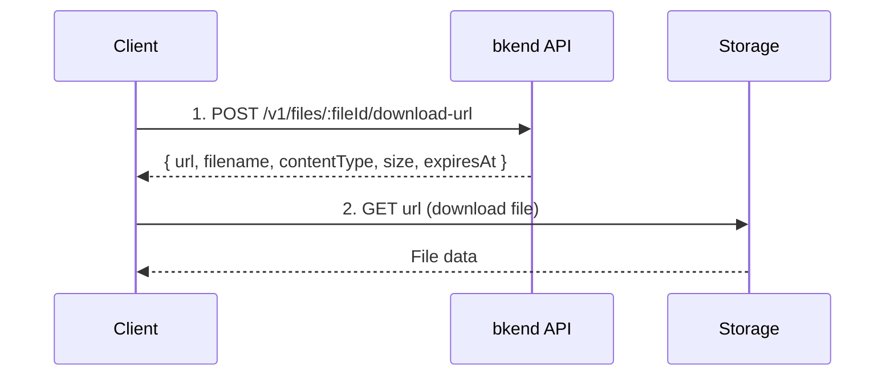

# File Download


Obtain a Presigned URL to download files.



**Before you start** — You need the following to proceed:
- [Project creation](../getting-started/02-quickstart.md) completed
- User authentication completed (JWT token required — all file APIs require authentication)


**APIs used in this document:**

| Endpoint | Method | Auth | Description |
|----------|:------:|:----:|-------------|
| `/v1/files/:fileId/download-url` | POST | JWT | Issue download URL |

## Overview

File downloads also use the Presigned URL approach, just like uploads. You obtain a time-limited download URL from the bkend API and download the file directly from storage.



***

## Obtain Download URL

### POST /v1/files/:fileId/download-url



```bash
curl -X POST https://api-client.bkend.ai/v1/files/{fileId}/download-url \
  -H "X-API-Key: {pk_publishable_key}" \
  -H "Authorization: Bearer {accessToken}"
```


```javascript
const response = await fetch(`https://api-client.bkend.ai/v1/files/${fileId}/download-url`, {
  method: 'POST',
  headers: {
    'Authorization': `Bearer ${accessToken}`,
    'X-API-Key': '{pk_publishable_key}',
  },
});

const { url, filename, contentType, size, expiresAt } = await response.json();
```



### Path Parameters

| Parameter | Type | Required | Description |
|-----------|------|:--------:|-------------|
| `fileId` | `string` | ✅ | File ID |

### Response (200 OK)

```json
{
  "url": "https://s3.amazonaws.com/bucket/...",
  "filename": "profile.jpg",
  "contentType": "image/jpeg",
  "size": 1048576,
  "expiresAt": "2025-01-15T11:30:00.000Z"
}
```

| Field | Type | Description |
|-------|------|-------------|
| `url` | `string` | Presigned URL |
| `filename` | `string` | Original file name |
| `contentType` | `string` | MIME type |
| `size` | `number` | File size in bytes |
| `expiresAt` | `string` | URL expiration time (ISO 8601) |


Download URLs have an expiration time. Start the download before `expiresAt`.


***

## Download Implementation

### Browser Download

```javascript
async function downloadFile(fileId, accessToken) {
  // 1. Obtain download URL
  const res = await fetch(`https://api-client.bkend.ai/v1/files/${fileId}/download-url`, {
    method: 'POST',
    headers: {
      'Authorization': `Bearer ${accessToken}`,
      'X-API-Key': '{pk_publishable_key}',
    },
  });

  const { url, filename } = await res.json();

  // 2. Trigger download
  const link = document.createElement('a');
  link.href = url;
  link.download = filename;
  link.click();
}
```

### Programmatic Download

```javascript
async function downloadToBlob(fileId, accessToken) {
  const res = await fetch(`https://api-client.bkend.ai/v1/files/${fileId}/download-url`, {
    method: 'POST',
    headers: {
      'Authorization': `Bearer ${accessToken}`,
      'X-API-Key': '{pk_publishable_key}',
    },
  });

  const { url, contentType } = await res.json();

  // Fetch file data from storage
  const fileRes = await fetch(url);
  const blob = await fileRes.blob();

  return blob;
}
```

***

## Error Responses

| Error Code | HTTP | Description |
|------------|:----:|-------------|
| `file/not-found` | 404 | File not found |
| `file/access-denied` | 403 | Access denied |
| `common/authentication-required` | 401 | Authentication required |

***

## Using in Your App

The `bkendFetch` helper automatically includes the required headers.

```javascript
import { bkendFetch } from './bkend.js';

// Browser download
async function downloadFile(fileId) {
  // 1. Obtain download URL
  const { url, filename } = await bkendFetch(`/v1/files/${fileId}/download-url`, {
    method: 'POST',
  });

  // 2. Trigger download
  const link = document.createElement('a');
  link.href = url;
  link.download = filename;
  link.click();
}

// Programmatic download (fetch as Blob)
async function downloadToBlob(fileId) {
  // 1. Obtain download URL
  const { url, contentType } = await bkendFetch(`/v1/files/${fileId}/download-url`, {
    method: 'POST',
  });

  // 2. Fetch file data from storage (do not use bkendFetch — no Authorization header needed)
  const fileRes = await fetch(url);
  const blob = await fileRes.blob();

  return blob;
}

// Image preview
async function previewImage(fileId, imgElement) {
  const blob = await downloadToBlob(fileId);
  const objectUrl = URL.createObjectURL(blob);

  imgElement.src = objectUrl;

  // Clean up memory
  imgElement.onload = () => URL.revokeObjectURL(objectUrl);
}

// Usage example
const fileId = 'file-uuid-1234';
await downloadFile(fileId); // Browser download

// Or image preview
const img = document.querySelector('#preview');
await previewImage(fileId, img);
```


For `bkendFetch` setup, see [Integrating bkend with Your App](../getting-started/03-app-integration.md).


***

## Next Steps

- [File List](05-file-list.md) — Search for files to download
- [File Access Permissions](08-permissions.md) — Configure download permissions
- [Single File Upload](02-upload-single.md) — Upload files
