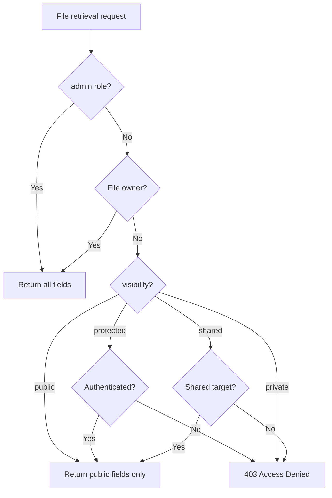

# File Access Permissions


Understand visibility-based and owner-based access control for files.


## Overview

bkend storage provides access control based on **Visibility** (access scope) and **Owner**. Set the visibility when uploading a file, and only the owner can access private files.

***

## Visibility

Determines the access scope of a file.

| Visibility | Description | Accessible By |
|-----------|-------------|---------------|
| `public` | Public | All users |
| `private` | Private (default) | Owner, admin |
| `protected` | Protected | Authenticated users |
| `shared` | Shared | Designated users |

### Setting Visibility

Set visibility during file upload or by updating metadata.

```javascript
// Set during upload
const presigned = await fetch('https://api-client.bkend.ai/v1/files/presigned-url', {
  method: 'POST',
  headers: {
    'Content-Type': 'application/json',
    'X-API-Key': '{pk_publishable_key}',
    'Authorization': `Bearer ${accessToken}`,
  },
  body: JSON.stringify({
    filename: 'document.pdf',
    contentType: 'application/pdf',
    visibility: 'protected', // Accessible only by authenticated users
  }),
}).then(res => res.json());
```

### Changing Visibility

```bash
curl -X PATCH https://api-client.bkend.ai/v1/files/{fileId} \
  -H "Content-Type: application/json" \
  -H "X-API-Key: {pk_publishable_key}" \
  -H "Authorization: Bearer {accessToken}" \
  -d '{
    "visibility": "public"
  }'
```

***

## Owner

Owner information is automatically set when registering file metadata.

### Owner Types

| Type | Description |
|------|-------------|
| `user` | Authenticated user (default) |
| `session` | Session-based |
| `service` | Service account |
| `public` | Public (no owner) |

***

## Access Control Rules

### File Retrieval



### File Modification/Deletion

| Action | admin | Owner | Non-owner |
|--------|:-----:|:-----:|:---------:|
| View | ✅ All fields | ✅ All fields | Depends on visibility |
| Edit | ✅ | ✅ | ❌ |
| Delete | ✅ | ✅ | ❌ |

***

## RLS on List Queries

RLS (Row Level Security) is automatically applied when listing files (`GET /v1/files`).

| User | Visible Scope |
|------|---------------|
| `admin` | All files |
| Authenticated user | Own files + public/protected files |
| Unauthenticated user | Public files only |

***

## Usage Patterns

### Profile Image (Public)

```javascript
// Set profile images to public so anyone can view them
await uploadFile({
  filename: 'avatar.jpg',
  contentType: 'image/jpeg',
  visibility: 'public',
  category: 'images',
});
```

### Personal Document (Private)

```javascript
// Set personal documents to private so only the owner can access them
await uploadFile({
  filename: 'report.pdf',
  contentType: 'application/pdf',
  visibility: 'private',
  category: 'documents',
});
```

### Team Shared File (Authenticated Users)

```javascript
// Set team files to protected so only authenticated users can access them
await uploadFile({
  filename: 'meeting-notes.docx',
  contentType: 'application/vnd.openxmlformats-officedocument.wordprocessingml.document',
  visibility: 'protected',
  category: 'documents',
});
```

***


Files uploaded with `public` visibility are accessible to anyone who knows the URL. Always set sensitive files to `private`.


## Next Steps

- [File Metadata](04-file-metadata.md) — Change visibility settings
- [File List](05-file-list.md) — Filter by visibility
- [Security Best Practices](../security/07-best-practices.md) — File security recommendations
