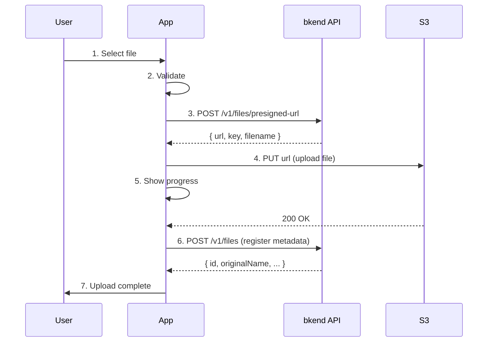

# File Upload App Patterns


Learn patterns for implementing file upload functionality in your app, from file selection to upload, progress display, and previews.


## Overview

This guide explains how to implement file upload functionality using the bkend storage API. Since files are uploaded directly to S3 via Presigned URLs, even large files can be handled reliably.




If you have not set up `bkendFetch` yet, see [Integrating bkend with Your App](../getting-started/03-app-integration.md) first.


***

## Overall Flow

File upload consists of 3 API calls.

| Step | Method | Endpoint | Description |
|:----:|:------:|----------|-------------|
| 1 | `POST` | `/v1/files/presigned-url` | Obtain Presigned URL |
| 2 | `PUT` | Issued S3 URL | Upload file directly to S3 |
| 3 | `POST` | `/v1/files` | Register metadata with bkend |


Presigned URLs are valid for **15 minutes** only. Complete the upload before they expire.


***

## 1. File Selection UI

### Basic File Input

```html
<div id="uploadArea">
  <input type="file" id="fileInput" accept="image/*,.pdf,.doc,.docx" />
  <div id="preview" style="display:none">
    
    <p id="fileInfo"></p>
  </div>
  <button id="uploadBtn" disabled>Upload</button>
  <div id="progress" style="display:none">
    <progress id="progressBar" max="100" value="0"></progress>
    <span id="progressText">0%</span>
  </div>
</div>
```

### File Selection Event

```javascript
const fileInput = document.getElementById('fileInput');
const uploadBtn = document.getElementById('uploadBtn');

fileInput.addEventListener('change', (e) => {
  const file = e.target.files[0];
  if (!file) return;

  // Validate
  if (!validateFile(file)) return;

  // Image preview
  if (file.type.startsWith('image/')) {
    showPreview(file);
  }

  // Show file info
  document.getElementById('fileInfo').textContent =
    `${file.name} (${formatFileSize(file.size)})`;
  document.getElementById('preview').style.display = 'block';
  uploadBtn.disabled = false;
});
```

***

## 2. File Validation

Validate file size and format on the client side before uploading.

```javascript
const MAX_FILE_SIZE = 50 * 1024 * 1024; // 50MB
const ALLOWED_TYPES = [
  'image/jpeg',
  'image/png',
  'image/gif',
  'image/webp',
  'application/pdf',
  'application/msword',
  'application/vnd.openxmlformats-officedocument.wordprocessingml.document',
];

function validateFile(file) {
  if (file.size > MAX_FILE_SIZE) {
    alert(`File size exceeds ${formatFileSize(MAX_FILE_SIZE)}.`);
    return false;
  }

  if (!ALLOWED_TYPES.includes(file.type)) {
    alert('Unsupported file format.');
    return false;
  }

  return true;
}

function formatFileSize(bytes) {
  if (bytes < 1024) return `${bytes}B`;
  if (bytes < 1024 * 1024) return `${(bytes / 1024).toFixed(1)}KB`;
  return `${(bytes / (1024 * 1024)).toFixed(1)}MB`;
}
```

***

## 3. Upload Implementation

### 3-Step Upload Function

```javascript
async function uploadFile(file) {
  const progressBar = document.getElementById('progressBar');
  const progressText = document.getElementById('progressText');
  document.getElementById('progress').style.display = 'block';
  uploadBtn.disabled = true;

  try {
    // Step 1: Obtain Presigned URL
    updateProgress(10, 'Getting URL...');
    const presigned = await bkendFetch('/v1/files/presigned-url', {
      method: 'POST',
      body: JSON.stringify({
        filename: file.name,
        contentType: file.type,
        fileSize: file.size,
        visibility: 'private',
      }),
    });

    // Step 2: Upload file to S3
    updateProgress(30, 'Uploading...');
    await uploadToS3(presigned.url, file, (percent) => {
      const adjusted = 30 + Math.round(percent * 0.6); // 30~90%
      updateProgress(adjusted, `Uploading... ${adjusted}%`);
    });

    // Step 3: Register metadata
    updateProgress(90, 'Registering...');
    const metadata = await bkendFetch('/v1/files', {
      method: 'POST',
      body: JSON.stringify({
        s3Key: presigned.key,
        originalName: file.name,
        mimeType: file.type,
        size: file.size,
        visibility: 'private',
      }),
    });

    updateProgress(100, 'Done');
    return metadata;
  } catch (error) {
    handleUploadError(error);
    throw error;
  } finally {
    uploadBtn.disabled = false;
  }
}

function updateProgress(percent, text) {
  document.getElementById('progressBar').value = percent;
  document.getElementById('progressText').textContent = text;
}
```

### S3 Upload (with Progress Tracking)

Use `XMLHttpRequest` to track upload progress.

```javascript
function uploadToS3(url, file, onProgress) {
  return new Promise((resolve, reject) => {
    const xhr = new XMLHttpRequest();

    xhr.upload.addEventListener('progress', (e) => {
      if (e.lengthComputable) {
        const percent = Math.round((e.loaded / e.total) * 100);
        onProgress(percent);
      }
    });

    xhr.addEventListener('load', () => {
      if (xhr.status >= 200 && xhr.status < 300) {
        resolve();
      } else {
        reject(new Error(`S3 upload failed: ${xhr.status}`));
      }
    });

    xhr.addEventListener('error', () => {
      reject(new Error('A network error occurred.'));
    });

    xhr.open('PUT', url);
    xhr.setRequestHeader('Content-Type', file.type);
    xhr.send(file);
  });
}
```


Do not include the `Authorization` header when uploading to an S3 Presigned URL. The Presigned URL itself contains the authentication information.


### Connect the Upload Button

```javascript
document.getElementById('uploadBtn').addEventListener('click', async () => {
  const file = fileInput.files[0];
  if (!file) return;

  const result = await uploadFile(file);
  console.log('Uploaded file ID:', result.id);
});
```

***

## 4. Image Preview

Show a preview when the user selects an image file.

```javascript
function showPreview(file) {
  const reader = new FileReader();

  reader.onload = (e) => {
    const img = document.getElementById('previewImage');
    img.src = e.target.result;
    img.style.maxWidth = '300px';
    img.style.maxHeight = '200px';
  };

  reader.readAsDataURL(file);
}
```

### Preview After Upload (Using Download URL)

Display uploaded files by obtaining a download URL.

```javascript
async function showUploadedImage(fileId) {
  const fileData = await bkendFetch(`/v1/files/${fileId}`);

  // Obtain download URL
  const download = await bkendFetch(`/v1/files/${fileId}/download-url`);

  const img = document.createElement('img');
  img.src = download.url;
  img.alt = fileData.originalName;
  img.style.maxWidth = '300px';

  document.getElementById('uploadedFiles').appendChild(img);
}
```

***

## 5. Error Handling

Handle errors from each step separately.

```javascript
function handleUploadError(error) {
  document.getElementById('progress').style.display = 'none';

  if (error.status === 400) {
    const message = error.code === 'file/file-too-large'
      ? 'File size exceeds the server limit.'
      : error.code === 'file/invalid-format'
        ? 'Unsupported file format.'
        : error.code === 'file/invalid-name'
          ? 'Invalid file name.'
          : 'Bad request.';
    alert(message);
    return;
  }

  if (error.status === 401) {
    alert('Login required.');
    return;
  }

  if (error.status === 403) {
    alert('You do not have permission to upload files.');
    return;
  }

  if (error.message?.includes('S3 upload failed')) {
    alert('Failed to save the file. Please try again.');
    return;
  }

  if (error.message?.includes('network')) {
    alert('Please check your network connection.');
    return;
  }

  alert('An error occurred during upload.');
  console.error(error);
}
```

### Error Code Summary

| Error Code | HTTP | Stage | Description |
|------------|:----:|:-----:|-------------|
| `file/invalid-name` | 400 | Presigned URL | Invalid file name |
| `file/file-too-large` | 400 | Presigned URL | File size exceeded |
| `file/invalid-format` | 400 | Presigned URL | Unsupported format |
| `file/s3-key-already-exists` | 409 | Metadata registration | File already registered |
| `file/access-denied` | 403 | All stages | Access denied |
| `common/authentication-required` | 401 | All stages | Authentication required |
| `file/bucket-not-configured` | 500 | Presigned URL | S3 bucket not configured |

***

## 6. File Management

Implement file listing and deletion for uploaded files.

### File List

```javascript
async function loadFileList(page = 1) {
  const params = new URLSearchParams({
    page: String(page),
    limit: '20',
    sortBy: 'createdAt',
    sortDirection: 'desc',
  });

  const result = await bkendFetch(`/v1/files?${params}`);

  renderFileList(result.items);
  return result.pagination;
}

function renderFileList(files) {
  const container = document.getElementById('fileList');
  container.innerHTML = files
    .map(
      (file) => `
      <div class="file-item">
        <span>${file.originalName}</span>
        <span>${formatFileSize(file.size)}</span>
        <span>${file.mimeType}</span>
        <button onclick="deleteFile('${file.id}')">Delete</button>
      </div>
    `
    )
    .join('');
}
```

### File Deletion

```javascript
async function deleteFile(fileId) {
  if (!confirm('Delete this file? Deleted files cannot be recovered.')) {
    return;
  }

  try {
    await bkendFetch(`/v1/files/${fileId}`, { method: 'DELETE' });
    console.log('File deleted');
    loadFileList();
  } catch (error) {
    if (error.status === 403) {
      alert('You do not have permission to delete this file.');
    } else if (error.status === 404) {
      alert('File not found.');
    } else {
      alert('An error occurred during deletion.');
    }
  }
}
```


**Warning** — Deleted files cannot be recovered. Always prompt the user for confirmation before deleting.


***

## API Summary

| Feature | Method | Endpoint | Content-Type |
|---------|:------:|----------|:------------:|
| Obtain Presigned URL | `POST` | `/v1/files/presigned-url` | `application/json` |
| Upload to S3 | `PUT` | Issued URL | File's MIME type |
| Register metadata | `POST` | `/v1/files` | `application/json` |
| File list | `GET` | `/v1/files` | - |
| Retrieve file | `GET` | `/v1/files/{fileId}` | - |
| Delete file | `DELETE` | `/v1/files/{fileId}` | - |

***

## Next Steps

- [Single File Upload](02-upload-single.md) — Detailed Presigned URL workflow
- [Large File Upload](03-upload-multipart.md) — Multipart upload
- [File Metadata](04-file-metadata.md) — Register/update metadata
- [File Access Permissions](08-permissions.md) — Visibility settings
- [API Reference](09-api-reference.md) — Complete storage API list
- Example projects — See file upload implementation code in [blog-web](../../examples/blog-web/) · [recipe-web](../../examples/recipe-web/) · [social-network-app](../../examples/social-network-app/)
