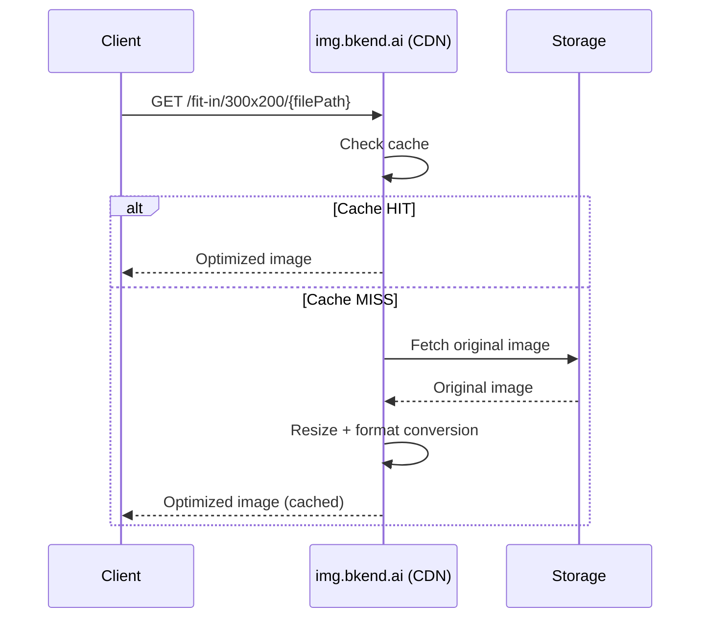

# Image Optimization


💡 Resize and convert uploaded images using just a URL. The CDN handles everything automatically — no API calls needed.



💡 **Before you start** — You need the following to use this feature:
- File upload completed ([Single File Upload](02-upload-single.md))
- File `visibility` set to `public` ([File Access Permissions](08-permissions.md))


## Overview

bkend provides an image optimization CDN (`img.bkend.ai`). If you know the uploaded file's path, you can resize, convert formats, and adjust quality simply by constructing a URL.



### Key Features

| Feature | Description |
|---------|-------------|
| **URL-based transformation** | No API calls needed — just construct the URL |
| **Auto WebP conversion** | Automatically converts to WebP when the browser supports it |
| **CDN caching** | Once generated, optimized images are served from CDN cache |
| **Original preserved** | The original image is never modified |

***

## URL Pattern

### Basic Structure

```
https://img.bkend.ai/{transformation options}/{file path}
```

- **Transformation options**: Resize and filter instructions included in the URL path
- **File path**: The `key` value returned when uploading

### Resizing

| Feature | URL Pattern | Description |
|---------|-------------|-------------|
| Fit within bounds | `/fit-in/{width}x{height}/` | Maintains aspect ratio within specified dimensions |
| Smart crop | `/{width}x{height}/smart/` | Detects key areas and crops accordingly |
| Width only | `/fit-in/{width}x0/` | Height adjusts automatically |
| Height only | `/fit-in/0x{height}/` | Width adjusts automatically |



```
https://img.bkend.ai/fit-in/300x200/{filePath}
```

Fits the image within 300x200 while maintaining aspect ratio. Ideal for card thumbnails.


```
https://img.bkend.ai/300x200/smart/{filePath}
```

Detects key areas (faces, text, etc.) and crops accordingly. Ideal for profile images.


```
https://img.bkend.ai/fit-in/600x0/{filePath}
```

Fixes width to 600px, height adjusts to maintain ratio. Ideal for detail page images.



### Filters

Filters start with the `/filters:` prefix, and multiple filters can be chained with `:`.

| Filter | Pattern | Description |
|--------|---------|-------------|
| Quality | `filters:quality({1-100})` | JPEG/WebP quality (80 recommended) |
| Format | `filters:format({ext})` | `webp`, `jpeg`, `png`, etc. |
| Blur | `filters:blur({radius})` | Background blur effect |

```
https://img.bkend.ai/fit-in/300x200/filters:quality(80):format(webp)/{filePath}
```


💡 Even without specifying `filters:format(webp)`, the CDN automatically converts to WebP when the browser supports it.


***

## Practical Examples

### Profile Image (Avatar)

```
https://img.bkend.ai/80x80/smart/{filePath}
```

Smart crops to 80x80, centering on face detection.

### Card Thumbnail

```
https://img.bkend.ai/fit-in/400x300/filters:quality(80)/{filePath}
```

Generates a 400x300 thumbnail for card UIs.

### Detail Page Image

```
https://img.bkend.ai/fit-in/800x0/filters:quality(85)/{filePath}
```

Fixed width of 800px with height adjusted to maintain aspect ratio.

### Gallery Grid

```
https://img.bkend.ai/fit-in/200x200/filters:quality(75)/{filePath}
```

200x200 square thumbnails for gallery layouts.

***

## Using in Your App

### JavaScript/TypeScript Helper

```typescript
const IMAGE_BASE_URL = process.env.NEXT_PUBLIC_IMAGE_URL || 'https://img.bkend.ai';

interface ImageOptions {
  width?: number;
  height?: number;
  quality?: number;
  format?: 'webp' | 'jpeg' | 'png';
  mode?: 'fit' | 'smart';
}

/**
 * Generates an optimized image URL.
 * @param filePath - The key value returned from upload
 * @param options - Resize/filter options
 */
function getImageUrl(filePath: string, options: ImageOptions = {}): string {
  const { width = 0, height = 0, quality, format, mode = 'fit' } = options;

  const parts: string[] = [];

  // Resize
  if (width || height) {
    if (mode === 'smart') {
      parts.push(`${width}x${height}`, 'smart');
    } else {
      parts.push(`fit-in/${width}x${height}`);
    }
  }

  // Filters
  const filters: string[] = [];
  if (quality) filters.push(`quality(${quality})`);
  if (format) filters.push(`format(${format})`);

  if (filters.length > 0) {
    parts.push(`filters:${filters.join(':')}`);
  }

  const path = parts.length > 0 ? `${parts.join('/')}/${filePath}` : filePath;
  return `${IMAGE_BASE_URL}/${path}`;
}
```

#### Usage Examples

```typescript
// Profile avatar (80x80, smart crop)
const avatarUrl = getImageUrl(user.avatarKey, {
  width: 80,
  height: 80,
  mode: 'smart',
});

// Card thumbnail (400x300, quality 80)
const thumbnailUrl = getImageUrl(recipe.imageKey, {
  width: 400,
  height: 300,
  quality: 80,
});

// Detail page (width 800px)
const detailUrl = getImageUrl(product.imageKey, {
  width: 800,
  quality: 85,
});
```

### Flutter Helper

```dart
const String _imageBaseUrl = String.fromEnvironment(
  'IMAGE_BASE_URL',
  defaultValue: 'https://img.bkend.ai',
);

String getImageUrl(
  String filePath, {
  int width = 0,
  int height = 0,
  int? quality,
  String? format,
  bool smartCrop = false,
}) {
  final parts = <String>[];

  // Resize
  if (width > 0 || height > 0) {
    if (smartCrop) {
      parts.addAll(['${width}x$height', 'smart']);
    } else {
      parts.add('fit-in/${width}x$height');
    }
  }

  // Filters
  final filters = <String>[];
  if (quality != null) filters.add('quality($quality)');
  if (format != null) filters.add('format($format)');

  if (filters.isNotEmpty) {
    parts.add('filters:${filters.join(":")}');
  }

  final path = parts.isNotEmpty ? '${parts.join("/")}/$filePath' : filePath;
  return '$_imageBaseUrl/$path';
}
```

***

## Responsive Images

### HTML srcset

Provide multiple image sizes and let the browser choose the best one for the screen.

```html

```

### React/Next.js Component

```tsx
function OptimizedImage({
  filePath,
  alt,
  widths = [400, 800, 1200],
  className,
}: {
  filePath: string;
  alt: string;
  widths?: number[];
  className?: string;
}) {
  const src = getImageUrl(filePath, { width: widths[1] });
  const srcSet = widths
    .map((w) => `${getImageUrl(filePath, { width: w })} ${w}w`)
    .join(', ');

  return (
    
  );
}
```

***

## Important Notes


⚠️ The image optimization CDN only supports files with **`public` visibility**. It cannot be used with `private`, `protected`, or `shared` files.


| Condition | How to Display |
|-----------|---------------|
| `visibility: public` | Use `img.bkend.ai` optimized URL |
| `visibility: private/protected/shared` | Download via Presigned URL ([File Download](06-download.md)) |


💡 Set profile photos, post images, and other public images to `public` visibility to take advantage of CDN optimization.


***

## Performance Tips

| Tip | Description |
|-----|-------------|
| **Use appropriate sizes** | Don't request images larger than what's displayed on screen |
| **Use `loading="lazy"`** | Defer loading of off-screen images to improve initial load time |
| **Quality 80 recommended** | In most cases, `quality(80)` reduces file size with no visible difference |
| **Use srcset** | Serve appropriate sizes for mobile/desktop to save bandwidth |

***

## Next Steps

- [Single File Upload](02-upload-single.md) — Upload images
- [File Access Permissions](08-permissions.md) — Set `public` visibility
- [File Upload App Patterns](10-upload-app-patterns.md) — Use optimized URLs after upload
- [File Download](06-download.md) — Download private files
