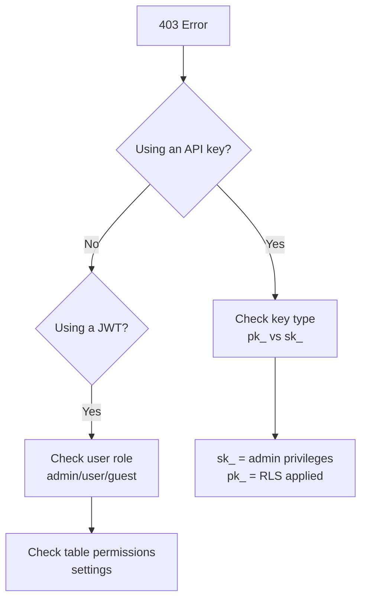

# Common Error Codes


💡 This page covers frequently encountered errors when using the bkend API and how to resolve them.


## Overview

This document organizes error causes and solutions by HTTP status code. All error responses follow a standard format:

```json
{
  "success": false,
  "error": {
    "code": "auth/invalid-credentials",
    "message": "Invalid email or password"
  }
}
```

Error codes follow the `{domain}/{error-name}` format. The `domain` tells you which module the error came from, and `error-name` describes what went wrong.

***

## 400 Bad Request

Occurs when the request format is invalid.

| Error Code | Cause | Solution |
|----------|------|---------|
| `data/validation-error` | Schema validation failed (missing required fields, incorrect types) | Check the required fields and types in the request body |
| `auth/invalid-email-format` | Invalid email format | Enter a valid email (e.g., `user@example.com`) |
| `auth/invalid-password-format` | Password does not meet requirements | Ensure the password meets length and complexity requirements |
| `auth/invalid-request` | Invalid request parameters | Check all request parameters for correct format |
| `common/invalid-parameters` | Invalid or missing required parameters | Verify that all required parameters are present and correctly formatted |

### How to Check Errors

```javascript
const response = await fetch('https://api-client.bkend.ai/v1/data/posts', {
  method: 'POST',
  headers: {
    'Content-Type': 'application/json',
    'X-API-Key': '{pk_publishable_key}',
  },
  body: JSON.stringify({
    title: 'Title', // Make sure required fields are included
  }),
});

if (!response.ok) {
  const result = await response.json();
  // result.success === false
  console.error('Error code:', result.error.code);
  console.error('Error message:', result.error.message);
}
```

***

## 401 Unauthorized

Occurs when authentication credentials are missing or invalid.

| Error Code | Cause | Solution |
|----------|------|---------|
| `auth/unauthorized` | Missing or invalid auth token | Include a valid token in the `Authorization` header |
| `auth/access-token-expired` | Access Token has expired | Use a Refresh Token to obtain a new Access Token |
| `auth/invalid-access-token` | Invalid or expired Access Token | Check the token value |
| `auth/invalid-refresh-token` | Invalid Refresh Token | Re-login to obtain a new Refresh Token |
| `auth/invalid-token-format` | Invalid token format | Verify the token value (`pk_`/`sk_` prefix or a valid JWT) |
| `auth/missing-authorization-header` | Authorization header is missing | Add the `Authorization: Bearer {accessToken}` header |

### Refreshing an Access Token

```javascript
async function refreshAccessToken(refreshToken) {
  const response = await fetch('https://api-client.bkend.ai/v1/auth/refresh', {
    method: 'POST',
    headers: {
      'Content-Type': 'application/json',
      'X-API-Key': '{pk_publishable_key}',
    },
    body: JSON.stringify({ refreshToken }),
  });

  if (!response.ok) {
    // Refresh Token has also expired — re-login required
    throw new Error('Re-login is required');
  }

  const result = await response.json();
  return result.accessToken;
}
```

***

## 403 Forbidden

Occurs when you are authenticated but lack the required permissions.

| Error Code | Cause | Solution |
|----------|------|---------|
| `data/permission-denied` | Insufficient RLS permissions | Check the table's `permissions` settings |
| `data/system-table-access` | System table access blocked | Use admin authentication (Secret Key) |
| `data/scope-insufficient` | API Key scope does not include this operation | Use an API key with the required scope |
| `auth/forbidden` | Access permission denied | Verify the user's role and permissions |
| `file/access-denied` | File access denied | Check file access permissions |

### How to Diagnose Permissions



***

## 404 Not Found

Occurs when the requested resource does not exist.

| Error Code | Cause | Solution |
|----------|------|---------|
| `data/table-not-found` | Table does not exist | Check the table name for correct casing and spelling |
| `data/not-found` | Record does not exist | Verify the record ID |
| `data/environment-not-found` | Invalid environment in the API key | Verify you are using the correct environment's API key |
| `auth/account-not-found` | User account not found | Verify the email or user ID |
| `file/not-found` | File does not exist | Verify the file ID |


💡 Table names are case-sensitive. `Posts` and `posts` are treated as different tables.


***

## 409 Conflict

Occurs when there is a resource conflict.

| Error Code | Cause | Solution |
|----------|------|---------|
| `auth/email-already-exists` | Email is already registered | Use a different email or try logging in |
| `data/duplicate-value` | Unique index violation | Use a non-duplicate value |
| `auth/account-already-linked` | Social account already linked | Check existing linked accounts |

***

## 429 Too Many Requests

Occurs when the API call limit is exceeded.

| Error Code | Cause | Solution |
|----------|------|---------|
| `data/rate-limit-exceeded` | API call limit exceeded | Reduce call frequency or upgrade your plan |
| `auth/too-many-requests` | Too many requests | Wait a moment and try again |
| `auth/too-many-login-attempts` | Login attempt limit exceeded | Wait a moment and try again |
| `auth/too-many-code-requests` | Verification code request limit exceeded | Wait a moment and try again |

### Retry Handling

```javascript
async function fetchWithRetry(url, options, maxRetries = 3) {
  for (let i = 0; i < maxRetries; i++) {
    const response = await fetch(url, options);

    if (response.status === 429) {
      const retryAfter = response.headers.get('Retry-After');
      const delay = retryAfter ? parseInt(retryAfter) * 1000 : (i + 1) * 2000;
      await new Promise(resolve => setTimeout(resolve, delay));
      continue;
    }

    return response;
  }
  throw new Error('Maximum retry count exceeded');
}
```

***

## 500 Internal Server Error

An internal server error has occurred.

| Action | Description |
|------|------|
| **Retry** | This may be a temporary error. Wait a moment and try again |
| **If it persists** | If it keeps happening with the same request, review your request payload |
| **Contact support** | If the problem continues, reach out to the support team |

***

## Error Response Format

All API errors follow a consistent structure:

```json
{
  "success": false,
  "error": {
    "code": "{domain}/{error-name}",
    "message": "Human-readable error description"
  }
}
```

| Field | Type | Description |
|-------|------|------|
| `success` | `boolean` | Always `false` for error responses |
| `error.code` | `string` | Machine-readable error code in `{domain}/{error-name}` format |
| `error.message` | `string` | Human-readable error message |

### HTTP Status Code Mapping

Error codes are automatically mapped to HTTP status codes based on patterns:

| Pattern in Error Code | HTTP Status |
|---|:---:|
| `unauthorized`, `invalid-token`, `token-expired` | 401 |
| `forbidden`, `permission-denied`, `access-denied` | 403 |
| `not-found` | 404 |
| `too-many`, `rate-limit` | 429 |
| Other errors | 400 |

***

## Error Debugging Tips

1. **Check the response body** -- Look at `error.code` and `error.message` fields
2. **Check request headers** -- Verify `Content-Type` and `X-API-Key` headers
3. **Check the environment** -- Make sure you are using the correct API key for the target environment (`dev` / `staging` / `prod`)
4. **Test with curl** -- Determine whether the issue is in your client code or the API itself

***

## Next Steps

- [Connection Issues](02-connection-issues.md) -- Resolve connectivity problems
- [Authentication Issues](03-auth-issues.md) -- Fix authentication errors
- [FAQ](05-faq.md) -- Frequently asked questions
