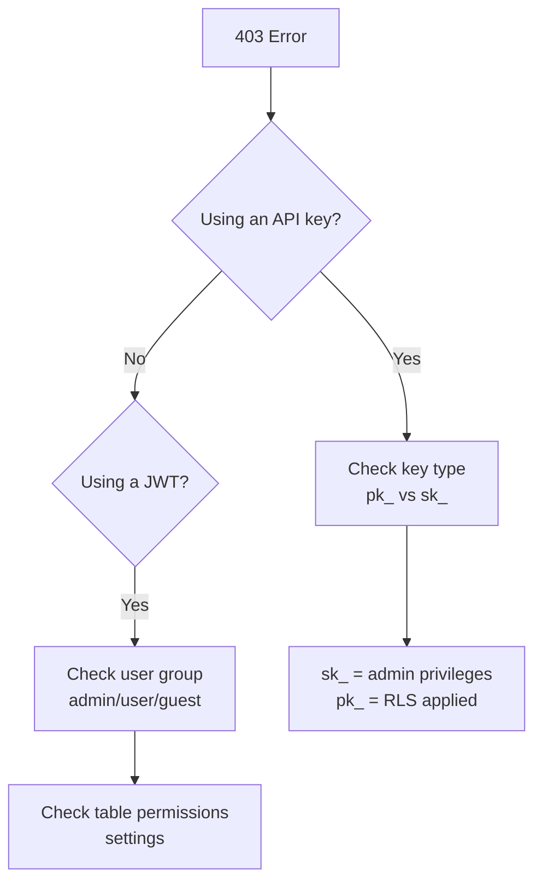

# Common Error Codes


This page covers frequently encountered errors when using the bkend API and how to resolve them.


## Overview

This document organizes error causes and solutions by HTTP status code.

***

## 400 Bad Request

Occurs when the request format is invalid.

| Error Code | Cause | Solution |
|----------|------|---------|
| `VALIDATION_ERROR` | Missing required parameter or incorrect type | Check the required fields and types in the request body |
| `INVALID_COLUMN_TYPE` | Unsupported column type | Choose from String, Number, Boolean, Date, Array, Object, or Mixed |
| `INVALID_FILTER` | Invalid filter format | Verify the filter operators |

### How to Check Errors

```javascript
const response = await fetch('https://api-client.bkend.ai/v1/data/posts', {
  method: 'POST',
  headers: {
    'Content-Type': 'application/json',
    'X-API-Key': '{pk_publishable_key}',
  },
  body: JSON.stringify({
    title: 'Title', // Make sure required fields are included
  }),
});

if (!response.ok) {
  const error = await response.json();
  console.error('Error code:', error.error);
  console.error('Error message:', error.message);
}
```

***

## 401 Unauthorized

Occurs when authentication credentials are missing or invalid.

| Error Code | Cause | Solution |
|----------|------|---------|
| `UNAUTHORIZED` | Missing auth token | Include a key in the `X-API-Key` header |
| `TOKEN_EXPIRED` | Access Token expired | Use a Refresh Token to obtain a new Access Token |
| `INVALID_TOKEN` | Invalid token format | Verify the token value (`pk_`/`sk_` prefix or a valid JWT) |
| `TOKEN_REVOKED` | Revoked API key | Generate a new API key |

### Refreshing an Access Token

```javascript
async function refreshAccessToken(refreshToken) {
  const response = await fetch('https://api-client.bkend.ai/v1/auth/refresh', {
    method: 'POST',
    headers: {
      'Content-Type': 'application/json',
      'X-API-Key': '{pk_publishable_key}',
    },
    body: JSON.stringify({ refreshToken }),
  });

  if (!response.ok) {
    // Refresh Token has also expired — re-login required
    throw new Error('Re-login is required');
  }

  const { accessToken } = await response.json();
  return accessToken;
}
```

***

## 403 Forbidden

Occurs when you are authenticated but lack the required permissions.

| Error Code | Cause | Solution |
|----------|------|---------|
| `PERMISSION_DENIED` | Insufficient RLS permissions | Check the table's `permissions` settings |
| `SYSTEM_TABLE_ACCESS` | System table access blocked | Use admin authentication (Secret Key) |

### How to Diagnose Permissions



***

## 404 Not Found

Occurs when the requested resource does not exist.

| Error Code | Cause | Solution |
|----------|------|---------|
| `TABLE_NOT_FOUND` | Table does not exist | Check the table name for correct casing and spelling |
| `RECORD_NOT_FOUND` | Record does not exist | Verify the record ID |
| `PROJECT_NOT_FOUND` | Invalid project in the API key | Verify you are using the correct API key |
| `ENVIRONMENT_NOT_FOUND` | Invalid environment in the API key | Verify you are using the correct environment's API key |


Table names are case-sensitive. `Posts` and `posts` are treated as different tables.


***

## 409 Conflict

Occurs when there is a resource conflict.

| Error Code | Cause | Solution |
|----------|------|---------|
| `DUPLICATE_TABLE` | A table with the same name already exists | Use a different name or check the existing table |
| `EMAIL_ALREADY_EXISTS` | Email is already registered | Use a different email or try logging in |
| `UNIQUE_CONSTRAINT` | Unique index violation | Use a non-duplicate value |

***

## 429 Too Many Requests

Occurs when the API call limit is exceeded.

| Error Code | Cause | Solution |
|----------|------|---------|
| `RATE_LIMIT_EXCEEDED` | API call limit exceeded | Reduce call frequency or upgrade your plan |
| `EMAIL_RATE_LIMIT` | Email sending limit exceeded | Wait a moment and try again |

### Retry Handling

```javascript
async function fetchWithRetry(url, options, maxRetries = 3) {
  for (let i = 0; i < maxRetries; i++) {
    const response = await fetch(url, options);

    if (response.status === 429) {
      const retryAfter = response.headers.get('Retry-After');
      const delay = retryAfter ? parseInt(retryAfter) * 1000 : (i + 1) * 2000;
      await new Promise(resolve => setTimeout(resolve, delay));
      continue;
    }

    return response;
  }
  throw new Error('Maximum retry count exceeded');
}
```

***

## 500 Internal Server Error

An internal server error has occurred.

| Action | Description |
|------|------|
| **Retry** | This may be a temporary error. Wait a moment and try again |
| **If it persists** | If it keeps happening with the same request, review your request payload |
| **Contact support** | If the problem continues, reach out to the support team |

***

## Error Debugging Tips

1. **Check the response body** -- Look at the `error` and `message` fields
2. **Check request headers** -- Verify `Content-Type` and `X-API-Key` headers
3. **Check the environment** -- Make sure you are using the correct API key for the target environment (`dev` / `staging` / `prod`)
4. **Test with curl** -- Determine whether the issue is in your client code or the API itself

***

## Next Steps

- [Connection Issues](02-connection-issues.md) -- Resolve connectivity problems
- [Authentication Issues](03-auth-issues.md) -- Fix authentication errors
- [FAQ](05-faq.md) -- Frequently asked questions
