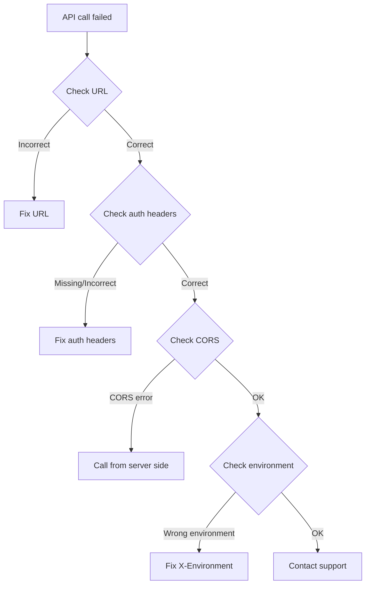

# Connection Issues


This page covers common connectivity problems when calling the bkend API and how to resolve them.


## Overview

If an API call fails, follow the diagnostic steps below.



***

## Verify the API URL

Make sure you are using the correct API URL.

| Item | Correct Value |
|------|----------|
| **REST API** | `https://api-client.bkend.ai` |
| **MCP Server** | `https://api.bkend.ai/mcp` |

### Common Mistakes

| Incorrect URL | Correct URL |
|-----------|----------|
| `http://api-client.bkend.ai` | `https://api-client.bkend.ai` |
| `api-client.bkend.ai/data/posts` | `https://api-client.bkend.ai/v1/data/posts` |
| `/data/posts` (missing v1) | `/v1/data/posts` |

***

## Check Authentication Headers

### Required Headers

```bash
curl -X GET https://api-client.bkend.ai/v1/data/posts \
  -H "Authorization: Bearer {api_key_or_jwt}" \
  -H "X-Project-Id: {project_id}" \
  -H "X-Environment: dev"
```

| Header | Required | Notes |
|------|:----:|------|
| `Authorization` | Conditional | `Bearer ` prefix required (note the space) |
| `X-Project-Id` | Yes | Project ID (find it in the console) |
| `X-Environment` | Yes | `dev` / `staging` / `prod` |


In `Authorization: Bearer {token}`, there must be a **space** between `Bearer` and the token. `Bearer{token}` is invalid.


***

## CORS Issues

CORS errors can occur when calling the API directly from a browser.

### Symptoms

```text
Access to fetch at 'https://api-client.bkend.ai/...'
from origin 'http://localhost:3000' has been blocked by CORS policy
```

### Solutions

| Method | Description |
|------|------|
| **Server-side call** | Call from Next.js API Routes, Express, etc. |
| **Proxy setup** | Use your dev server's proxy feature |

```javascript
// Next.js API Route example
// pages/api/posts.ts
export default async function handler(req, res) {
  const response = await fetch('https://api-client.bkend.ai/v1/data/posts', {
    headers: {
      'Authorization': `Bearer ${process.env.BKEND_API_KEY}`,
      'X-Project-Id': process.env.BKEND_PROJECT_ID,
      'X-Environment': 'dev',
    },
  });
  const data = await response.json();
  res.json(data);
}
```

***

## Timeout Issues

### Symptoms

Requests take too long or time out.

### Solutions

| Cause | Solution |
|------|------|
| Fetching large datasets | Limit the number of results with the `limit` parameter |
| Missing indexes | Add indexes to frequently filtered fields |
| Network problems | Check your network connection |

***

## MCP Connection Issues

### When the MCP Server Won't Connect

1. **Check your Node.js version** -- Node.js 18 or later is required
2. **Verify the MCP URL** -- Confirm that `https://api.bkend.ai/mcp` is correct
3. **Check authentication** -- Make sure OAuth authentication is complete
4. **Restart the AI tool** -- Restart the tool and try again

### When the MCP Tool List Is Empty

1. Verify that OAuth authentication is complete
2. Check that you have an Organization
3. Make sure the project has an active environment

***

## Test Directly with curl

When an issue occurs, use curl to test the API directly and determine whether the problem is in your client code or the API.

```bash
# Test data retrieval
curl -v -X GET "https://api-client.bkend.ai/v1/data/posts?limit=1" \
  -H "Authorization: Bearer ak_{your_api_key}" \
  -H "X-Project-Id: {project_id}" \
  -H "X-Environment: dev"
```

The `-v` flag lets you inspect the request and response headers.

***

## Next Steps

- [Common Error Codes](01-common-errors.md) -- Solutions by HTTP status code
- [Authentication Issues](03-auth-issues.md) -- Auth-related problems
- [FAQ](05-faq.md) -- Frequently asked questions
