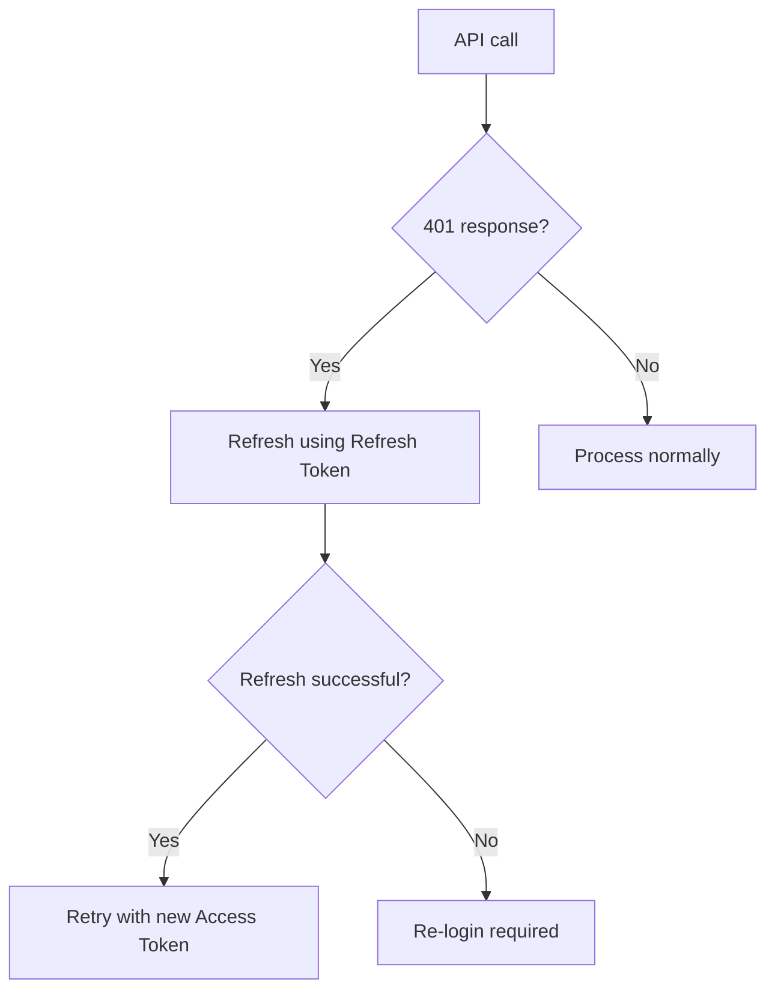

# Authentication Issues


This page covers common authentication problems in bkend and how to resolve them.


## Overview

Authentication issues typically arise in four areas: signup, login, token management, and social login. This document provides diagnostics and solutions for each.

***

## Signup Issues

### Email Duplicate Error (409)

```json
{ "statusCode": 409, "error": "EMAIL_ALREADY_EXISTS" }
```

**Solution:** This email is already registered. Try logging in or use the password reset feature.

### Password Validation Error (400)

Passwords must meet the following requirements:

| Requirement | Condition |
|------|------|
| Minimum length | 8 characters or more |
| Maximum length | 128 characters or fewer |

### Email Format Error (400)

Make sure the email is in a valid format (e.g., `user@example.com`).

***

## Login Issues

### Incorrect Password (401)

```json
{ "statusCode": 401, "error": "INVALID_CREDENTIALS" }
```

**Solution:** Double-check the email and password. If you forgot your password, use the password reset feature.

### Email Not Verified (403)

This happens when a user tries to log in without completing email verification in a project that requires it.

**Solution:** Check for the email verification link. If you did not receive the email, request a new verification email.

***

## Token Management Issues

### Access Token Expiration

| Token | Validity |
|------|---------|
| Access Token | 1 hour |
| Refresh Token | 30 days |

When the Access Token expires, use the Refresh Token to obtain a new one.



### Implementing Automatic Token Refresh

```javascript
async function fetchWithAuth(url, options = {}) {
  let accessToken = getStoredAccessToken();

  const response = await fetch(url, {
    ...options,
    headers: {
      ...options.headers,
      'Authorization': `Bearer ${accessToken}`,
      'X-Project-Id': '{project_id}',
      'X-Environment': 'dev',
    },
  });

  if (response.status === 401) {
    // Access Token expired — attempt refresh
    const refreshToken = getStoredRefreshToken();
    const refreshResponse = await fetch(
      'https://api-client.bkend.ai/v1/auth/refresh',
      {
        method: 'POST',
        headers: {
          'Content-Type': 'application/json',
          'X-Project-Id': '{project_id}',
          'X-Environment': 'dev',
        },
        body: JSON.stringify({ refreshToken }),
      }
    );

    if (refreshResponse.ok) {
      const { accessToken: newToken } = await refreshResponse.json();
      storeAccessToken(newToken);

      // Retry the original request with the new token
      return fetch(url, {
        ...options,
        headers: {
          ...options.headers,
          'Authorization': `Bearer ${newToken}`,
          'X-Project-Id': '{project_id}',
          'X-Environment': 'dev',
        },
      });
    }

    // Refresh Token also expired — re-login required
    redirectToLogin();
  }

  return response;
}
```

***

## Social Login Issues

### OAuth Callback Errors

| Cause | Solution |
|------|------|
| Redirect URI mismatch | Check the Redirect URI in your OAuth provider settings |
| Incorrect Client ID/Secret | Re-verify the values in the provider console |
| Insufficient scope | Add the required scopes (email, profile) |

### Verifying Google OAuth Settings

1. Check your OAuth consent screen settings in the [Google Cloud Console](https://console.cloud.google.com/)
2. Make sure the bkend callback URL is included in **Authorized redirect URIs**
3. If in test mode, verify that the test users are registered

### Verifying GitHub OAuth Settings

1. Check your OAuth App in [GitHub Developer Settings](https://github.com/settings/developers)
2. Make sure the **Authorization callback URL** is correct

***

## Password Reset Issues

### Not Receiving the Reset Email

1. Check your **spam folder**
2. Verify that the email address is the one you registered with
3. Make sure you have not exceeded the email sending limit (per-hour limit)
4. Wait a moment and try again

### Reset Link Has Expired

Password reset links have a limited validity period. If the link has expired, submit a new reset request.

***


Store authentication tokens (`accessToken`) securely in client storage (localStorage, cookie). It is recommended to implement automatic refresh logic using the Refresh Token when the token expires. See [Token Management](../authentication/20-token-management.md)


## Next Steps

- [Common Error Codes](01-common-errors.md) -- Detailed error codes
- [Connection Issues](02-connection-issues.md) -- API connectivity problems
- [Security Best Practices](../security/07-best-practices.md) -- Authentication security recommendations
