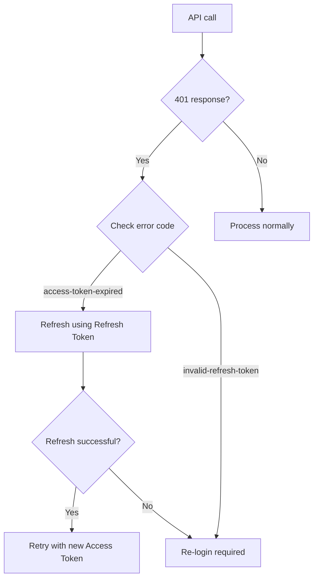

# Authentication Issues


💡 This page covers common authentication problems in bkend and how to resolve them.


## Overview

Authentication issues typically arise in five areas: signup, login, token management, social login, and MFA. This document provides diagnostics and solutions for each.

***

## Signup Issues

### Email Duplicate Error (409)

```json
{
  "success": false,
  "error": {
    "code": "auth/email-already-exists",
    "message": "This email is already in use"
  }
}
```

**Solution:** This email is already registered. Try logging in or use the password reset feature.

### Password Validation Error (400)

```json
{
  "success": false,
  "error": {
    "code": "auth/invalid-password-format",
    "message": "Invalid password format"
  }
}
```

Passwords must meet the following requirements:

| Requirement | Condition |
|------|------|
| Minimum length | 8 characters or more |
| Maximum length | 128 characters or fewer |


⚠️ If your project has a custom password policy configured, the minimum/maximum length requirements may differ.


### Email Format Error (400)

```json
{
  "success": false,
  "error": {
    "code": "auth/invalid-email-format",
    "message": "Invalid email format"
  }
}
```

Make sure the email is in a valid format (e.g., `user@example.com`).

***

## Login Issues

### Incorrect Password (401)

```json
{
  "success": false,
  "error": {
    "code": "auth/invalid-credentials",
    "message": "Invalid email or password"
  }
}
```

**Solution:** Double-check the email and password. If you forgot your password, use the password reset feature.

### Email Not Verified (403)

```json
{
  "success": false,
  "error": {
    "code": "auth/email-not-verified",
    "message": "Email has not been verified"
  }
}
```

This happens when a user tries to log in without completing email verification in a project that requires it.

**Solution:** Check for the email verification link. If you did not receive the email, request a new verification email.

### Account Locked (429)

```json
{
  "success": false,
  "error": {
    "code": "auth/account-locked",
    "message": "Account has been locked"
  }
}
```

**Solution:** Too many failed login attempts caused the account to be locked. Wait a moment and try again, or use the password reset feature.

***

## Token Management Issues

### Access Token Expiration

| Token | Validity |
|------|---------|
| Access Token | 1 hour |
| Refresh Token | 30 days |

When the Access Token expires, use the Refresh Token to obtain a new one.



### Common Token Errors

| Error Code | Cause | Solution |
|----------|------|---------|
| `auth/access-token-expired` | Access Token has expired | Refresh using the Refresh Token |
| `auth/invalid-refresh-token` | Invalid Refresh Token | Re-login required |
| `auth/invalid-token-format` | Invalid token format | Verify the token format |
| `auth/missing-authorization-header` | Authorization header missing | Add `Authorization: Bearer {accessToken}` header |

### Implementing Automatic Token Refresh

```javascript
const PUBLISHABLE_KEY = '{pk_publishable_key}'; // Issued from the console

async function fetchWithAuth(url, options = {}) {
  let accessToken = getStoredAccessToken();

  const response = await fetch(url, {
    ...options,
    headers: {
      ...options.headers,
      'X-API-Key': PUBLISHABLE_KEY,
      'Authorization': `Bearer ${accessToken}`,
    },
  });

  if (response.status === 401) {
    // Access Token expired — attempt refresh
    const refreshToken = getStoredRefreshToken();
    const refreshResponse = await fetch(
      'https://api-client.bkend.ai/v1/auth/refresh',
      {
        method: 'POST',
        headers: {
          'Content-Type': 'application/json',
          'X-API-Key': PUBLISHABLE_KEY,
        },
        body: JSON.stringify({ refreshToken }),
      }
    );

    if (refreshResponse.ok) {
      const result = await refreshResponse.json();
      storeAccessToken(result.accessToken);

      // Retry the original request with the new token
      return fetch(url, {
        ...options,
        headers: {
          ...options.headers,
          'X-API-Key': PUBLISHABLE_KEY,
          'Authorization': `Bearer ${result.accessToken}`,
        },
      });
    }

    // Refresh Token also expired — re-login required
    redirectToLogin();
  }

  return response;
}
```

***

## Social Login Issues

### OAuth Callback Errors

| Error Code | Cause | Solution |
|----------|------|---------|
| `auth/invalid-oauth-code` | Invalid OAuth authorization code | Retry the OAuth flow from the beginning |
| `auth/oauth-not-configured` | OAuth provider not configured | Configure the OAuth provider in the console |
| `auth/unsupported-provider` | Unsupported OAuth provider | Check supported providers (Google, GitHub) |
| `auth/account-exists-different-provider` | Email registered with a different provider | Log in using the original provider or link accounts |

### Verifying Google OAuth Settings

1. Check your OAuth consent screen settings in the [Google Cloud Console](https://console.cloud.google.com/)
2. Make sure the bkend callback URL is included in **Authorized redirect URIs**
3. If in test mode, verify that the test users are registered

### Verifying GitHub OAuth Settings

1. Check your OAuth App in [GitHub Developer Settings](https://github.com/settings/developers)
2. Make sure the **Authorization callback URL** is correct

***

## MFA (Multi-Factor Authentication) Issues

### MFA Required During Login

```json
{
  "success": false,
  "error": {
    "code": "auth/mfa-required",
    "message": "Two-factor authentication is required"
  }
}
```

**Solution:** The user has MFA enabled. Submit the TOTP code to complete authentication.

### Common MFA Errors

| Error Code | Cause | Solution |
|----------|------|---------|
| `auth/invalid-mfa-code` | Invalid TOTP code | Enter the correct 6-digit code from your authenticator app |
| `auth/mfa-already-enabled` | MFA is already active | No action needed; MFA is already set up |
| `auth/mfa-not-enabled` | MFA is not active | Enable MFA first before using MFA features |
| `auth/mfa-setup-expired` | MFA setup session expired | Start the MFA setup process again |
| `auth/mfa-backup-codes-exhausted` | All backup codes have been used | Disable and re-enable MFA to generate new backup codes |

***

## Magic Link Issues

### Token Errors

| Error Code | Cause | Solution |
|----------|------|---------|
| `auth/magic-token-expired` | Magic link has expired | Request a new magic link |
| `auth/magic-token-missing` | Magic token not provided | Check that the full link URL is being used |
| `auth/magiclink-not-available-for-social` | Email is registered via social login | Use social login instead |

***

## Password Reset Issues

### Not Receiving the Reset Email

1. Check your **spam folder**
2. Verify that the email address is the one you registered with
3. Make sure you have not exceeded the email sending limit (per-hour limit)
4. Wait a moment and try again

### Reset Link Has Expired

```json
{
  "success": false,
  "error": {
    "code": "auth/expired-password-reset-token",
    "message": "Expired password reset token"
  }
}
```

Password reset links have a limited validity period. If the link has expired, submit a new reset request.

### Same Password Error

```json
{
  "success": false,
  "error": {
    "code": "auth/same-as-previous-password",
    "message": "Please use a different password"
  }
}
```

**Solution:** Choose a password that is different from your current one.

***


⚠️ Store authentication tokens (`accessToken`) securely in client storage (localStorage, cookie). It is recommended to implement automatic refresh logic using the Refresh Token when the token expires. See [Token Management](../authentication/20-token-management.md)


## Next Steps

- [Common Error Codes](01-common-errors.md) -- Detailed error codes
- [Connection Issues](02-connection-issues.md) -- API connectivity problems
- [Security Best Practices](../security/07-best-practices.md) -- Authentication security recommendations
