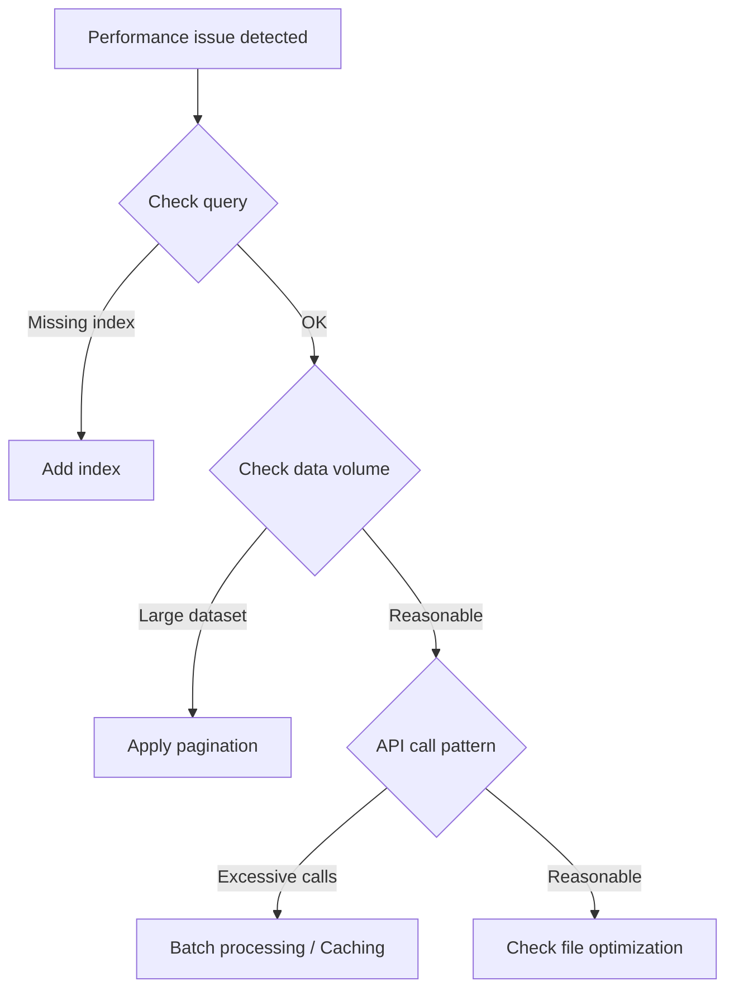

# Performance Issues


This page explains how to diagnose and resolve performance issues with the bkend API.


## Overview

If API responses are slow or timeouts occur, follow the diagnostic steps below.



***

## Resolving Slow Queries

### Cause: Missing Indexes

When frequently filtered fields lack indexes, the entire collection is scanned.

**Diagnosis:**

```bash
# Check filtered fields
curl -X GET "https://api-client.bkend.ai/v1/data/posts?andFilters[status]=published" \
  -H "X-API-Key: {pk_publishable_key}"
```

If the response is slow, add an index to the `status` field.

**Solution:**

Add an index through the console or MCP tools.

```json
{
  "name": "idx_status",
  "fields": { "status": 1 }
}
```

### Recommended Fields for Indexing

| Scenario | Index to Add |
|------|-------------|
| Filtering by status | `{ "status": 1 }` |
| Latest by category | `{ "category": 1, "createdAt": -1 }` |
| Lookup by user | `{ "userId": 1 }` |
| Search + sort | `{ "title": 1, "createdAt": -1 }` |

***

## Fetching Large Datasets

### Cause: No Pagination

Querying without `limit` returns the entire dataset.

**Solution:**

```javascript
// Bad example — fetches all data
const response = await fetch('/v1/data/posts');

// Good example — with pagination
const response = await fetch('/v1/data/posts?limit=20&offset=0');
```

### Recommended limit Values

| Data Type | Recommended limit |
|-----------|:---------:|
| List page | 10--20 |
| Infinite scroll | 20--50 |
| Search results | 10--20 |
| Autocomplete | 5--10 |

***

## Optimizing API Calls

### Cause: Excessive API Calls

| Problem Pattern | Solution |
|----------|---------|
| Individual API calls in a loop | Use batch processing for a single call |
| Fetching the same data repeatedly | Apply client-side caching |
| Including unnecessary fields | Use the `fields` parameter to select only the fields you need |

### Batch Processing

```javascript
// Bad example — individual inserts (10 calls)
for (const item of items) {
  await fetch('/v1/data/posts', {
    method: 'POST',
    body: JSON.stringify(item),
  });
}

// Good example — batch insert (1 call)
await fetch('/v1/data/posts', {
  method: 'POST',
  body: JSON.stringify(items), // Pass as an array
});
```

***

## File Upload Optimization

| Problem | Solution |
|------|------|
| Large file upload fails | Use multipart upload |
| Slow image loading | Use WebP format or compress before uploading |
| Slow public files | Verify CDN URL usage |

***

## Performance Characteristics by Environment

| Environment | Characteristics | Notes |
|------|------|------|
| `dev` | Default performance | For development and testing |
| `staging` | Same as dev | For integration testing |
| `prod` | Production-optimized | For live services |

***

## Performance Diagnostic Checklist

- [ ] Indexes are set on frequently filtered fields
- [ ] Query results are limited with `limit`
- [ ] Only necessary fields are selected using `fields`
- [ ] API calls are minimized through batch processing
- [ ] Infrequently changing data is cached
- [ ] Multipart upload is used for large files

***


The maximum `limit` value for list queries is 100. When processing large datasets, use pagination and reduce unnecessary fields to minimize response size. See [Sorting and Pagination](../database/09-sorting-pagination.md)


## Next Steps

- [Performance Optimization Guide](../guides/04-performance.md) -- Detailed optimization strategies
- [Filtering](../database/08-filtering.md) -- Writing efficient queries
- [Common Error Codes](01-common-errors.md) -- Error resolution
