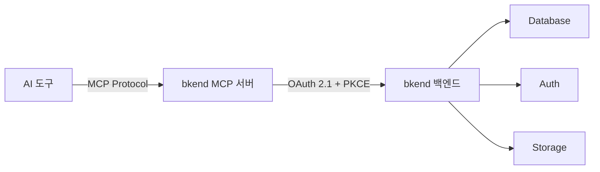
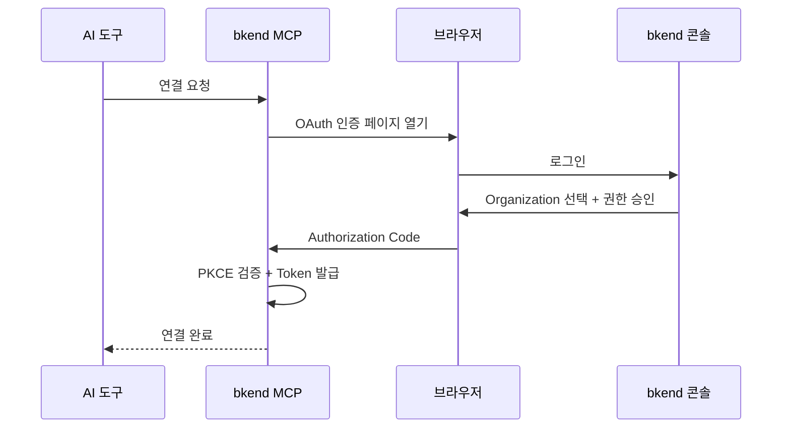

# AI 도구 연동 개요


💡 bkend MCP 서버를 통해 Claude Code, Cursor 등 다양한 AI 도구에서 자연어로 백엔드를 관리하세요.


## 개요

bkend는 [MCP(Model Context Protocol)](https://spec.modelcontextprotocol.io/2025-03-26)를 통해 AI 도구와 연결됩니다. MCP를 지원하는 AI 도구에서 자연어로 명령하면, bkend가 Database, Auth, Storage를 자동으로 관리합니다.



***

## 지원하는 AI 도구

| 도구 | MCP 지원 | 인증 방식 | 설정 문서 |
|------|:--------:|----------|----------|
| Claude Code | ✅ | OAuth 2.1 | [설정](04-claude-code-setup.md) / [사용법](05-claude-code-usage.md) |
| Claude Desktop | ✅ | OAuth 2.1 | [설정](04-claude-code-setup.md) |
| Cursor | ✅ | OAuth 2.1 | [설정](06-cursor-setup.md) / [사용법](07-cursor-usage.md) |
| Antigravity | ✅ | OAuth 2.1 | [연동](08-antigravity-setup.md) |
| 기타 MCP 도구 | ✅ | OAuth 2.1 | [기타 도구](09-other-tools.md) |

***

## MCP 서버 정보

| 항목 | 값 |
|------|-----|
| Server URL | `https://api.bkend.ai/mcp` |
| Protocol Version | `2025-03-26` |
| Transport | Streamable HTTP |
| 인증 | [OAuth 2.1](https://datatracker.ietf.org/doc/html/draft-ietf-oauth-v2-1-12) + PKCE |
| Message Format | JSON-RPC 2.0 |

***

## 제공되는 도구

### 고정 도구

세션 컨텍스트와 문서 검색을 위한 도구입니다.

| 도구 | 설명 |
|------|------|
| `get_context` | 세션 시작 시 필수 호출 — Organization ID, 리소스 계층 및 주의사항 안내 |
| `search_docs` | bkend 문서 검색 — API 가이드, 인증 구현, CRUD 패턴, 코드 예시 등 |

### API 도구

bkend 백엔드의 관리 기능을 호출하는 도구입니다. Organization, Project, Environment, Table 등을 관리할 수 있습니다.

→ 각 도구의 상세 파라미터와 응답은 [MCP 도구 개요](../mcp/01-overview.md)를 참고하세요.


⚠️ MCP 도구는 **관리 기능**(테이블 스키마, 프로젝트, 환경 등)을 제어합니다. 앱 사용자 데이터를 다루는 Consumer API와는 다릅니다. Consumer API 연동은 [앱에서 bkend 연동하기](../getting-started/03-app-integration.md)를 참고하세요.


***

## 빠른 시작



```bash
claude mcp add bkend --transport http https://api.bkend.ai/mcp
```


```json
{
  "mcpServers": {
    "mcp-bkend": {
      "type": "http",
      "url": "https://api.bkend.ai/mcp"
    }
  }
}
```


MCP를 지원하는 도구에서 다음 URL로 연결하세요:

```text
https://api.bkend.ai/mcp
```



***

## 인증 흐름

bkend MCP는 [OAuth 2.1](https://datatracker.ietf.org/doc/html/draft-ietf-oauth-v2-1-12) + PKCE 방식으로 인증합니다.



→ 인증 설정 상세는 [OAuth 2.1 인증 설정](03-oauth-setup.md)을 참고하세요.

***

## 권한 (Scopes)

MCP 연동 시 부여되는 권한입니다.

| 리소스 | 읽기 | 생성 | 수정 | 삭제 |
|--------|:----:|:----:|:----:|:----:|
| Organization | ✅ | - | - | - |
| Project | ✅ | ✅ | ✅ | ✅ |
| Environment | ✅ | ✅ | - | ✅ |
| Table Schema | ✅ | ✅ | ✅ | ✅ |
| Table Data | ✅ | ✅ | ✅ | ✅ |

***

## 다음 단계

- [MCP 프로토콜 이해](02-mcp-protocol.md) — MCP 프로토콜 상세
- [OAuth 2.1 인증 설정](03-oauth-setup.md) — 인증 흐름과 토큰 관리
- [Claude Code 설정](04-claude-code-setup.md) — Claude Code 연동
- [Cursor 설정](06-cursor-setup.md) — Cursor 연동
- [MCP 도구 레퍼런스](../mcp/01-overview.md) — MCP 도구 상세 파라미터
- [실전 프로젝트 쿡북](../../cookbooks/README.md) — MCP로 실전 앱 백엔드 구축하기

## 참조 표준

- [MCP Specification 2025-03-26](https://spec.modelcontextprotocol.io/2025-03-26)
- [OAuth 2.1](https://datatracker.ietf.org/doc/html/draft-ietf-oauth-v2-1-12)
