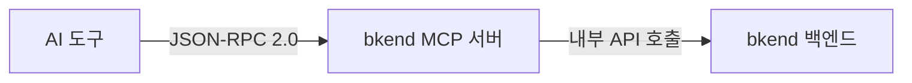

# MCP 프로토콜 이해


💡 MCP(Model Context Protocol)의 핵심 개념과 bkend MCP 서버의 동작 방식을 이해합니다.


## 개요

[MCP(Model Context Protocol)](https://spec.modelcontextprotocol.io/2025-03-26)는 AI 도구가 외부 서비스와 통신하기 위한 표준 프로토콜입니다. bkend는 MCP 2025-03-26 스펙의 Streamable HTTP 방식을 사용합니다.



***

## 지원 스펙

| 항목 | 상세 |
|------|------|
| **Protocol Version** | 2025-03-26 |
| **Transport** | Streamable HTTP |
| **Message Format** | JSON-RPC 2.0 |
| **인증** | [OAuth 2.1](https://datatracker.ietf.org/doc/html/draft-ietf-oauth-v2-1-12) + PKCE |
| **엔드포인트** | `https://api.bkend.ai/mcp` |

### Streamable HTTP

bkend는 SSE 대신 **Streamable HTTP** 방식을 사용합니다.

| 특성 | Streamable HTTP (현재) | SSE (이전 방식) |
|------|----------------------|----------------|
| **전송 방식** | 단순 POST 요청/응답 | 서버→클라이언트 스트림 |
| **연결 유지** | 요청 시에만 연결 | 항상 열어둠 |
| **서버 리소스** | 요청 처리 후 해제 | 연결당 메모리 점유 |
| **확장성** | 자동 확장 용이 | 연결 기반 확장 어려움 |

***

## 핵심 구성 요소

### Tools (도구)

AI 도구가 호출할 수 있는 함수입니다. bkend는 두 가지 유형을 제공합니다.

**고정 도구** — 컨텍스트 확인과 문서 검색:

| 도구 | 설명 |
|------|------|
| `get_context` | 세션 시작 시 필수 호출 — Organization ID, 리소스 계층 안내 |
| `search_docs` | bkend 문서 검색 |

**API 도구** — bkend 백엔드의 관리 기능을 호출합니다.

→ 전체 도구 목록은 [MCP 도구 개요](../mcp/01-overview.md)를 참고하세요.

### Resources (리소스)

MCP 서버가 제공하는 데이터 리소스입니다.

```text
Organization
  └── Project
        └── Environment (dev/staging/prod)
              └── Table
                    ├── Fields
                    └── Indexes
```

→ 리소스 상세는 [MCP 리소스](../mcp/08-resources.md)를 참고하세요.

***

## 권한 범위 (Scopes)

MCP 토큰에 부여되는 권한입니다.

| 스코프 | 설명 |
|--------|------|
| `organization:read` | Organization 정보 조회 |
| `project:read` / `project:create` / `project:update` / `project:delete` | Project 관리 |
| `environment:read` / `environment:create` / `environment:delete` | Environment 관리 |
| `table:read` / `table:create` / `table:update` / `table:delete` | 테이블 스키마 관리 |
| `table:data:read` / `table:data:create` / `table:data:update` / `table:data:delete` | 테이블 데이터 CRUD |
| `access-token:read` | Access Token 조회 |

### 와일드카드 스코프

| 패턴 | 설명 |
|------|------|
| `*:*` | 전체 권한 |
| `project:*` | Project의 모든 액션 |
| `*:read` | 모든 리소스 읽기 |

***


⚠️ MCP 도구 호출 시 **`get_context`를 세션 시작 시 반드시 먼저 호출**하세요. Organization ID와 리소스 계층 정보가 없으면 이후 도구 호출이 실패합니다.


## 에러 코드

| 코드 | 의미 | 설명 |
|------|------|------|
| `-32700` | Parse Error | JSON 파싱 실패 |
| `-32600` | Invalid Request | 잘못된 요청 형식 |
| `-32601` | Method Not Found | 존재하지 않는 메서드 |
| `-32602` | Invalid Params | 잘못된 파라미터 |
| `-32603` | Internal Error | 서버 내부 오류 |
| `-32001` | Unauthorized | 인증 실패 |
| `-32002` | Not Found | 리소스 미발견 / 세션 만료 |

***

## 다음 단계

- [OAuth 2.1 인증 설정](03-oauth-setup.md) — 인증 흐름 상세
- [Claude Code 설정](04-claude-code-setup.md) — Claude Code 연동
- [MCP 도구 레퍼런스](../mcp/09-api-reference.md) — MCP 도구 전체 스키마

## 참조 표준

- [MCP Specification 2025-03-26](https://spec.modelcontextprotocol.io/2025-03-26)
- [OAuth 2.1](https://datatracker.ietf.org/doc/html/draft-ietf-oauth-v2-1-12)
- [RFC 7636 — PKCE](https://datatracker.ietf.org/doc/html/rfc7636)
- [JSON-RPC 2.0](https://www.jsonrpc.org/specification)
