# MCP 프로토콜 이해


💡 MCP(Model Context Protocol)의 핵심 개념과 bkend MCP 서버의 동작 방식을 이해합니다.


## 개요

[MCP(Model Context Protocol)](https://spec.modelcontextprotocol.io/2025-03-26)는 AI 도구가 외부 서비스와 통신하기 위한 표준 프로토콜입니다. bkend는 MCP 2025-03-26 스펙의 Streamable HTTP 방식을 사용합니다.

```mermaid
flowchart LR
    A[AI 도구] -->|JSON-RPC 2.0| B[bkend MCP 서버]
    B -->|내부 API 호출| C[bkend 백엔드]
```



***

## 지원 스펙

| 항목 | 상세 |
|------|------|
| **Protocol Version** | 2025-03-26 |
| **Transport** | Streamable HTTP |
| **Message Format** | JSON-RPC 2.0 |
| **인증** | [OAuth 2.1](https://datatracker.ietf.org/doc/html/draft-ietf-oauth-v2-1-12) + PKCE |
| **엔드포인트** | `https://api.bkend.ai/mcp` |

### Streamable HTTP

bkend는 SSE 대신 **Streamable HTTP** 방식을 사용합니다.

| 특성 | Streamable HTTP (현재) | SSE (이전 방식) |
|------|----------------------|----------------|
| **전송 방식** | 단순 POST 요청/응답 | 서버→클라이언트 스트림 |
| **연결 유지** | 요청 시에만 연결 | 항상 열어둠 |
| **서버 리소스** | 요청 처리 후 해제 | 연결당 메모리 점유 |
| **확장성** | 자동 확장 용이 | 연결 기반 확장 어려움 |

***

## 핵심 구성 요소

### Tools (도구)

AI 도구가 호출할 수 있는 함수입니다. bkend는 두 가지 유형을 제공합니다.

**문서 도구** — bkend 사용법을 안내합니다:

```
0_get_context      세션 컨텍스트 (매 세션 시작 시 자동 호출)
1_concepts         핵심 개념
2_tutorial         설정 튜토리얼
3~7_howto/examples 구현 가이드 및 코드 예시
```

**API 도구** — 실제 API를 호출합니다:

```
backend_org_list        Organization 목록 조회
backend_project_create  Project 생성
backend_table_create    테이블 생성
backend_field_manage    필드 관리
```

→ 전체 도구 목록은 [Database MCP 도구](12-mcp-db-tools.md), [Auth MCP 도구](14-mcp-auth-tools.md)를 참고하세요.

### Resources (리소스)

MCP 서버가 제공하는 데이터 리소스입니다.

```
Organization
  └── Project
        └── Environment (dev/staging/prod)
              └── Table
                    ├── Fields
                    └── Indexes
```

→ 리소스 상세는 [MCP 리소스](15-mcp-resources.md)를 참고하세요.

***

## MCP 엔드포인트

### Discovery

| 메서드 | 경로 | 설명 |
|--------|------|------|
| GET | `/.well-known/oauth-protected-resource` | Protected Resource 메타데이터 |
| GET | `/.well-known/oauth-authorization-server` | Auth Server 메타데이터 |

### OAuth

| 메서드 | 경로 | 설명 |
|--------|------|------|
| POST | `/mcp/oauth/register` | Dynamic Client Registration |
| GET | `/mcp/oauth/authorize` | 인가 페이지 리다이렉트 |
| POST | `/mcp/oauth/authorize` | Authorization Code 발급 |
| POST | `/mcp/oauth/token` | Access Token 발급 |
| POST | `/mcp/oauth/revoke` | Token 폐기 |

### MCP 프로토콜

| 메서드 | 경로 | 설명 |
|--------|------|------|
| POST | `/mcp` | JSON-RPC 요청/응답 |
| DELETE | `/mcp` | 세션 종료 |
| GET | `/mcp/info` | 서버 정보 조회 |

***

## JSON-RPC 메서드

| 메서드 | 설명 |
|--------|------|
| `initialize` | MCP 프로토콜 초기화 |
| `initialized` | 초기화 완료 알림 |
| `tools/list` | 사용 가능한 도구 목록 |
| `tools/call` | 도구 실행 |
| `resources/list` | 리소스 목록 |
| `resources/read` | 리소스 조회 |

### 세션 관리

MCP 세션은 `mcp-session-id` 헤더로 관리됩니다.

1. `initialize` 요청 시 서버가 `mcp-session-id` 헤더를 응답합니다
2. 이후 모든 요청에 `mcp-session-id` 헤더를 포함하세요
3. 세션이 만료되면 `initialize`부터 다시 시작하세요


⚠️ `mcp-session-id` 헤더 없이 요청하면 404 오류가 반환됩니다 (`initialize` 제외).


***

## 권한 범위 (Scopes)

MCP 토큰에 부여되는 권한입니다.

| 스코프 | 설명 |
|--------|------|
| `organization:read` | Organization 정보 조회 |
| `project:read` / `project:create` / `project:update` / `project:delete` | Project 관리 |
| `environment:read` / `environment:create` / `environment:delete` | Environment 관리 |
| `table:read` / `table:create` / `table:update` / `table:delete` | 테이블 스키마 관리 |
| `table:data:read` / `table:data:create` / `table:data:update` / `table:data:delete` | 테이블 데이터 CRUD |

### 와일드카드 스코프

| 패턴 | 설명 |
|------|------|
| `*:*` | 전체 권한 |
| `project:*` | Project의 모든 액션 |
| `*:read` | 모든 리소스 읽기 |

***

## 에러 코드

| 코드 | 의미 | 설명 |
|------|------|------|
| `-32700` | Parse Error | JSON 파싱 실패 |
| `-32600` | Invalid Request | 잘못된 요청 형식 |
| `-32601` | Method Not Found | 존재하지 않는 메서드 |
| `-32602` | Invalid Params | 잘못된 파라미터 |
| `-32603` | Internal Error | 서버 내부 오류 |
| `-32001` | Unauthorized | 인증 실패 |
| `-32002` | Not Found | 리소스 미발견 / 세션 만료 |

***

## 다음 단계

- [OAuth 2.1 인증 설정](03-oauth-setup.md) — 인증 흐름 상세
- [Claude Code 설정](04-claude-code-setup.md) — Claude Code 연동
- [MCP 직접 연동](10-direct-mcp.md) — MCP 프로토콜 직접 구현

## 참조 표준

- [MCP Specification 2025-03-26](https://spec.modelcontextprotocol.io/2025-03-26)
- [OAuth 2.1](https://datatracker.ietf.org/doc/html/draft-ietf-oauth-v2-1-12)
- [RFC 7636 — PKCE](https://datatracker.ietf.org/doc/html/rfc7636)
- [JSON-RPC 2.0](https://www.jsonrpc.org/specification)
