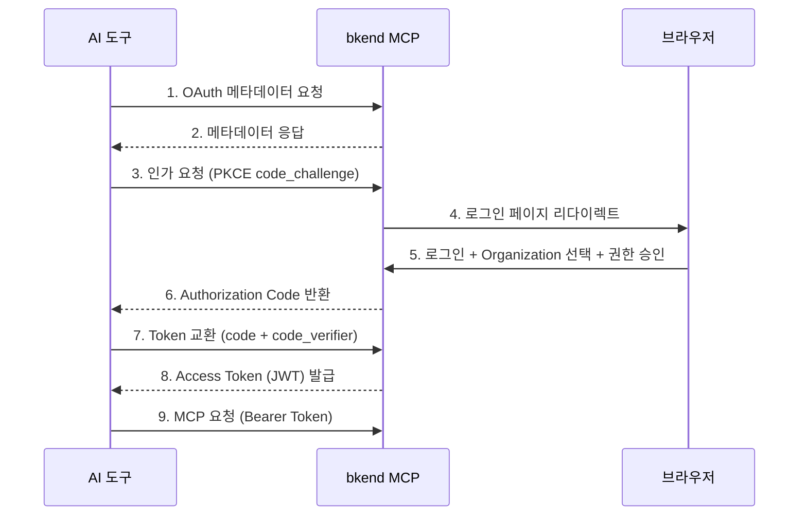

# OAuth 2.1 인증 설정


💡 bkend MCP 서버의 OAuth 2.1 인증 흐름과 토큰 관리를 이해합니다.


## 개요

bkend MCP는 [OAuth 2.1](https://datatracker.ietf.org/doc/html/draft-ietf-oauth-v2-1-12)과 [PKCE(RFC 7636)](https://datatracker.ietf.org/doc/html/rfc7636)를 사용하여 인증합니다. 대부분의 AI 도구는 이 과정을 자동으로 처리하므로, 별도의 설정 없이 브라우저에서 로그인만 하면 됩니다.

***

## 인증 흐름



***

## 인증 단계

### 1단계: AI 도구에서 MCP 서버 연결

AI 도구(Claude Code, Cursor 등)에서 bkend MCP 서버 URL을 설정하면, 첫 요청 시 자동으로 인증 흐름이 시작됩니다.

### 2단계: 브라우저 로그인

브라우저가 자동으로 열리며 bkend 콘솔 로그인 페이지가 표시됩니다.

<!-- 📸 IMG: MCP OAuth 로그인 페이지 -->

### 3단계: Organization 선택

로그인 후 MCP에서 사용할 Organization을 선택합니다.


⚠️ Organization에 프로젝트가 없으면 MCP 도구를 사용할 수 없습니다. 먼저 [콘솔에서 프로젝트를 생성](../console/04-project-management.md)하세요.


### 4단계: 권한 승인

요청된 권한을 확인하고 승인하세요. 승인이 완료되면 AI 도구로 자동 연결됩니다.

***

## 토큰 관리

### 토큰 유효 기간

| 토큰 | 유효 기간 | 용도 |
|------|----------|------|
| Access Token | 1시간 | API 인증 (`Authorization: Bearer {token}`) |
| Refresh Token | 30일 | Access Token 갱신 |
| Authorization Code | 10분 | Token 교환용 (1회 사용) |

### 자동 갱신

대부분의 AI 도구는 Access Token이 만료되면 Refresh Token으로 자동 갱신합니다. 수동 개입이 필요한 경우는 다음과 같습니다:

| 상황 | 해결 방법 |
|------|----------|
| Access Token 만료 | 자동 갱신 (Refresh Token 사용) |
| Refresh Token 만료 (30일) | 브라우저에서 재인증 |
| Token 폐기 | 브라우저에서 재인증 |

***

## OAuth 메타데이터

bkend MCP 서버의 OAuth 메타데이터는 표준 경로에서 조회할 수 있습니다.



```bash
curl https://api.bkend.ai/.well-known/oauth-protected-resource
```


```bash
curl https://api.bkend.ai/.well-known/oauth-authorization-server
```

```json
{
  "issuer": "https://api.bkend.ai/mcp",
  "authorization_endpoint": "https://api.bkend.ai/mcp/oauth/authorize",
  "token_endpoint": "https://api.bkend.ai/mcp/oauth/token",
  "registration_endpoint": "https://api.bkend.ai/mcp/oauth/register",
  "revocation_endpoint": "https://api.bkend.ai/mcp/oauth/revoke",
  "code_challenge_methods_supported": ["S256"]
}
```



***

## Dynamic Client Registration

MCP 클라이언트를 직접 구현하는 경우 [RFC 7591](https://datatracker.ietf.org/doc/html/rfc7591) 기반의 Dynamic Client Registration을 사용합니다.

```bash
curl -X POST https://api.bkend.ai/mcp/oauth/register \
  -H "Content-Type: application/json" \
  -d '{
    "client_name": "My Custom Client",
    "redirect_uris": ["http://localhost:3000/callback"]
  }'
```

```json
{
  "client_id": "dyn-xxxxxxxx",
  "client_name": "My Custom Client"
}
```


💡 Claude Code, Cursor 등 MCP 지원 도구는 Dynamic Client Registration을 자동으로 수행합니다. 직접 구현이 필요한 경우에만 이 API를 사용하세요.


***

## 문제 해결

### 인증 페이지가 열리지 않을 때

1. 기본 브라우저가 설정되어 있는지 확인하세요
2. 방화벽이나 프록시가 `https://api.bkend.ai` 접근을 차단하지 않는지 확인하세요

### 인증 후 연결이 안 될 때

1. bkend 콘솔에서 Organization에 프로젝트가 있는지 확인하세요
2. AI 도구의 MCP 설정을 제거하고 다시 추가하세요

### "Token expired" 오류

Refresh Token이 만료(30일)된 경우입니다. AI 도구를 재시작하면 브라우저에서 재인증이 진행됩니다.

***

## 다음 단계

- [Claude Code 설정](04-claude-code-setup.md) — Claude Code 연동
- [Cursor 설정](06-cursor-setup.md) — Cursor 연동
- [MCP 직접 연동](10-direct-mcp.md) — OAuth 흐름 직접 구현

## 참조 표준

- [OAuth 2.1](https://datatracker.ietf.org/doc/html/draft-ietf-oauth-v2-1-12)
- [RFC 7636 — PKCE](https://datatracker.ietf.org/doc/html/rfc7636)
- [RFC 7591 — Dynamic Client Registration](https://datatracker.ietf.org/doc/html/rfc7591)
