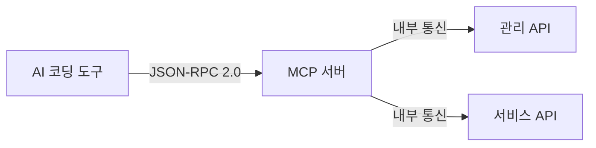

# API 개요

> bkend가 제공하는 API의 종류와 사용법을 안내합니다.

## 개요

bkend는 두 가지 방식으로 API를 제공합니다: **MCP (Model Context Protocol)** 도구와 **REST API**. AI 코딩 도구에서는 MCP를 통해, 일반 애플리케이션에서는 REST API를 통해 bkend 기능을 사용할 수 있습니다.

---

## API 종류

| API | 프로토콜 | 용도 | 인증 |
|-----|---------|------|------|
| **MCP 도구** | JSON-RPC 2.0 (Streamable HTTP) | AI 코딩 도구 연동 | OAuth 2.1 + PKCE |
| **관리 API** | REST (HTTP) | 프로젝트/테이블 관리 | OAuth 2.1 + PKCE |
| **서비스 API** | REST (HTTP) | User 앱 데이터 조작 | JWT (API Key) |

---

## MCP 도구

MCP 도구는 Claude Code, Cursor 등 AI 코딩 도구에서 자연어로 bkend를 조작할 수 있게 합니다.



| 도구 분류 | 설명 | 예시 |
|----------|------|------|
| **문서 도구** | 사용법 가이드, 코드 예시 | `0_get_context`, `2_tutorial` |
| **Database 도구** | 테이블/데이터 관리 | `backend_table_create`, `backend_table_list` |
| **Schema 도구** | 스키마/인덱스 관리 | `backend_field_manage`, `backend_schema_rollback` |

---

## REST API

### 관리 API

프로젝트 설정, 테이블 관리, 환경 관리 등 관리 작업에 사용합니다.

| 리소스 | Base Path | 설명 |
|--------|-----------|------|
| Organization | `/v1/organizations` | 조직 관리 |
| Project | `/v1/projects` | 프로젝트 관리 |
| Environment | `/v1/projects/{id}/environments` | 환경 관리 |
| Table | `/v1/projects/{id}/environments/{env}/tables` | 테이블 관리 |

### 서비스 API

User 앱에서 데이터를 조작할 때 사용합니다.

| 리소스 | Base Path | 설명 |
|--------|-----------|------|
| Data | `/v1/data/{tableName}` | 데이터 CRUD |
| Auth | `/v1/auth` | 인증 (로그인, 회원가입 등) |
| Files | `/v1/files` | 파일 업로드/다운로드 |

---

## 공통 요청 헤더

### 서비스 API 헤더

| 헤더 | 필수 | 설명 |
|------|------|------|
| `x-project-id` | ✅ | 프로젝트 ID |
| `x-environment` | - | 환경 이름 (기본값: `development`) |
| `Authorization` | ✅ | `Bearer {accessToken}` (보호된 엔드포인트) |
| `Content-Type` | ✅ | `application/json` (POST/PUT/PATCH) |

---

## 공통 응답 형식

### 성공 응답

```json
{
  "success": true,
  "data": { ... }
}
```

### 목록 응답

```json
{
  "items": [ ... ],
  "pagination": {
    "total": 100,
    "page": 1,
    "limit": 20,
    "totalPages": 5,
    "hasNextPage": true,
    "hasPrevPage": false
  }
}
```

### 에러 응답

```json
{
  "error": {
    "code": "auth/unauthorized",
    "message": "인증되지 않은 요청입니다"
  }
}
```

---

## HTTP 상태 코드

| 코드 | 설명 |
|------|------|
| 200 | 성공 (GET, PUT, DELETE) |
| 201 | 생성 성공 (POST) |
| 400 | 잘못된 요청 (검증 실패) |
| 401 | 인증 필요 |
| 403 | 권한 없음 |
| 404 | 리소스 없음 |
| 409 | 충돌 (중복) |
| 429 | 요청 횟수 초과 |

---

## 관련 문서

- [MCP 프로토콜](02-mcp-protocol.md) — MCP 프로토콜 상세
- [Database MCP 도구](03-db-tools.md) — Database 관련 MCP 도구
- [REST API 개요](06-rest-overview.md) — REST API 상세
- [에러 코드](10-error-codes.md) — 전체 에러 코드 레퍼런스
