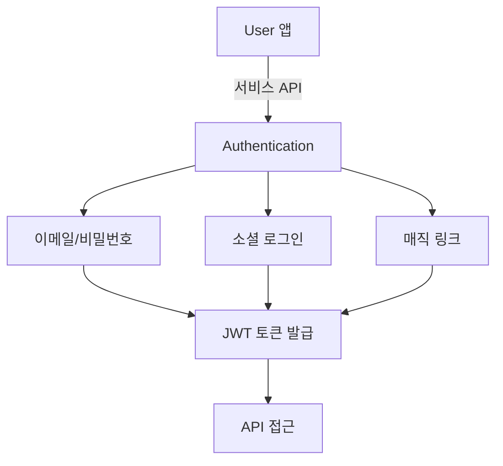
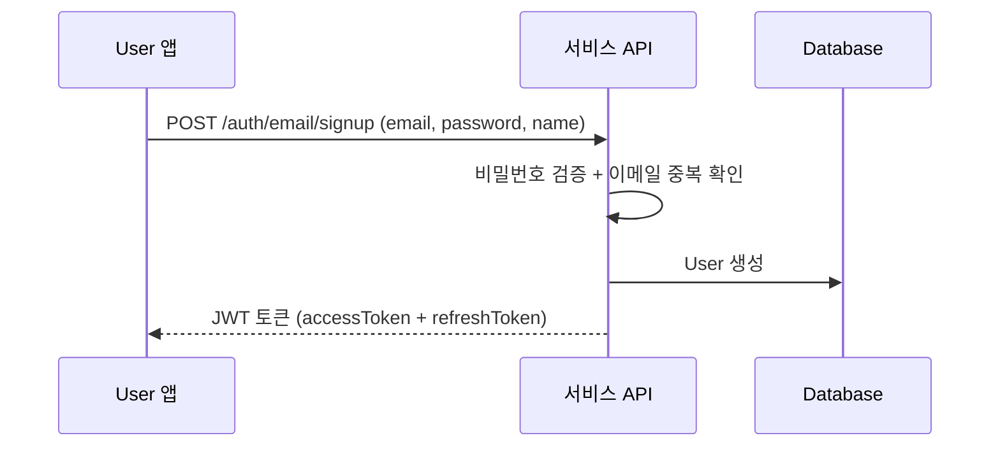
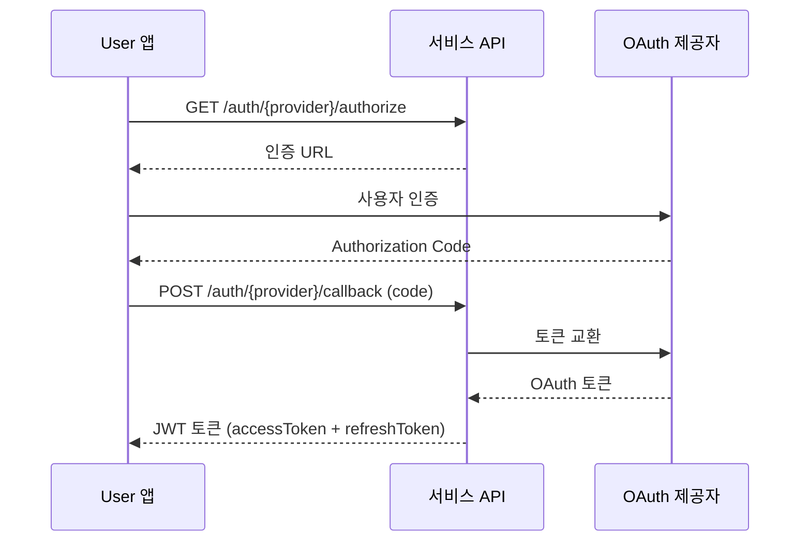

# Auth 개요

> bkend의 Authentication 기능으로 User 인증과 세션을 관리하는 방법을 소개합니다.

## 개요

bkend Authentication은 이메일/비밀번호 로그인, 소셜 로그인, 매직 링크 등 다양한 인증 방식을 지원하는 관리형 인증 서비스입니다. JWT 기반 세션 관리, 이메일 인증, 비밀번호 재설정, 2FA까지 콘솔이나 API를 통해 설정할 수 있습니다.

---

## 주요 기능

| 기능 | 설명 |
|------|------|
| **이메일 회원가입** | 이메일과 비밀번호로 계정 생성 |
| **이메일 로그인** | 비밀번호 기반 로그인 |
| **소셜 로그인** | Google, GitHub 지원 |
| **매직 링크** | 비밀번호 없이 이메일 링크로 로그인 |
| **비밀번호 재설정** | 이메일을 통한 비밀번호 재설정 |
| **이메일 인증** | 이메일 주소 소유권 확인 |
| **JWT 토큰** | Access Token + Refresh Token 기반 인증 |
| **세션 관리** | 디바이스별 세션 추적 및 관리 |
| **2FA** | TOTP 기반 2단계 인증 |
| **계정 연동** | 여러 소셜 계정을 하나의 계정에 연결 |
| **유저 프로필** | 프로필 정보 조회 및 수정 |

---

## 지원하는 인증 방식

| 방식 | 엔드포인트 | 설명 |
|------|-----------|------|
| 비밀번호 | `POST /auth/email/signup` | 이메일 + 비밀번호 회원가입 |
| 비밀번호 | `POST /auth/email/signin` | 이메일 + 비밀번호 로그인 |
| 매직 링크 | `POST /auth/email/signup` | 이메일 링크로 회원가입 |
| 매직 링크 | `POST /auth/email/signin` | 이메일 링크로 로그인 |
| Google | `GET /auth/google/authorize` | Google OAuth 2.0 |
| GitHub | `GET /auth/github/authorize` | GitHub OAuth |

---

## 인증 흐름

### 비밀번호 방식

### 소셜 로그인 방식

---

## 토큰 구조

| 토큰 | 형식 | 만료 시간 | 용도 |
|------|------|----------|------|
| **Access Token** | JWT | 1시간 (3600초) | API 요청 인증 |
| **Refresh Token** | JWT | 7일 (604800초) | Access Token 갱신 |

---

## API 인증 헤더

서비스 API 호출 시 다음 헤더를 포함하세요:

| 헤더 | 필수 | 설명 |
|------|------|------|
| `x-project-id` | ✅ | 프로젝트 ID |
| `x-environment` | - | 환경 이름 (기본값: `development`) |
| `Authorization` | ✅ | `Bearer {accessToken}` (보호된 엔드포인트) |

---

## 비밀번호 정책

| 규칙 | 요구사항 |
|------|---------|
| 최소 길이 | 8자 |
| 대문자 | 1개 이상 |
| 소문자 | 1개 이상 |
| 숫자 | 1개 이상 |
| 특수 문자 | 1개 이상 |

---

## 관련 문서

- [콘솔에서 Auth 관리](02-console-ui.md) — 콘솔 UI 가이드
- [이메일 회원가입](03-signup-email.md) — 이메일 회원가입
- [이메일 로그인](04-login-email.md) — 이메일 로그인
- [소셜 로그인 개요](07-social-overview.md) — 소셜 로그인 설정
- [JWT 토큰](12-jwt-tokens.md) — 토큰 구조 상세
- [세션 관리](11-session-management.md) — 세션 관리 가이드
