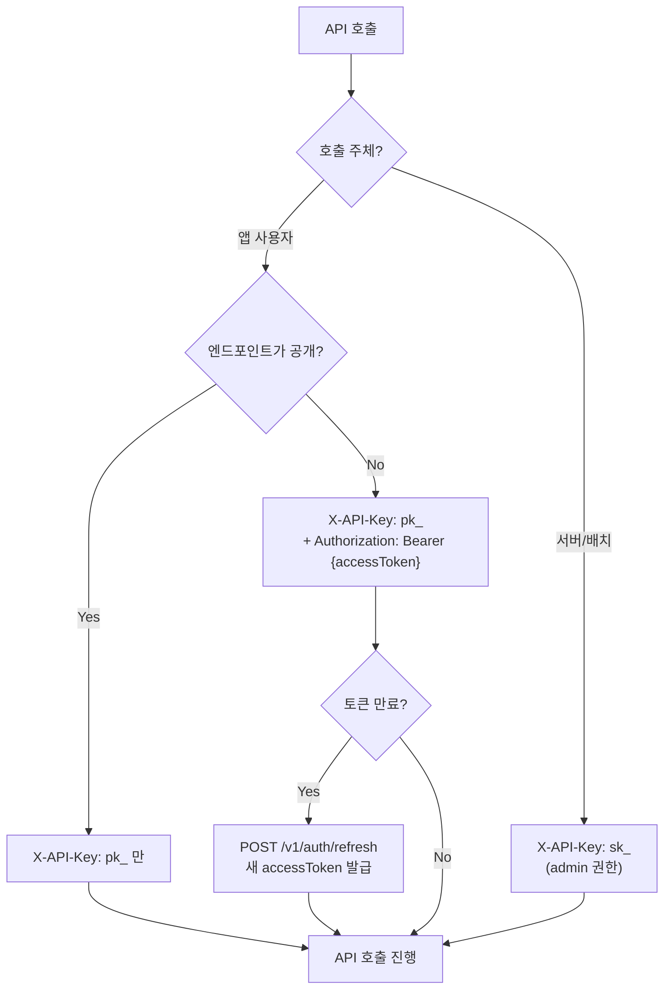

# 인증 시스템 개요


💡 bkend는 이메일, 소셜 로그인, 매직 링크 등 다양한 인증 방식을 제공합니다.


## 개요

앱에서 사용자별로 데이터를 분리하고, '내 게시글만 수정 가능'과 같은 권한을 적용하려면 사용자 인증이 필요합니다.

bkend 인증 시스템은 프로젝트의 User를 관리하는 핵심 기능입니다. 회원가입부터 로그인, 세션 관리, 다중 인증(MFA)까지 앱에 필요한 인증 기능을 REST API로 제공합니다.

***

## 인증 결정 트리

다음 다이어그램은 API 호출 시 어떤 인증 방식을 선택해야 하는지 안내합니다.



| 시나리오 | 필요 헤더 | 설명 |
|---------|----------|------|
| 공개 엔드포인트 (signup 등) | `X-API-Key: {pk_publishable_key}` | 프로젝트 식별만 필요 |
| 인증 필요 엔드포인트 (CRUD) | `X-API-Key: {pk_publishable_key}` + `Authorization: Bearer {accessToken}` | 프로젝트 + 사용자 식별 |
| 서버 사이드 (admin) | `X-API-Key: {sk_secret_key}` | 전체 권한 |

***

## 인증 방식

bkend는 다음 인증 방식을 지원합니다.

| 방식 | 설명 | 사용 사례 |
|------|------|----------|
| **이메일 + 비밀번호** | 전통적인 이메일/비밀번호 인증 | 일반적인 웹/앱 서비스 |
| **매직 링크** | 이메일로 일회용 로그인 링크 전송 | 비밀번호 없는 간편 로그인 |
| **Google OAuth** | Google 계정으로 소셜 로그인 | 빠른 소셜 로그인 |
| **GitHub OAuth** | GitHub 계정으로 소셜 로그인 | 개발자 중심 서비스 |

***

## 인증 흐름


***

## JWT 토큰

bkend는 JWT(JSON Web Token) 기반 인증을 사용합니다.

| 토큰 | 용도 | 유효 기간 |
|------|------|----------|
| **Access Token** | API 요청 시 인증 헤더에 포함 | 단기 (기본 1시간) |
| **Refresh Token** | Access Token 만료 시 갱신 | 장기 (기본 7일) |

### 인증 헤더

```text
Authorization: Bearer {accessToken}
```


⚠️ Access Token이 만료되면 Refresh Token으로 새 Access Token을 발급받으세요. Refresh Token까지 만료되면 다시 로그인해야 합니다.


***

## 필수 헤더

모든 인증 API 요청에는 다음 헤더가 필요합니다.

| 헤더 | 값 | 필수 | 설명 |
|------|-----|:----:|------|
| `X-API-Key` | `{pk_publishable_key}` | ✅ | Publishable Key (콘솔에서 발급). 프로젝트 ID + 환경 포함 |
| `Authorization` | `Bearer {accessToken}` | 조건부 | 인증이 필요한 엔드포인트 |


💡 `pk_` 키에 프로젝트 ID와 환경 정보가 포함되어 있으므로, 별도의 컨텍스트 헤더가 불필요합니다. [API 키 관리](../console/11-api-keys.md)에서 Publishable Key를 발급하세요.


***

## User 역할

bkend 프로젝트에 등록된 User는 다음 역할을 가질 수 있습니다.

| 역할 | 설명 |
|------|------|
| `admin` | 관리자 — 모든 데이터에 접근 가능 |
| `user` | 일반 사용자 — 기본 역할 |
| `guest` | 게스트 — 제한된 접근 |

역할에 따라 데이터 접근 권한이 달라집니다. 자세한 내용은 [RLS 정책](../security/05-rls-policies.md)을 참고하세요.

***

## 주요 기능

### 계정 관리

- [이메일 회원가입](02-email-signup.md) — 이메일과 비밀번호로 계정 생성
- [이메일 로그인](03-email-signin.md) — 이메일과 비밀번호로 로그인
- [매직 링크](04-magic-link.md) — 비밀번호 없이 이메일로 로그인
- [회원 탈퇴](16-account-deletion.md) — 계정 삭제

### 소셜 로그인

- [소셜 로그인 개요](05-social-overview.md) — OAuth 인증 흐름 이해
- [Google OAuth](06-social-google.md) — Google 계정 연동
- [GitHub OAuth](07-social-github.md) — GitHub 계정 연동

### 보안

- [비밀번호 관리](08-password-management.md) — 비밀번호 재설정 및 변경
- [이메일 인증](09-email-verification.md) — 이메일 소유권 확인
- [세션 관리](10-session-management.md) — 활성 세션 조회 및 종료
- [다중 인증 (MFA)](11-mfa.md) — TOTP 기반 2단계 인증

### User 관리

- [소셜 계정 연동](12-account-linking.md) — 여러 소셜 계정 연결
- [초대 시스템](13-invitation.md) — 이메일로 사용자 초대
- [사용자 프로필](14-user-profile.md) — 프로필 및 아바타 관리
- [사용자 관리](15-user-management.md) — 사용자 목록, 역할, 설정

### 설정

- [인증 제공자 설정](17-provider-config.md) — OAuth 및 이메일 인증 설정
- [이메일 템플릿](18-email-templates.md) — 인증 이메일 커스터마이징

***

## 다음 단계

- [이메일 회원가입](02-email-signup.md) — 첫 번째 인증 구현
- [Auth & User REST API 레퍼런스](19-api-reference.md) — 전체 API 목록
- [콘솔에서 API 키 발급](../console/11-api-keys.md) — API 접근 토큰 생성
- [실전 프로젝트 쿡북](../../cookbooks/README.md) — 인증이 포함된 실전 앱 만들기
