# 이메일 회원가입


💡 이메일과 비밀번호로 새 User 계정을 생성하세요.


## 개요

이메일 회원가입은 가장 기본적인 인증 방식입니다. User는 이메일과 비밀번호를 입력하여 계정을 생성하고, 즉시 JWT 토큰을 발급받습니다.

***

## 회원가입 흐름

```mermaid
sequenceDiagram
    participant Client as 클라이언트
    participant API as bkend API
    participant DB as 데이터베이스

    Client->>API: POST /v1/auth/email/signup
    API->>API: 비밀번호 정책 검증
    API->>DB: User 생성
    DB-->>API: User 저장 완료
    API->>API: JWT 토큰 생성
    API-->>Client: accessToken + refreshToken
```



***

## REST API

### POST /v1/auth/email/signup



```bash
curl -X POST https://api-client.bkend.ai/v1/auth/email/signup \
  -H "Content-Type: application/json" \
  -H "X-Project-Id: {project_id}" \
  -H "X-Environment: prod" \
  -d '{
    "method": "password",
    "email": "user@example.com",
    "password": "MyP@ssw0rd!",
    "name": "홍길동"
  }'
```


```javascript
const response = await fetch('https://api-client.bkend.ai/v1/auth/email/signup', {
  method: 'POST',
  headers: {
    'Content-Type': 'application/json',
    'X-Project-Id': '{project_id}',
    'X-Environment': 'prod',
  },
  body: JSON.stringify({
    method: 'password',
    email: 'user@example.com',
    password: 'MyP@ssw0rd!',
    name: '홍길동',
  }),
});

const data = await response.json();
// data.accessToken, data.refreshToken
```



### 요청 파라미터

| 파라미터 | 타입 | 필수 | 설명 |
|---------|------|:----:|------|
| `method` | `string` | ✅ | `"password"` 고정 |
| `email` | `string` | ✅ | 사용자 이메일 주소 |
| `password` | `string` | ✅ | 비밀번호 (정책 참고) |
| `name` | `string` | ✅ | 사용자 이름 |

### 비밀번호 정책

기본 비밀번호 정책은 다음과 같습니다.

| 규칙 | 기본값 |
|------|--------|
| 최소 길이 | 8자 |
| 대문자 포함 | ✅ |
| 소문자 포함 | ✅ |
| 숫자 포함 | ✅ |
| 특수문자 포함 | ✅ |


💡 비밀번호 정책은 [인증 제공자 설정](17-provider-config.md)에서 프로젝트별로 변경할 수 있습니다.


### 성공 응답

```json
{
  "accessToken": "eyJhbGciOiJIUzI1NiIs...",
  "refreshToken": "eyJhbGciOiJIUzI1NiIs...",
  "tokenType": "Bearer",
  "expiresIn": 3600
}
```

| 필드 | 타입 | 설명 |
|------|------|------|
| `accessToken` | `string` | JWT Access Token |
| `refreshToken` | `string` | JWT Refresh Token |
| `tokenType` | `string` | 토큰 타입 (`"Bearer"`) |
| `expiresIn` | `number` | Access Token 만료 시간 (초) |

### 에러 응답

| 에러 코드 | HTTP | 설명 |
|----------|:----:|------|
| `auth/invalid-email` | 400 | 이메일 형식이 올바르지 않음 |
| `auth/invalid-password-format` | 400 | 비밀번호 정책 위반 |
| `auth/email-already-exists` | 409 | 이미 등록된 이메일 |

***

## 이메일 인증

회원가입 후 이메일 인증을 요청하면 인증 이메일이 발송됩니다. 이메일 인증은 선택 사항이지만, 비밀번호 재설정 등의 기능을 사용하려면 인증이 필요합니다.

자세한 내용은 [이메일 인증](09-email-verification.md)을 참고하세요.

***

## 다음 단계

- [이메일 로그인](03-email-signin.md) — 생성한 계정으로 로그인
- [매직 링크](04-magic-link.md) — 비밀번호 없이 가입/로그인
- [이메일 인증](09-email-verification.md) — 이메일 소유권 확인
