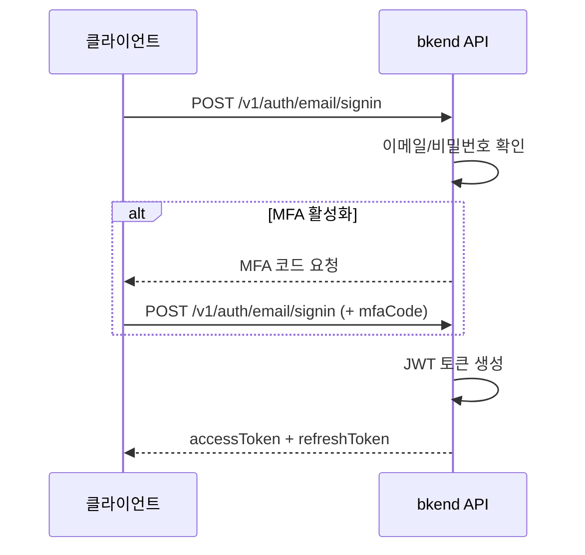

# 이메일 로그인


💡 이메일과 비밀번호로 로그인하여 JWT 토큰을 발급받으세요.


## 개요

등록된 이메일과 비밀번호로 로그인하면 Access Token과 Refresh Token이 발급됩니다. MFA가 활성화된 계정은 TOTP 코드도 함께 제출해야 합니다.

***

## 로그인 흐름



***

## REST API

### POST /v1/auth/email/signin



```bash
curl -X POST https://api-client.bkend.ai/v1/auth/email/signin \
  -H "Content-Type: application/json" \
  -H "X-Project-Id: {project_id}" \
  -H "X-Environment: dev" \
  -d '{
    "method": "password",
    "email": "user@example.com",
    "password": "MyP@ssw0rd!"
  }'
```


```javascript
const response = await fetch('https://api-client.bkend.ai/v1/auth/email/signin', {
  method: 'POST',
  headers: {
    'Content-Type': 'application/json',
    'X-Project-Id': '{project_id}',
    'X-Environment': 'dev',
  },
  body: JSON.stringify({
    method: 'password',
    email: 'user@example.com',
    password: 'MyP@ssw0rd!',
  }),
});

const data = await response.json();
```



### 요청 파라미터

| 파라미터 | 타입 | 필수 | 설명 |
|---------|------|:----:|------|
| `method` | `string` | ✅ | `"password"` 고정 |
| `email` | `string` | ✅ | 등록된 이메일 주소 |
| `password` | `string` | ✅ | 비밀번호 |
| `mfaCode` | `string` | 조건부 | MFA 활성화 시 6자리 TOTP 코드 |

### MFA가 활성화된 경우

MFA가 활성화된 계정은 `mfaCode`를 함께 전달해야 합니다.

```bash
curl -X POST https://api-client.bkend.ai/v1/auth/email/signin \
  -H "Content-Type: application/json" \
  -H "X-Project-Id: {project_id}" \
  -H "X-Environment: dev" \
  -d '{
    "method": "password",
    "email": "user@example.com",
    "password": "MyP@ssw0rd!",
    "mfaCode": "123456"
  }'
```

### 성공 응답

```json
{
  "accessToken": "eyJhbGciOiJIUzI1NiIs...",
  "refreshToken": "eyJhbGciOiJIUzI1NiIs...",
  "tokenType": "Bearer",
  "expiresIn": 3600
}
```

### 에러 응답

| 에러 코드 | HTTP | 설명 |
|----------|:----:|------|
| `auth/invalid-email` | 400 | 이메일 형식이 올바르지 않음 |
| `auth/invalid-credentials` | 401 | 이메일 또는 비밀번호 불일치 |
| `auth/mfa-required` | 403 | MFA 코드가 필요함 |
| `auth/invalid-mfa-code` | 401 | MFA 코드가 올바르지 않음 |
| `auth/account-banned` | 403 | 이용이 정지된 계정 |

***

## 앱에서 사용하기

`bkendFetch` 헬퍼를 사용하면 필수 헤더가 자동으로 포함됩니다.

```javascript
import { bkendFetch } from './bkend.js';

const result = await bkendFetch('/v1/auth/email/signin', {
  method: 'POST',
  body: {
    method: 'password',
    email: 'user@example.com',
    password: 'MyP@ssw0rd!',
  },
});

localStorage.setItem('accessToken', result.accessToken);
localStorage.setItem('refreshToken', result.refreshToken);
```


💡 `bkendFetch` 설정은 [앱에서 bkend 연동하기](../getting-started/06-app-integration.md)를 참고하세요.


***

## 토큰 갱신

Access Token이 만료되면 Refresh Token으로 새 토큰을 발급받으세요.

```bash
curl -X POST https://api-client.bkend.ai/v1/auth/refresh \
  -H "Content-Type: application/json" \
  -H "X-Project-Id: {project_id}" \
  -H "X-Environment: dev" \
  -d '{
    "refreshToken": "{refresh_token}"
  }'
```

자세한 내용은 [세션 관리](10-session-management.md)를 참고하세요.

***

## 다음 단계

- [매직 링크](04-magic-link.md) — 비밀번호 없이 로그인
- [비밀번호 관리](08-password-management.md) — 비밀번호 재설정
- [다중 인증 (MFA)](11-mfa.md) — 2단계 인증 설정
