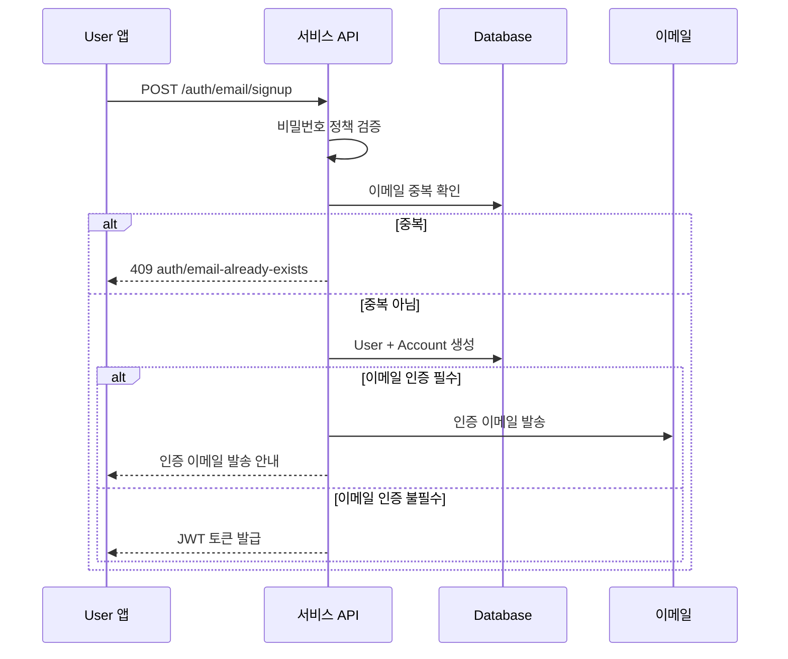

# 이메일 회원가입

> 이메일과 비밀번호로 User 계정을 생성하는 방법을 안내합니다.

## 개요

이메일 회원가입은 `method` 파라미터로 비밀번호 방식과 매직 링크 방식을 선택할 수 있습니다. 이 문서에서는 비밀번호 방식의 회원가입을 다룹니다.

---

## REST API로 회원가입하기

### 요청

```bash
curl -X POST "https://api.bkend.ai/v1/auth/email/signup" \
  -H "x-project-id: {project_id}" \
  -H "x-environment: dev" \
  -H "Content-Type: application/json" \
  -d '{
    "method": "password",
    "email": "user@example.com",
    "password": "MyP@ssw0rd!",
    "name": "홍길동"
  }'
```

### 응답 (200 OK)

```json
{
  "accessToken": "eyJhbGciOiJIUzI1NiIs...",
  "refreshToken": "eyJhbGciOiJIUzI1NiIs...",
  "tokenType": "Bearer",
  "expiresIn": 3600
}
```

---

## 파라미터

| 파라미터 | 타입 | 필수 | 설명 |
|---------|------|------|------|
| `method` | string | ✅ | `password` (비밀번호 방식) |
| `email` | string | ✅ | 사용자 이메일 |
| `password` | string | ✅ | 비밀번호 (최소 8자, 대문자+소문자+숫자+특수문자) |
| `name` | string | ✅ | 사용자 이름 |

---

## 처리 흐름



---

## 비밀번호 정책

| 규칙 | 요구사항 |
|------|---------|
| 최소 길이 | 8자 |
| 대문자 | 1개 이상 포함 |
| 소문자 | 1개 이상 포함 |
| 숫자 | 1개 이상 포함 |
| 특수 문자 | 1개 이상 포함 |

---

## 에러 응답

| 에러 코드 | HTTP 상태 | 설명 |
|----------|----------|------|
| `auth/email-already-exists` | 409 | 이미 사용 중인 이메일 |
| `auth/invalid-email-format` | 400 | 잘못된 이메일 형식 |
| `auth/invalid-password-format` | 400 | 비밀번호 정책 미충족 |
| `auth/invalid-name-format` | 400 | 이름 형식 오류 |

---

## 관련 문서

- [이메일 로그인](04-login-email.md) — 로그인 가이드
- [이메일 인증](06-email-verification.md) — 이메일 인증
- [매직 링크](10-magic-link.md) — 비밀번호 없는 회원가입
- [JWT 토큰](12-jwt-tokens.md) — 토큰 구조 상세
