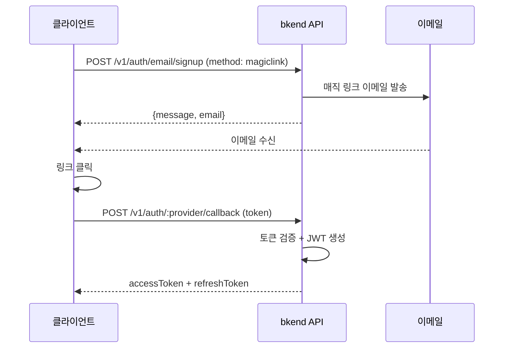

# 매직 링크 인증


💡 비밀번호 없이 이메일 링크만으로 회원가입하고 로그인하세요.


## 개요

매직 링크(Magic Link)는 비밀번호 없이 이메일로 일회용 로그인 링크를 전송하는 인증 방식입니다. User가 이메일의 링크를 클릭하면 자동으로 인증이 완료됩니다.

***

## 매직 링크 흐름



***

## 매직 링크 회원가입

### POST /v1/auth/email/signup



```bash
curl -X POST https://api-client.bkend.ai/v1/auth/email/signup \
  -H "Content-Type: application/json" \
  -H "X-API-Key: {pk_publishable_key}" \
  -d '{
    "method": "magiclink",
    "email": "user@example.com",
    "callbackUrl": "https://myapp.com/auth/callback"
  }'
```


```javascript
const response = await fetch('https://api-client.bkend.ai/v1/auth/email/signup', {
  method: 'POST',
  headers: {
    'Content-Type': 'application/json',
    'X-API-Key': '{pk_publishable_key}',
  },
  body: JSON.stringify({
    method: 'magiclink',
    email: 'user@example.com',
    callbackUrl: 'https://myapp.com/auth/callback',
  }),
});
```



### 요청 파라미터

| 파라미터 | 타입 | 필수 | 설명 |
|---------|------|:----:|------|
| `method` | `string` | ✅ | `"magiclink"` 고정 |
| `email` | `string` | ✅ | 사용자 이메일 주소 |
| `callbackUrl` | `string` | ✅ | 인증 완료 후 리다이렉트 URL |

### 성공 응답

```json
{
  "message": "Magic link sent successfully",
  "email": "user@example.com"
}
```


💡 이미 등록된 이메일로 매직 링크 회원가입을 요청하면 로그인 링크가 발송됩니다. 별도의 가입/로그인 분기 처리가 필요 없습니다.


***

## 매직 링크 로그인

### POST /v1/auth/email/signin

```bash
curl -X POST https://api-client.bkend.ai/v1/auth/email/signin \
  -H "Content-Type: application/json" \
  -H "X-API-Key: {pk_publishable_key}" \
  -d '{
    "method": "magiclink",
    "email": "user@example.com",
    "callbackUrl": "https://myapp.com/auth/callback"
  }'
```

요청 파라미터는 회원가입과 동일합니다.

***

## 콜백 처리

User가 이메일의 매직 링크를 클릭하면 `callbackUrl`로 리다이렉트되며, URL에 `token` 파라미터가 포함됩니다.

```text
https://myapp.com/auth/callback?token={magic_link_token}
```

이 토큰을 사용하여 JWT를 발급받으세요.

### POST /v1/auth/email/callback

```bash
curl -X POST https://api-client.bkend.ai/v1/auth/email/callback \
  -H "Content-Type: application/json" \
  -H "X-API-Key: {pk_publishable_key}" \
  -d '{
    "token": "{magic_link_token}"
  }'
```

### 성공 응답

```json
{
  "accessToken": "eyJhbGciOiJIUzI1NiIs...",
  "refreshToken": "eyJhbGciOiJIUzI1NiIs...",
  "tokenType": "Bearer",
  "expiresIn": 3600,
  "is_new_user": true
}
```

| 필드 | 타입 | 설명 |
|------|------|------|
| `is_new_user` | `boolean` | 신규 가입 여부 (`true`: 회원가입, `false`: 로그인) |

***

## 매직 링크 설정

매직 링크 기능의 활성화 여부와 만료 시간은 [인증 제공자 설정](17-provider-config.md)에서 변경할 수 있습니다.

| 설정 | 기본값 | 설명 |
|------|--------|------|
| `magicLinkEnabled` | `true` | 매직 링크 활성화 여부 |
| `magicLinkExpirationMinutes` | 15 | 링크 만료 시간 (분) |

***

## 에러 응답

| 에러 코드 | HTTP | 설명 |
|----------|:----:|------|
| `auth/invalid-email` | 400 | 이메일 형식이 올바르지 않음 |
| `auth/invalid-token` | 401 | 매직 링크 토큰이 유효하지 않음 |
| `auth/token-expired` | 401 | 매직 링크가 만료됨 |
| `auth/magiclink-disabled` | 400 | 매직 링크가 비활성화됨 |

***

## 다음 단계

- [소셜 로그인 개요](05-social-overview.md) — OAuth 인증 방식
- [이메일 회원가입](02-email-signup.md) — 비밀번호 방식 회원가입
- [인증 제공자 설정](17-provider-config.md) — 매직 링크 설정 변경
