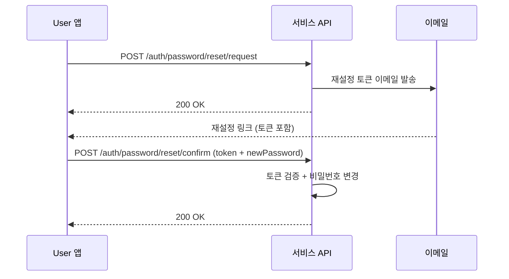

# 비밀번호 재설정

> 비밀번호를 분실했을 때 이메일을 통해 재설정하는 방법을 안내합니다.

## 개요

비밀번호 재설정은 2단계로 진행됩니다: 재설정 요청(이메일 발송) → 재설정 확인(새 비밀번호 설정).

---

## 1단계: 재설정 요청

### 요청

```bash
curl -X POST "https://api.bkend.ai/v1/auth/password/reset/request" \
  -H "x-project-id: {project_id}" \
  -H "x-environment: dev" \
  -H "Content-Type: application/json" \
  -d '{
    "email": "user@example.com"
  }'
```

### 응답 (200 OK)

```json
{}
```

> 💡 **Tip** - 보안을 위해 계정 존재 여부와 관계없이 동일한 응답을 반환합니다.

---

## 2단계: 재설정 확인

이메일로 받은 토큰과 새 비밀번호를 전송합니다.

### 요청

```bash
curl -X POST "https://api.bkend.ai/v1/auth/password/reset/confirm" \
  -H "x-project-id: {project_id}" \
  -H "x-environment: dev" \
  -H "Content-Type: application/json" \
  -d '{
    "email": "user@example.com",
    "token": "{reset_token}",
    "newPassword": "NewP@ssw0rd!"
  }'
```

### 응답 (200 OK)

```json
{}
```

---

## 비밀번호 변경 (로그인 상태)

이미 로그인한 User가 비밀번호를 변경하려면 다음 API를 사용하세요:

```bash
curl -X POST "https://api.bkend.ai/v1/auth/password/change" \
  -H "x-project-id: {project_id}" \
  -H "x-environment: dev" \
  -H "Authorization: Bearer {accessToken}" \
  -H "Content-Type: application/json" \
  -d '{
    "currentPassword": "MyP@ssw0rd!",
    "newPassword": "NewP@ssw0rd!"
  }'
```

---

## 처리 흐름



---

## 에러 응답

| 에러 코드 | HTTP 상태 | 설명 |
|----------|----------|------|
| `auth/invalid-password-reset-token` | 400 | 유효하지 않은 재설정 토큰 |
| `auth/expired-password-reset-token` | 400 | 만료된 재설정 토큰 |
| `auth/invalid-password-format` | 400 | 비밀번호 정책 미충족 |
| `auth/same-as-previous-password` | 400 | 이전과 동일한 비밀번호 |
| `auth/invalid-password` | 401 | 현재 비밀번호 오류 (변경 시) |
| `auth/too-many-code-requests` | 429 | 요청 횟수 초과 |

---

## 관련 문서

- [이메일 로그인](04-login-email.md) — 이메일 로그인
- [이메일 인증](06-email-verification.md) — 이메일 인증
- [Auth 개요](01-overview.md) — 비밀번호 정책
