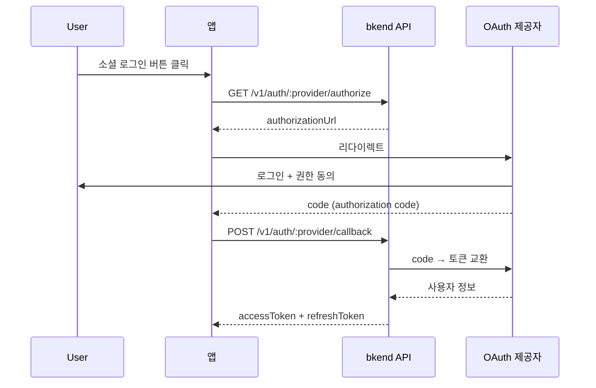

# 소셜 로그인 개요


💡 Google, GitHub 등 외부 OAuth 제공자를 통해 간편하게 로그인하세요.


## 개요

소셜 로그인은 OAuth 2.0 프로토콜을 기반으로 외부 인증 제공자(Google, GitHub)의 계정으로 로그인하는 방식입니다. User는 별도의 비밀번호 없이 기존 소셜 계정으로 빠르게 가입하고 로그인할 수 있습니다.

***

## 지원 제공자

| 제공자 | 프로토콜 | 설명 |
|--------|---------|------|
| **Google** | OAuth 2.0 + OpenID Connect | Google 계정 로그인 |
| **GitHub** | OAuth 2.0 | GitHub 계정 로그인 |

***

## OAuth 인증 흐름



***

## 1단계: 인증 URL 생성

### GET /v1/auth/:provider/authorize

OAuth 제공자의 인증 페이지 URL을 생성합니다.

```bash
curl -X GET "https://api-client.bkend.ai/v1/auth/google/authorize?redirect=https://myapp.com/auth/callback" \
  -H "X-Project-Id: {project_id}" \
  -H "X-Environment: dev"
```

#### 요청 파라미터

| 파라미터 | 위치 | 타입 | 필수 | 설명 |
|---------|------|------|:----:|------|
| `provider` | Path | `string` | ✅ | `google` 또는 `github` |
| `redirect` | Query | `string` | - | 인증 완료 후 리다이렉트 URL |
| `state` | Query | `string` | - | 사용자 정의 상태 값 |

#### 성공 응답

```json
{
  "authorizationUrl": "https://accounts.google.com/o/oauth2/v2/auth?client_id=...&redirect_uri=...&scope=..."
}
```

이 URL로 User를 리다이렉트하세요.

***

## 2단계: 콜백 처리

OAuth 제공자에서 인증이 완료되면 authorization code와 함께 콜백 URL로 리다이렉트됩니다. 이 code를 bkend API에 전달하여 JWT 토큰을 발급받으세요.

### POST /v1/auth/:provider/callback



```bash
curl -X POST https://api-client.bkend.ai/v1/auth/google/callback \
  -H "Content-Type: application/json" \
  -H "X-Project-Id: {project_id}" \
  -H "X-Environment: dev" \
  -d '{
    "code": "{authorization_code}",
    "state": "{state_value}"
  }'
```


```javascript
// 콜백 URL에서 code 추출
const urlParams = new URLSearchParams(window.location.search);
const code = urlParams.get('code');
const state = urlParams.get('state');

const response = await fetch('https://api-client.bkend.ai/v1/auth/google/callback', {
  method: 'POST',
  headers: {
    'Content-Type': 'application/json',
    'X-Project-Id': '{project_id}',
    'X-Environment': 'dev',
  },
  body: JSON.stringify({ code, state }),
});

const data = await response.json();
// data.accessToken, data.refreshToken, data.is_new_user
```



#### 요청 파라미터

| 파라미터 | 타입 | 필수 | 설명 |
|---------|------|:----:|------|
| `code` | `string` | 조건부 | OAuth authorization code |
| `idToken` | `string` | 조건부 | ID 토큰 (Google의 경우) |
| `accessToken` | `string` | - | OAuth access token |
| `state` | `string` | - | 인증 URL 생성 시 전달한 state |


💡 `code` 또는 `idToken` 중 하나 이상을 전달해야 합니다.


#### 성공 응답

```json
{
  "accessToken": "eyJhbGciOiJIUzI1NiIs...",
  "refreshToken": "eyJhbGciOiJIUzI1NiIs...",
  "tokenType": "Bearer",
  "expiresIn": 3600,
  "is_new_user": true
}
```

| 필드 | 타입 | 설명 |
|------|------|------|
| `is_new_user` | `boolean` | `true`: 최초 로그인 (자동 회원가입), `false`: 기존 회원 |

***

## 에러 응답

| 에러 코드 | HTTP | 설명 |
|----------|:----:|------|
| `auth/unsupported-provider` | 400 | 지원하지 않는 OAuth 제공자 |
| `auth/oauth-not-configured` | 400 | OAuth 설정이 완료되지 않음 |
| `auth/invalid-oauth-code` | 401 | authorization code가 유효하지 않음 |
| `auth/oauth-callback-failed` | 500 | OAuth 콜백 처리 실패 |

***

## OAuth 설정

소셜 로그인을 사용하려면 먼저 OAuth 제공자를 설정해야 합니다.

1. 각 제공자의 개발자 콘솔에서 OAuth 앱을 생성하세요.
2. `Client ID`와 `Client Secret`을 발급받으세요.
3. bkend에서 [인증 제공자 설정](17-provider-config.md)으로 등록하세요.

***

## 다음 단계

- [Google OAuth](06-social-google.md) — Google 로그인 설정 가이드
- [GitHub OAuth](07-social-github.md) — GitHub 로그인 설정 가이드
- [소셜 계정 연동](12-account-linking.md) — 기존 계정에 소셜 로그인 추가
