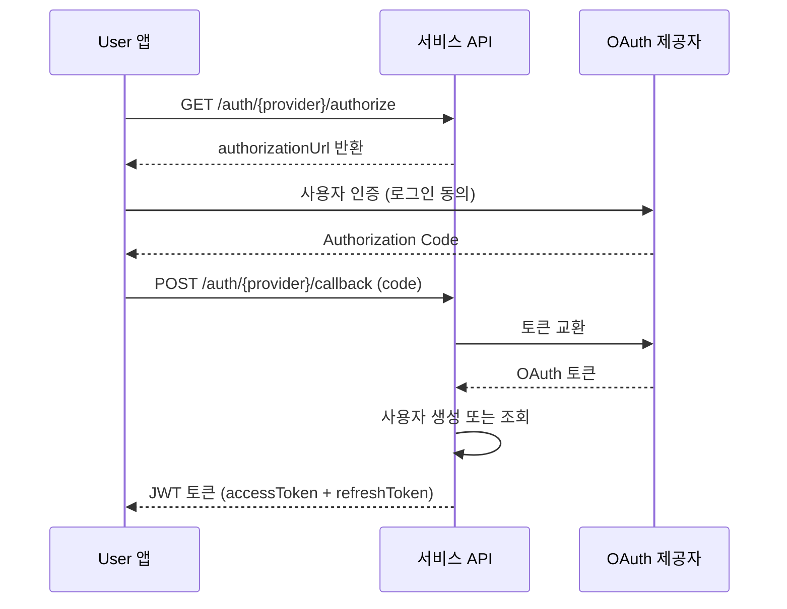

# 소셜 로그인 개요

> 소셜 로그인의 지원 제공자와 공통 흐름을 안내합니다.

## 개요

bkend Authentication은 주요 OAuth 제공자를 통한 소셜 로그인을 지원합니다. User는 별도의 비밀번호 없이 기존 소셜 계정으로 로그인할 수 있습니다.

---

## 지원 제공자

| 제공자 | 인증 URL | 기본 Scope |
|--------|---------|-----------|
| **Google** | `GET /auth/google/authorize` | openid, email, profile |
| **GitHub** | `GET /auth/github/authorize` | read:user, user:email |

---

## 공통 인증 흐름

모든 소셜 로그인은 OAuth 2.0 표준([RFC 6749](https://datatracker.ietf.org/doc/html/rfc6749))을 따릅니다.



---

## 1단계: 인증 URL 요청하기

### 요청

```bash
curl -X GET "https://api.bkend.ai/v1/auth/{provider}/authorize?redirect={callback_url}" \
  -H "x-project-id: {project_id}" \
  -H "x-environment: dev"
```

### 파라미터

| 파라미터 | 타입 | 필수 | 설명 |
|---------|------|------|------|
| `provider` | string | ✅ | OAuth 제공자 (`google`, `github`) |
| `redirect` | string | - | 인증 완료 후 리다이렉트 URL |
| `state` | string | - | CSRF 방지용 상태값 |

### 응답 (200 OK)

```json
{
  "authorizationUrl": "https://accounts.google.com/o/oauth2/v2/auth?client_id=...&redirect_uri=...&scope=openid+email+profile&state=..."
}
```

---

## 2단계: 콜백 처리하기

OAuth 제공자 인증 후 Authorization Code를 전달하여 로그인을 완료합니다.

### API 방식 (SPA, 모바일)

```bash
curl -X POST "https://api.bkend.ai/v1/auth/{provider}/callback" \
  -H "x-project-id: {project_id}" \
  -H "x-environment: dev" \
  -H "Content-Type: application/json" \
  -d '{
    "code": "{authorization_code}",
    "state": "{state}",
    "redirectUri": "{redirect_uri}"
  }'
```

### 콜백 파라미터

| 파라미터 | 타입 | 필수 | 설명 |
|---------|------|------|------|
| `code` | string | - | Authorization Code (웹 방식) |
| `idToken` | string | - | ID Token (모바일 방식) |
| `state` | string | - | CSRF 방지용 상태값 |
| `redirectUri` | string | - | Code 교환에 사용한 리다이렉트 URI |

> 💡 **Tip** - `code` 또는 `idToken` 중 하나는 반드시 전달해야 합니다.

### 응답 (200 OK)

```json
{
  "accessToken": "eyJhbGciOiJIUzI1NiIs...",
  "refreshToken": "eyJhbGciOiJIUzI1NiIs...",
  "tokenType": "Bearer",
  "expiresIn": 3600,
  "is_new_user": false
}
```

| 필드 | 설명 |
|------|------|
| `accessToken` | API 요청에 사용하는 JWT 토큰 |
| `refreshToken` | 토큰 갱신에 사용하는 JWT 토큰 |
| `expiresIn` | Access Token 만료 시간 (초) |
| `is_new_user` | 신규 가입 여부 (`true`: 첫 로그인) |

### 리다이렉트 방식 (웹 브라우저)

GET 방식의 콜백은 302 리다이렉트로 응답합니다:

```
302 Redirect
Location: {redirect_url}?accessToken=xxx&refreshToken=yyy&expiresIn=3600&isNewUser=false
```

---

## 콘솔에서 소셜 로그인 설정하기

1. 콘솔에서 프로젝트를 선택하세요.
2. **Auth** 메뉴로 이동하세요.
3. **소셜 로그인** 설정 영역에서 원하는 제공자를 선택하세요.
4. **Client ID**와 **Client Secret**을 입력하세요.
5. **Redirect URI**를 확인하고 OAuth 제공자의 설정에 추가하세요.
6. **활성화** 토글을 켜세요.

---

## 에러 응답

| 에러 코드 | HTTP 상태 | 설명 |
|----------|----------|------|
| `auth/unsupported-provider` | 400 | 지원하지 않는 OAuth 제공자 |
| `auth/oauth-not-configured` | 400 | OAuth 제공자 설정이 없음 |
| `auth/missing-credentials` | 400 | code, idToken 모두 누락 |
| `auth/invalid-oauth-code` | 400 | 유효하지 않은 Authorization Code |
| `auth/account-exists-different-provider` | 409 | 다른 방식으로 가입된 이메일 |

---

## 관련 문서

- [Google 로그인](08-social-google.md) — Google OAuth 설정 가이드
- [GitHub 로그인](09-social-github.md) — GitHub OAuth 설정 가이드
- [콘솔에서 Auth 관리](02-console-ui.md) — 소셜 로그인 설정 화면
- [JWT 토큰](12-jwt-tokens.md) — 토큰 구조 상세
