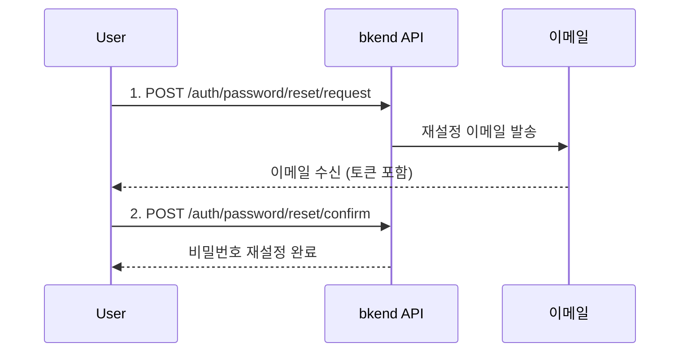

# 비밀번호 재설정 & 변경


💡 비밀번호를 잊었을 때 재설정하거나, 기존 비밀번호를 변경하세요.


## 개요

bkend는 두 가지 비밀번호 관리 기능을 제공합니다.

| 기능 | 인증 필요 | 용도 |
|------|:--------:|------|
| **비밀번호 재설정** | ❌ | 비밀번호를 잊었을 때 이메일로 재설정 |
| **비밀번호 변경** | ✅ | 로그인 상태에서 비밀번호 변경 |

***

## 비밀번호 재설정

비밀번호를 잊은 User가 이메일을 통해 새 비밀번호를 설정하는 3단계 흐름입니다.



### 1단계: 재설정 요청

```bash
curl -X POST https://api-client.bkend.ai/v1/auth/password/reset/request \
  -H "Content-Type: application/json" \
  -H "X-API-Key: {pk_publishable_key}" \
  -d '{
    "email": "user@example.com"
  }'
```

| 파라미터 | 타입 | 필수 | 설명 |
|---------|------|:----:|------|
| `email` | `string` | ✅ | 등록된 이메일 주소 |


💡 보안을 위해 등록되지 않은 이메일을 입력해도 동일한 성공 응답을 반환합니다. 이메일 존재 여부가 노출되지 않습니다.


### 2단계: 비밀번호 재설정 확인

이메일에 포함된 토큰과 새 비밀번호를 전달하세요.

```bash
curl -X POST https://api-client.bkend.ai/v1/auth/password/reset/confirm \
  -H "Content-Type: application/json" \
  -H "X-API-Key: {pk_publishable_key}" \
  -d '{
    "email": "user@example.com",
    "token": "{reset_token}",
    "newPassword": "NewP@ssw0rd!"
  }'
```

| 파라미터 | 타입 | 필수 | 설명 |
|---------|------|:----:|------|
| `email` | `string` | ✅ | 이메일 주소 |
| `token` | `string` | ✅ | 이메일로 전달된 재설정 토큰 |
| `newPassword` | `string` | ✅ | 새 비밀번호 (비밀번호 정책 준수) |

***

## 비밀번호 변경

로그인된 상태에서 현재 비밀번호를 새 비밀번호로 변경합니다.

### POST /v1/auth/password/change



```bash
curl -X POST https://api-client.bkend.ai/v1/auth/password/change \
  -H "Content-Type: application/json" \
  -H "X-API-Key: {pk_publishable_key}" \
  -H "Authorization: Bearer {accessToken}" \
  -d '{
    "currentPassword": "MyP@ssw0rd!",
    "newPassword": "NewP@ssw0rd!"
  }'
```


```javascript
const response = await fetch('https://api-client.bkend.ai/v1/auth/password/change', {
  method: 'POST',
  headers: {
    'Content-Type': 'application/json',
    'X-API-Key': '{pk_publishable_key}',
    'Authorization': `Bearer ${accessToken}`,
  },
  body: JSON.stringify({
    currentPassword: 'MyP@ssw0rd!',
    newPassword: 'NewP@ssw0rd!',
  }),
});
```



| 파라미터 | 타입 | 필수 | 설명 |
|---------|------|:----:|------|
| `currentPassword` | `string` | ✅ | 현재 비밀번호 |
| `newPassword` | `string` | ✅ | 새 비밀번호 (현재와 달라야 함) |

***

## 에러 응답

| 에러 코드 | HTTP | 설명 |
|----------|:----:|------|
| `auth/invalid-email` | 400 | 이메일 형식이 올바르지 않음 |
| `auth/verification-token-not-found` | 404 | 재설정 토큰을 찾을 수 없음 |
| `auth/verification-token-expired` | 401 | 재설정 토큰이 만료됨 (24시간) |
| `auth/invalid-password-format` | 400 | 비밀번호 정책 위반 (최소 8자, 대문자·소문자·숫자·특수문자 각 1개 이상) |
| `auth/weak-password` | 400 | 유출된 비밀번호 데이터베이스에서 발견됨 |
| `auth/invalid-password` | 401 | 현재 비밀번호 불일치 |
| `auth/same-as-previous-password` | 400 | 새 비밀번호가 현재와 동일 |
| `auth/account-not-found` | 404 | 계정을 찾을 수 없음 |


💡 비밀번호 변경 성공 시 모든 세션이 무효화되며, 모든 기기에서 재로그인이 필요합니다.


***

## 다음 단계

- [이메일 인증](09-email-verification.md) — 이메일 소유권 확인
- [다중 인증 (MFA)](11-mfa.md) — 추가 보안 설정
- [인증 제공자 설정](17-provider-config.md) — 비밀번호 정책 변경
