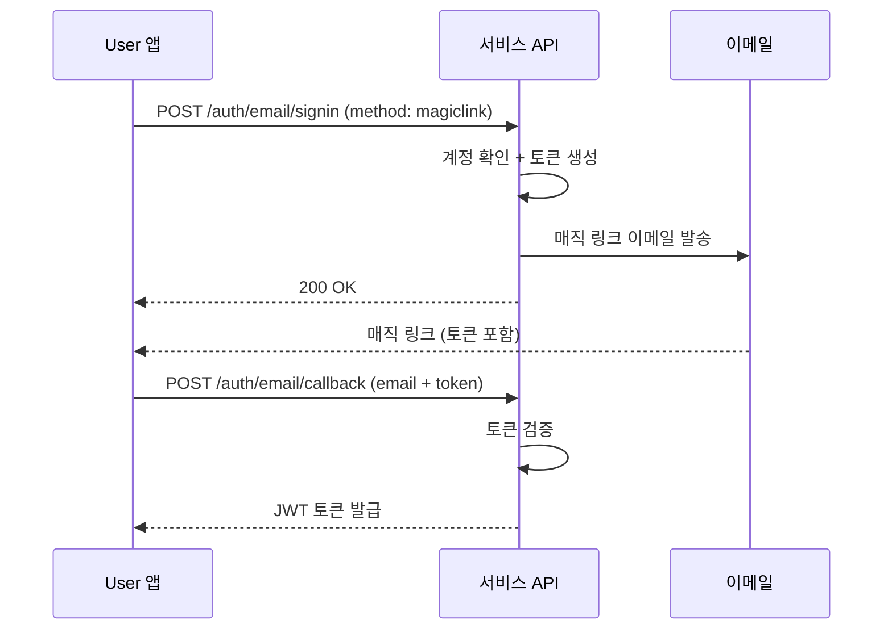

# 매직 링크

> 비밀번호 없이 이메일 링크만으로 회원가입하고 로그인하는 방법을 안내합니다.

## 개요

매직 링크는 비밀번호 대신 이메일로 전송된 일회용 링크를 통해 인증하는 방식입니다. User는 링크를 클릭하기만 하면 회원가입 또는 로그인이 완료됩니다.

---

## 매직 링크 회원가입하기

### 요청

```bash
curl -X POST "https://api.bkend.ai/v1/auth/email/signup" \
  -H "x-project-id: {project_id}" \
  -H "x-environment: dev" \
  -H "Content-Type: application/json" \
  -d '{
    "method": "magiclink",
    "email": "user@example.com",
    "callbackUrl": "https://myapp.com/auth/callback"
  }'
```

### 파라미터

| 파라미터 | 타입 | 필수 | 설명 |
|---------|------|------|------|
| `method` | string | ✅ | `magiclink` (매직 링크 방식) |
| `email` | string | ✅ | 사용자 이메일 |
| `callbackUrl` | string | ✅ | 매직 링크 클릭 시 리다이렉트 URL |

### 응답 (200 OK)

```json
{
  "message": "Magic link sent to user@example.com",
  "email": "user@example.com"
}
```

---

## 매직 링크 로그인하기

### 1단계: 매직 링크 요청

```bash
curl -X POST "https://api.bkend.ai/v1/auth/email/signin" \
  -H "x-project-id: {project_id}" \
  -H "x-environment: dev" \
  -H "Content-Type: application/json" \
  -d '{
    "email": "user@example.com",
    "callbackUrl": "https://myapp.com/auth/callback"
  }'
```

### 응답 (200 OK)

```json
{
  "callbackUrl": "https://myapp.com/auth/callback"
}
```

### 2단계: 토큰으로 인증 완료

User가 이메일의 매직 링크를 클릭하면, 링크에 포함된 토큰으로 인증을 완료합니다.

```bash
curl -X POST "https://api.bkend.ai/v1/auth/email/callback" \
  -H "x-project-id: {project_id}" \
  -H "x-environment: dev" \
  -H "Content-Type: application/json" \
  -d '{
    "email": "user@example.com",
    "token": "{magic_link_token}"
  }'
```

### 응답 (200 OK)

```json
{
  "accessToken": "eyJhbGciOiJIUzI1NiIs...",
  "refreshToken": "eyJhbGciOiJIUzI1NiIs...",
  "tokenType": "Bearer",
  "expiresIn": 3600,
  "is_new_user": false
}
```

---

## 처리 흐름



---

## 비밀번호 방식과 비교

| 항목 | 비밀번호 방식 | 매직 링크 방식 |
|------|-------------|-------------|
| 비밀번호 필요 | ✅ | ❌ |
| 이메일 필요 | ✅ | ✅ |
| 로그인 단계 | 1단계 (즉시) | 2단계 (이메일 확인) |
| 보안 | 비밀번호 복잡도에 의존 | 이메일 접근 권한에 의존 |
| 사용 사례 | 일반적인 로그인 | 간편한 로그인, 비밀번호 없는 서비스 |

---

## 에러 응답

| 에러 코드 | HTTP 상태 | 설명 |
|----------|----------|------|
| `auth/invalid-token` | 400 | 유효하지 않은 매직 링크 토큰 |
| `auth/token-expired` | 400 | 만료된 매직 링크 토큰 |
| `auth/user-not-found` | 404 | 계정이 존재하지 않음 (로그인 시) |
| `auth/email-already-exists` | 409 | 이미 가입된 이메일 (회원가입 시) |
| `auth/too-many-requests` | 429 | 요청 횟수 초과 |

---

## 관련 문서

- [이메일 로그인](04-login-email.md) — 비밀번호 방식 로그인
- [이메일 회원가입](03-signup-email.md) — 비밀번호 방식 회원가입
- [JWT 토큰](12-jwt-tokens.md) — 토큰 구조 상세
