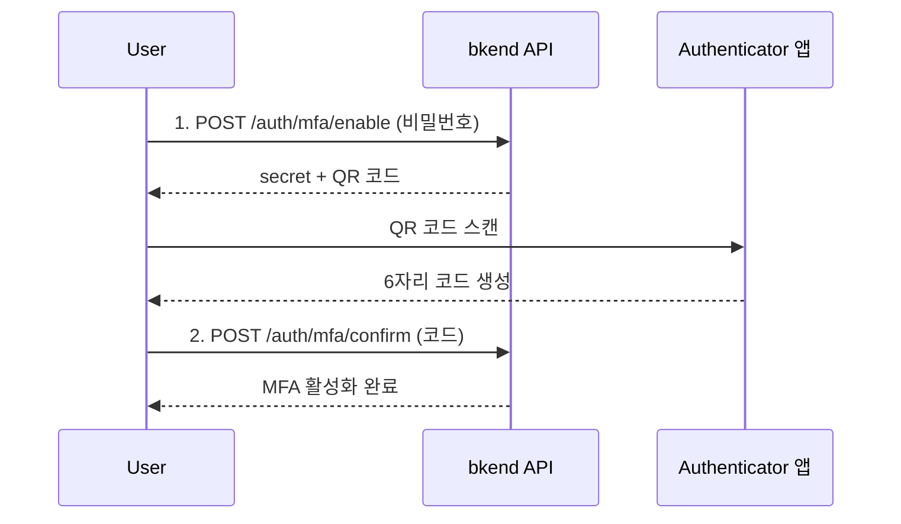

# 다중 인증 (MFA)


💡 TOTP 기반 2단계 인증으로 계정 보안을 강화하세요.


## 개요

다중 인증(Multi-Factor Authentication, MFA)은 비밀번호 외에 추가 인증 단계를 요구하여 계정 보안을 강화합니다. bkend는 TOTP(Time-based One-Time Password) 방식을 지원하며, Google Authenticator, Authy 등의 앱과 호환됩니다.

***

## MFA 설정 흐름



***

## MFA 활성화

### 1단계: MFA 활성화 준비

```bash
curl -X POST https://api-client.bkend.ai/v1/auth/mfa/enable \
  -H "Content-Type: application/json" \
  -H "Authorization: Bearer {accessToken}" \
  -H "X-Project-Id: {project_id}" \
  -H "X-Environment: prod" \
  -d '{
    "password": "MyP@ssw0rd!"
  }'
```

| 파라미터 | 타입 | 필수 | 설명 |
|---------|------|:----:|------|
| `password` | `string` | ✅ | 현재 비밀번호 (본인 확인) |

**응답:**

```json
{
  "secret": "JBSWY3DPEHPK3PXP",
  "qrCode": "data:image/png;base64,...",
  "issuer": "Bkend",
  "otpauth": "otpauth://totp/Bkend:user@example.com?secret=JBSWY3DPEHPK3PXP&issuer=Bkend"
}
```

| 필드 | 설명 |
|------|------|
| `secret` | Base32 인코딩 시크릿 (수동 입력용) |
| `qrCode` | QR 코드 이미지 (Base64) |
| `issuer` | 서비스 이름 |
| `otpauth` | OTPAuth URI (앱에서 직접 열기 용) |

### 2단계: MFA 활성화 확인

Authenticator 앱에서 생성된 6자리 코드를 입력하세요.

```bash
curl -X POST https://api-client.bkend.ai/v1/auth/mfa/confirm \
  -H "Content-Type: application/json" \
  -H "Authorization: Bearer {accessToken}" \
  -H "X-Project-Id: {project_id}" \
  -H "X-Environment: prod" \
  -d '{
    "code": "123456"
  }'
```

| 파라미터 | 타입 | 필수 | 설명 |
|---------|------|:----:|------|
| `code` | `string` | ✅ | Authenticator 앱의 6자리 코드 |


✅ MFA가 활성화되면 이후 로그인 시 비밀번호와 함께 6자리 코드를 입력해야 합니다.


***

## MFA 비활성화

### POST /v1/auth/mfa/disable

```bash
curl -X POST https://api-client.bkend.ai/v1/auth/mfa/disable \
  -H "Content-Type: application/json" \
  -H "Authorization: Bearer {accessToken}" \
  -H "X-Project-Id: {project_id}" \
  -H "X-Environment: prod" \
  -d '{
    "password": "MyP@ssw0rd!",
    "code": "123456"
  }'
```

| 파라미터 | 타입 | 필수 | 설명 |
|---------|------|:----:|------|
| `password` | `string` | ✅ | 현재 비밀번호 |
| `code` | `string` | - | Authenticator 앱의 6자리 코드 |


🚨 **위험** — MFA를 비활성화하면 계정 보안이 약화됩니다.


***

## MFA 로그인

MFA가 활성화된 상태에서 로그인할 때는 `mfaCode`를 함께 전달하세요.

```bash
curl -X POST https://api-client.bkend.ai/v1/auth/email/signin \
  -H "Content-Type: application/json" \
  -H "X-Project-Id: {project_id}" \
  -H "X-Environment: prod" \
  -d '{
    "method": "password",
    "email": "user@example.com",
    "password": "MyP@ssw0rd!",
    "mfaCode": "123456"
  }'
```

***

## 에러 응답

| 에러 코드 | HTTP | 설명 |
|----------|:----:|------|
| `auth/invalid-credentials` | 401 | 비밀번호가 올바르지 않음 |
| `auth/invalid-mfa-code` | 401 | MFA 코드가 올바르지 않음 |
| `auth/mfa-already-enabled` | 400 | 이미 MFA가 활성화됨 |
| `auth/mfa-not-enabled` | 400 | MFA가 활성화되지 않은 계정 |

***

## 다음 단계

- [이메일 로그인](03-email-signin.md) — MFA 로그인
- [세션 관리](10-session-management.md) — 활성 세션 확인
- [보안 모범 사례](../security/07-best-practices.md) — 보안 권장 사항

## 참조 표준

- [RFC 6238 — TOTP](https://datatracker.ietf.org/doc/html/rfc6238)
