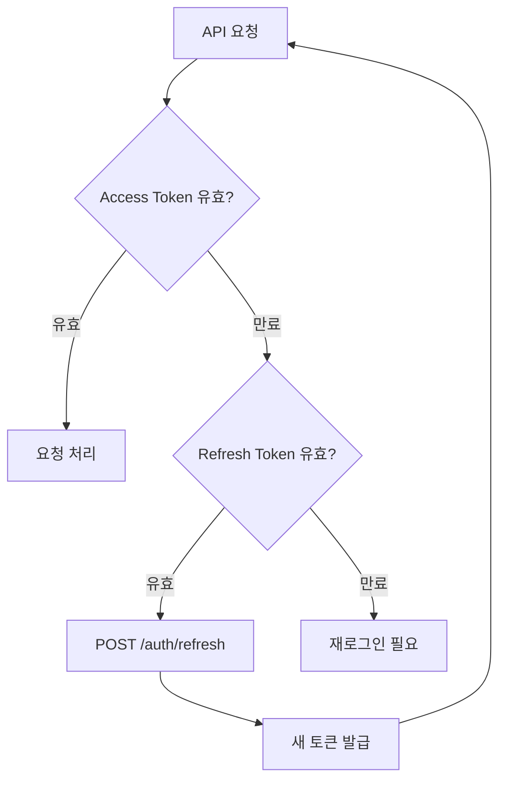

# JWT 토큰

> bkend 인증에서 사용하는 JWT 토큰의 구조와 사용법을 안내합니다.

## 개요

bkend는 [JWT (JSON Web Token)](https://datatracker.ietf.org/doc/html/rfc7519) 기반 인증을 사용합니다. 로그인 성공 시 Access Token과 Refresh Token 한 쌍이 발급되며, API 요청 시 Access Token을 포함하여 인증합니다.

---

## 토큰 종류

| 토큰 | 용도 | 만료 시간 |
|------|------|----------|
| **Access Token** | API 요청 인증 | 1시간 (3600초) |
| **Refresh Token** | Access Token 갱신 | 7일 (604800초) |

---

## Access Token 구조

Access Token은 JWT 표준([RFC 7519](https://datatracker.ietf.org/doc/html/rfc7519))을 따르는 3개 파트로 구성됩니다.

### Header

```json
{
  "alg": "HS256",
  "typ": "JWT"
}
```

### Payload

```json
{
  "sub": "user_abc123",
  "role": "user",
  "jti": "session_xyz789",
  "orgId": "org_def456",
  "orgRole": "admin",
  "iat": 1705312200,
  "exp": 1705315800
}
```

| 필드 | 설명 |
|------|------|
| `sub` | 사용자 ID (Subject) |
| `role` | 시스템 역할 |
| `jti` | 세션 ID (JWT ID) |
| `orgId` | 현재 선택된 Organization ID (선택) |
| `orgRole` | Organization 내 역할 (선택) |
| `iat` | 토큰 발급 시간 (Unix timestamp) |
| `exp` | 토큰 만료 시간 (Unix timestamp) |

---

## API 요청에 토큰 사용하기

보호된 API 엔드포인트에 요청할 때 `Authorization` 헤더에 Access Token을 포함하세요.

```bash
curl -X GET "https://api.bkend.ai/v1/data/{tableName}" \
  -H "x-project-id: {project_id}" \
  -H "x-environment: dev" \
  -H "Authorization: Bearer {accessToken}"
```

### 필수 헤더

| 헤더 | 필수 | 설명 |
|------|------|------|
| `x-project-id` | ✅ | 프로젝트 ID |
| `x-environment` | - | 환경 이름 (기본값: `development`) |
| `Authorization` | ✅ | `Bearer {accessToken}` |

---

## 토큰 만료 처리하기



Access Token이 만료되면 401 응답이 반환됩니다. Refresh Token으로 새 토큰을 발급받으세요.

```json
{
  "error": {
    "code": "auth/unauthorized",
    "message": "인증되지 않은 요청입니다"
  }
}
```

---

## 토큰 보안 권장사항

> ⚠️ **주의** - 토큰은 민감한 인증 정보입니다. 안전하게 관리하세요.

| 권장사항 | 설명 |
|---------|------|
| HTTPS 사용 | 토큰 전송 시 항상 HTTPS 사용 |
| 안전한 저장 | 브라우저: HttpOnly Cookie 또는 메모리, 모바일: Secure Storage |
| 노출 금지 | URL 파라미터, 로그, 소스 코드에 토큰 포함 금지 |
| 만료 시 갱신 | Access Token 만료 시 Refresh Token으로 즉시 갱신 |

---

## 에러 응답

| 에러 코드 | HTTP 상태 | 설명 |
|----------|----------|------|
| `auth/unauthorized` | 401 | 인증되지 않은 요청 (토큰 없음 또는 만료) |
| `auth/invalid-token-format` | 400 | 잘못된 토큰 형식 |
| `auth/session-expired` | 401 | 세션이 만료됨 |

---

## 관련 문서

- [토큰 갱신](13-refresh-tokens.md) — Refresh Token 사용법
- [세션 관리](11-session-management.md) — 세션 관리 가이드
- [Auth 개요](01-overview.md) — Authentication 기능 소개
