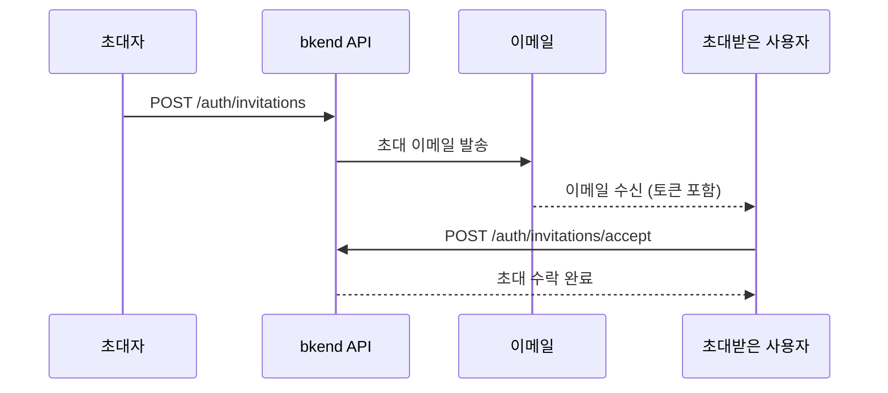

# 초대 시스템


💡 이메일로 사용자를 조직이나 프로젝트에 초대하세요.


## 개요

초대 시스템은 기존 멤버가 새로운 사용자를 조직이나 프로젝트에 초대하는 기능입니다. 초대받은 사용자는 이메일의 링크를 클릭하여 초대를 수락하거나 거절할 수 있습니다.

***

## 초대 흐름



***

## 초대 생성

### POST /v1/auth/invitations



```bash
curl -X POST https://api-client.bkend.ai/v1/auth/invitations \
  -H "Content-Type: application/json" \
  -H "Authorization: Bearer {accessToken}" \
  -H "X-Project-Id: {project_id}" \
  -H "X-Environment: dev" \
  -d '{
    "resourceType": "organization",
    "resourceId": "{org_id}",
    "resourceName": "My Organization",
    "email": "newuser@example.com",
    "name": "김개발",
    "resourceRole": "member"
  }'
```



### 요청 파라미터

| 파라미터 | 타입 | 필수 | 설명 |
|---------|------|:----:|------|
| `resourceType` | `string` | ✅ | `"organization"` 또는 `"project"` |
| `resourceId` | `string` | ✅ | 조직 또는 프로젝트 ID |
| `resourceName` | `string` | - | 리소스 이름 (이메일에 표시) |
| `email` | `string` | ✅ | 초대할 이메일 주소 |
| `name` | `string` | - | 초대받는 사용자 이름 |
| `resourceRole` | `string` | ✅ | 부여할 역할 |
| `inviterName` | `string` | - | 초대자 이름 (이메일에 표시) |

### 성공 응답

```json
{
  "id": "invitation-uuid",
  "resourceType": "organization",
  "resourceId": "org-uuid",
  "resourceName": "My Organization",
  "resourceRole": "member",
  "email": "newuser@example.com",
  "status": "pending",
  "expiresAt": "2025-01-28T00:00:00.000Z",
  "invitedBy": "admin-uuid",
  "createdAt": "2025-01-21T00:00:00.000Z"
}
```


💡 초대는 기본 7일 후 만료됩니다.


***

## 초대 목록 조회

### GET /v1/auth/invitations

```bash
curl -X GET "https://api-client.bkend.ai/v1/auth/invitations?resourceType=organization&status=pending&page=1&limit=10" \
  -H "Authorization: Bearer {accessToken}" \
  -H "X-Project-Id: {project_id}" \
  -H "X-Environment: dev"
```

| 파라미터 | 위치 | 타입 | 필수 | 설명 |
|---------|------|------|:----:|------|
| `resourceType` | Query | `string` | - | `organization` 또는 `project` |
| `resourceId` | Query | `string` | - | 리소스 ID 필터 |
| `status` | Query | `string` | - | `pending`, `accepted`, `rejected`, `expired`, `revoked` |
| `page` | Query | `number` | - | 페이지 번호 (기본값: 1) |
| `limit` | Query | `number` | - | 페이지당 항목 수 (기본값: 10) |

***

## 초대 상세 조회

### GET /v1/auth/invitations/:invitationId

```bash
curl -X GET https://api-client.bkend.ai/v1/auth/invitations/{invitationId} \
  -H "Authorization: Bearer {accessToken}" \
  -H "X-Project-Id: {project_id}" \
  -H "X-Environment: dev"
```

***

## 초대 수락

### POST /v1/auth/invitations/accept

초대 이메일의 토큰으로 초대를 수락합니다. 인증 없이 사용할 수 있습니다.

```bash
curl -X POST https://api-client.bkend.ai/v1/auth/invitations/accept \
  -H "Content-Type: application/json" \
  -H "X-Project-Id: {project_id}" \
  -H "X-Environment: dev" \
  -d '{
    "token": "{invitation_token}",
    "email": "newuser@example.com"
  }'
```

| 파라미터 | 타입 | 필수 | 설명 |
|---------|------|:----:|------|
| `token` | `string` | ✅ | 초대 토큰 (이메일에 포함) |
| `email` | `string` | - | 이메일 주소 (추가 검증용) |

***

## 초대 거절

### POST /v1/auth/invitations/reject

```bash
curl -X POST https://api-client.bkend.ai/v1/auth/invitations/reject \
  -H "Content-Type: application/json" \
  -H "X-Project-Id: {project_id}" \
  -H "X-Environment: dev" \
  -d '{
    "token": "{invitation_token}",
    "email": "newuser@example.com"
  }'
```

***

## 초대 취소

### DELETE /v1/auth/invitations/:invitationId

초대를 취소합니다. 초대자만 취소할 수 있습니다.

```bash
curl -X DELETE https://api-client.bkend.ai/v1/auth/invitations/{invitationId} \
  -H "Authorization: Bearer {accessToken}" \
  -H "X-Project-Id: {project_id}" \
  -H "X-Environment: dev"
```

***

## 초대 상태

| 상태 | 설명 |
|------|------|
| `pending` | 대기 중 — 아직 응답하지 않음 |
| `accepted` | 수락됨 |
| `rejected` | 거절됨 |
| `expired` | 만료됨 (7일 경과) |
| `revoked` | 취소됨 (초대자가 취소) |

***

## 에러 응답

| 에러 코드 | HTTP | 설명 |
|----------|:----:|------|
| `auth/invalid-token` | 401 | 초대 토큰이 유효하지 않음 |
| `auth/invitation-expired` | 400 | 초대가 만료됨 |
| `auth/invitation-already-accepted` | 400 | 이미 수락된 초대 |
| `auth/invitation-not-found` | 404 | 초대를 찾을 수 없음 |
| `auth/unauthorized` | 401 | 인증이 필요함 |

***

## 다음 단계

- [팀원 관리](../console/06-team-management.md) — 콘솔에서 팀원 관리
- [사용자 관리](15-user-management.md) — 사용자 역할 변경
- [인증 시스템 개요](01-overview.md) — 인증 흐름 이해
