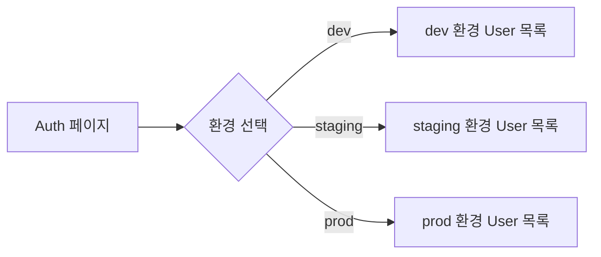

# 유저 목록 조회

> 콘솔에서 프로젝트에 가입한 User 목록을 조회하고 관리하는 방법을 안내합니다.

## 개요

콘솔의 **Auth** 페이지에서 프로젝트에 가입한 전체 User 목록을 확인할 수 있습니다. 이메일, 이름으로 검색하고 인증 방식이나 상태로 필터링할 수 있습니다.

---

## User 목록 화면

### 접근 방법

1. 콘솔에서 프로젝트를 선택하세요.
2. Sidebar의 **Auth** 메뉴를 클릭하세요.
3. 상단의 환경 탭에서 원하는 환경(dev, staging, prod)을 선택하세요.

### 목록 항목

| 항목 | 설명 |
|------|------|
| **이름** | User 이름 |
| **이메일** | 가입 이메일 주소 |
| **인증 방식** | 이메일, Google, GitHub |
| **이메일 인증** | 인증 완료 / 미인증 |
| **가입일** | 계정 생성 일시 |
| **마지막 로그인** | 최근 로그인 일시 |

---

## 검색 및 필터링

### 검색

목록 상단의 검색 필드에서 **이메일** 또는 **이름**으로 User를 검색할 수 있습니다.

### 필터

| 필터 | 옵션 |
|------|------|
| **인증 방식** | 이메일, Google, GitHub |
| **이메일 인증 상태** | 인증 완료, 미인증 |

---

## User 상세 보기

User 목록에서 항목을 클릭하면 상세 정보를 확인할 수 있습니다.

### 프로필 정보

| 항목 | 설명 |
|------|------|
| **ID** | 사용자 고유 ID |
| **이름** | 이름 |
| **닉네임** | 닉네임 |
| **이메일** | 이메일 주소 |
| **이메일 인증** | 인증 완료 시점 또는 미인증 |
| **프로필 이미지** | 프로필 사진 URL |
| **휴대폰** | 휴대폰 번호 |
| **성별** | 성별 |
| **자기소개** | bio 텍스트 |
| **가입일** | 계정 생성 일시 |
| **마지막 로그인** | 최근 로그인 일시 |

### 연동 계정

가입에 사용한 인증 방식과 연동된 소셜 계정 목록을 확인할 수 있습니다.

| 항목 | 설명 |
|------|------|
| **제공자** | 인증 제공자 (email, google, github 등) |
| **계정 타입** | credentials (이메일) 또는 oauth (소셜) |
| **제공자 계정 ID** | OAuth 제공자의 사용자 ID |

### 세션 정보

활성 세션 목록을 확인할 수 있습니다.

| 항목 | 설명 |
|------|------|
| **디바이스** | 디바이스 타입, 브라우저, OS |
| **IP 주소** | 접속 IP |
| **마지막 활동** | 최근 API 호출 시점 |
| **생성일** | 로그인 시점 |

---

## 환경별 조회

User 목록은 환경(dev, staging, prod)별로 분리되어 있습니다. 상단 탭에서 환경을 전환하면 해당 환경의 User만 표시됩니다.

---

## 관련 문서

- [콘솔에서 Auth 관리](02-console-ui.md) — Auth 설정 화면
- [유저 프로필 관리](14-user-profile.md) — 프로필 API
- [이메일 회원가입](03-signup-email.md) — 회원가입 가이드
